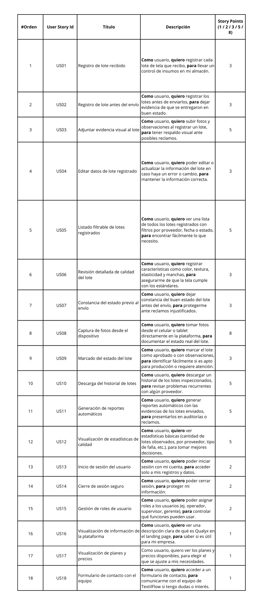
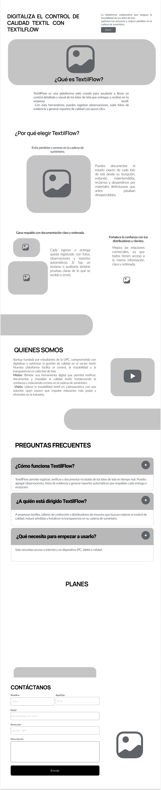
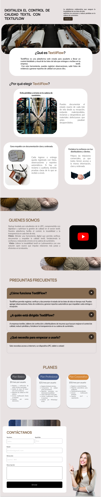

<h1 style="text-align: center;"><strong>Informe del Trabajo Final</strong></h1>
<h3 style="text-align: center;"><strong>Universidad Peruana de Ciencias Aplicadas</strong></h1>

  

<h4 style="text-align: center;"><strong>Ingeniería de Software</strong></h4>
<h4 style="text-align: center;"><strong>Desarrollo de Aplicaciones Open Source - 4289</strong></h4>
<h4 style="text-align: center;"><strong>Docente: Efraín Ricardo Bautista Ubillús</strong></h4>
<h4 style="text-align: center;"><strong>Startup: TextilFlow</strong></h4>
<h4 style="text-align: center;"><strong>Docente: Efraín Ricardo Bautista Ubillús</strong></h4>

### **Team members:**

<table style="width: 100%; border-collapse: collapse; margin: 0 auto;">
  <tr>
    <th style="border: 1px solid black; padding: 8px; text-align: center;">Nombre</th>
    <th style="border: 1px solid black; padding: 8px; text-align: center;">Código</th>
  </tr>
  </tr>
    <tr>
    <td style="border: 1px solid black; padding: 8px; text-align: center;">Steven Mathew Roca Tineo</td>
    <td style="border: 1px solid black; padding: 8px; text-align: center;">U202311361</td>
  </tr>
  <tr>
    <td style="border: 1px solid black; padding: 8px; text-align: center;">Naim Farid Napuri Rojas</td>
    <td style="border: 1px solid black; padding: 8px; text-align: center;">U202319146</td>
  </tr>
  </tr>
    <tr>
    <td style="border: 1px solid black; padding: 8px; text-align: center;">Maylhy Olinda Gutierrez Condo</td>
    <td style="border: 1px solid black; padding: 8px; text-align: center;">U202311220</td>
  </tr>  
  <tr>
    <td style="border: 1px solid black; padding: 8px; text-align: center;">Mathias Eduardo Bueno Perales</td>
    <td style="border: 1px solid black; padding: 8px; text-align: center;">U202313433</td>  
  </tr>
    <tr>
    <td style="border: 1px solid black; padding: 8px; text-align: center;">Giancarlo Rafael Solis Santa Cruz</td>
    <td style="border: 1px solid black; padding: 8px; text-align: center;">U202318615</td>
  </tr>
</table>

<h3 style="text-align: center;"><strong>Ciclo 2025-01</strong></h3>

## Registro de Versiones del Informe

## Project Report Collaboration Insights  

## Tabla de Contenidos

Capítulo I: Introducción 
    
  <ul>
    <li><a href="#11-Startup-Profile">1.1. Startup Profile</a></li>
    <li><a href="#111-Descripción-de-la-Startup">1.1.1. Descripción de la Startup</a></li>
    <li><a href="#112-Perfiles-de-Integrantes-del-Equipo">1.1.2. Perfiles de Integrantes del Equipo</a></li>
    <li><a href="#12-Solution-Profile">1.2. Solution Profile</a></li>
    <li><a href="#121-Antecedentes-y-Problemática">1.2.1. Antecedentes y Problemática</a></li>
    <li><a href="#122-Lean-UX-Process">1.2.2. Lean UX Process</a></li>
    <li><a href="#1221-Lean-UX-Problem-Statements">1.2.2.1. Lean UX Problem Statements</a></li>
    <li><a href="#1222-Lean-UX-Assumptions">1.2.2.2. Lean UX Assumptions</a></li>
    <li><a href="#1223-Lean-UX-Hypothesis-Statements">1.2.2.3. Lean UX Hypothesis Statements</a></li>
    <li><a href="#1224-Lean-UX-Canvas">1.2.2.4. Lean UX Canvas</a></li>
    <li><a href="#13-Segmentos-Objetivos">1.3. Segmentos Objetivos</a></li>
  </ul>    

Capítulo II: Requirements Elicitation & Analysis

  <ul>
    <li><a href="#21-competidores">2.1. Competidores</a></li>
    <li><a href="#211-Análisis-competitivo">2.1.1. Análisis competitivo</a></li>
    <li><a href="#212-Estrategias-y-tácticas-frente-a-competidores">2.1.2. Estrategias y tácticas frente a competidores</a></li>
    <li><a href="#22-Entrevistas">2.2. Entrevistas</a></li>
    <li><a href="#221-Diseño-de-entrevistas">2.2.1. Diseño de entrevistas</a></li>
    <li><a href="#222-Registro-de-entrevistas">2.2.2. Registro de entrevistas</a></li>
    <li><a href="#223-Análisis-de-entrevistas">2.2.3. Análisis de entrevistas</a></li>
    <li><a href="#23-Needfinding">2.3. Needfinding</a></li>
    <li><a href="#231-User-Personas">2.3.1. User Personas</a></li>
    <li><a href="#232-User-Task-Matrix">2.3.2. User Task Matrix</a></li>
    <li><a href="#233-User-Journey-Mapping">2.3.3. User Journey Mapping</a></li>
    <li><a href="#234-Empathy-Mapping">2.3.4. Empathy Mapping</a></li>
    <li><a href="#235-As-is-Scenario-Mapping">2.3.5. As-is Scenario Mapping</a></li>
    <li><a href="#24-Ubiquitous-Language">2.4. Ubiquitous Language</a></li>
</ul>   

Capítulo III: Requirements Specification 

  <ul>
    <li><a href="#31-To-Be-Scenario-Mapping">3.1. To-Be Scenario Mapping</a></li>
    <li><a href="#32-User-Stories">3.2. User Stories</a></li>
    <li><a href="#33-Impact-Mapping">3.3. Impact Mapping</a></li>
    <li><a href="#34-Product-Backlog">3.4. Product Backlog</a></li>
  </ul>    

Capítulo IV: Product Design 

  <ul>
    <li><a href="#41-Style-Guidelines">4.1. Style Guidelines</a></li>
    <li><a href="#411-General-Style-Guidelines">4.1.1. General Style Guidelines</a></li>
    <li><a href="#412-Web-Style-Guidelines">4.1.2. Web Style Guidelines</a></li>
    <li><a href="#42-Information-Architecture">4.2. Information Architecture</a></li>
    <li><a href="#421-Organization-Systems">4.2.1. Organization Systems</a></li>
    <li><a href="#422-Labeling-Systems">4.2.2. Labeling Systems</a></li>
    <li><a href="#423-SEO-Tags-and-Meta-Tags">4.2.3. SEO Tags and Meta Tags</a></li>
    <li><a href="#424-Searching-Systems">4.2.4. Searching Systems</a></li>
    <li><a href="#425-Navigation-Systems">4.2.5. Navigation Systems</a></li>
    <li><a href="#43-Landing-Page-UI-Design">4.3. Landing Page UI Design</a></li>
    <li><a href="#431-Landing-Page-Wireframe">4.3.1. Landing Page Wireframe</a></li>
    <li><a href="#432-Landing-Page-Mock-up">4.3.2. Landing Page Mock-up</a></li>
    <li><a href="#44-Web-Applications-UXUI-Design">4.4. Web Applications UX/UI Design</a></li>
    <li><a href="#441-Web-Applications-Wireframes">4.4.1. Web Applications Wireframes</a></li>
    <li><a href="#442-Web-Applications-Wireflow-Diagrams">4.4.2. Web Applications Wireflow Diagrams</a></li>
    <li><a href="#443-Web-Applications-Mock-ups">4.4.3. Web Applications Mock-ups</a></li>
    <li><a href="#444-Web-Applications-User-Flow-Diagrams">4.4.4. Web Applications User Flow Diagrams</a></li>
    <li><a href="#45-Web-Applications-Prototyping">4.5. Web Applications Prototyping</a></li>
    <li><a href="#46-Domain-Driven-Software-Architecture">4.6. Domain-Driven Software Architecture</a></li>
    <li><a href="#461-Software-Architecture-Context-Diagrams">4.6.1. Software Architecture Context Diagrams</a></li>
    <li><a href="#462-Software-Architecture-Container-Diagrams">4.6.2. Software Architecture Container Diagrams</a></li>
    <li><a href="#463-Software-Architecture-Components-Diagrams">4.6.3. Software Architecture Components Diagrams</a></li>
    <li><a href="#47-Software-Object-Oriented-Design">4.7. Software Object-Oriented Design</a></li>
    <li><a href="#471-Class-Diagrams">4.7.1. Class Diagrams</a></li>
    <li><a href="#472-Class-Dictionary">4.7.2. Class Dictionary</a></li>
    <li><a href="#48-Database-Design">4.8. Database Design</a></li>
    <li><a href="#481-Database-Diagram">4.8.1. Database Diagram</a></li>
  </ul>    

Capítulo V: Product Implementation, Validation & Deployment 

  <ul>
    <li><a href="#51-software-configuration-management">5.1. Software Configuration Management</a></li>
    <li><a href="#511-software-development-environment-configuration">5.1.1. Software Development Environment Configuration</a></li>
    <li><a href="#512-source-code-management">5.1.2. Source Code Management</a></li>
    <li><a href="#513-source-code-style-guide-conventions">5.1.3. Source Code Style Guide & Conventions</a></li>
    <li><a href="#514-software-deployment-configuration">5.1.4. Software Deployment Configuration</a></li>
    <li><a href="#52-landing-page-services-applications-implementation">5.2. Landing Page, Services & Applications Implementation</a></li>
    <li><a href="#521-sprint-1">5.2.1. Sprint 1</a></li>
    <li><a href="#5211-sprint-planning-1">5.2.1.1. Sprint Planning 1</a></li>
    <li><a href="#5212-aspect-leaders-and-collaborators">5.2.1.2. Aspect Leaders and Collaborators</a></li>
    <li><a href="#5213-sprint-backlog-1">5.2.1.3. Sprint Backlog 1</a></li>
    <li><a href="#5214-development-evidence-for-sprint-review">5.2.1.4. Development Evidence for Sprint Review</a></li>
    <li><a href="#5215-execution-evidence-for-sprint-review">5.2.1.5. Execution Evidence for Sprint Review</a></li>
    <li><a href="#5216-services-documentation-evidence-for-sprint-review">5.2.1.6. Services Documentation Evidence for Sprint Review</a></li>
    <li><a href="#5217-software-deployment-evidence-for-sprint-review">5.2.1.7. Software Deployment Evidence for Sprint Review</a></li>
    <li><a href="#5218-team-collaboration-insights-during-sprint">5.2.1.8. Team Collaboration Insights during Sprint</a></li>
  </ul>        

## **Student Outcome**

## **Capítulo I: Introducción**

### **1.1. Startup Profile**

#### **1.1.1. Descripción de la Startup**
Qualyx es una startup tecnológica orientada al desarrollo de soluciones digitales que optimizan la gestión operativa de las empresas del sector textil. Esta iniciativa surge como respuesta a la necesidad urgente de digitalizar y transparentar los procesos relacionados con la recepción, evaluación y trazabilidad de los insumos textiles, aspectos clave para asegurar la calidad en la producción de prendas y productos confeccionados.

Fundada por estudiantes de Ingeniería de Software de la Universidad de Ciencias Aplicadas de Perú, la startup tiene como propósito brindar herramientas tecnológicas accesibles, colaborativas, mejorando el control de calidad y reduciendo pérdidas en la cadena de suministro.
### *Servicios y Producto Principal:* 
 Su producto principal es TextilFlow, una plataforma web diseñada para permitir a las empresas textiles y distribuidores llevar un control visual y documental de los lotes de tela que se entregan y reciben.
 Con TextilFlow, las empresas pueden verificar en tiempo real las condiciones de la tela antes de ser usada (color, textura, elasticidad, entre otros aspectos), registrar observaciones con evidencia visual y generar reportes de calidad que sirven como respaldo ante posibles reclamos o auditorías. A su vez, los distribuidores pueden documentar el estado del lote antes del envío y compartirlo con sus clientes de forma segura y transparente.
### *Visión:*
Ser la plataforma open source líder en trazabilidad y control de calidad textil en América Latina, impulsando relaciones comerciales más justas, transparentes y eficientes dentro del ecosistema productivo.
### *Misión:*
 Proporcionar a distribuidores, talleres y empresas textiles una herramienta digital integral y colaborativa que permita verificar, documentar y respaldar la calidad de los insumos textiles, fortaleciendo la confianza en la cadena de suministro y reduciendo los errores en la producción.

#### **1.1.2. Perfiles de Integrantes del Equipo**

  

  

git 

#### **1.2. Solution Profile**

#### **1.2.1. Antecedentes y problemática**
#### What – ¿Cuál es el problema?
En el sector textil peruano, especialmente en las pequeñas y medianas empresas, los procesos de recepción de tela y control de calidad aún se realizan de forma manual, lo cual genera una alta tasa de errores e incidencias en la producción. La falta de herramientas digitales para registrar y validar las características técnicas de los insumos impide una trazabilidad efectiva del material, dificultando los reclamos a los proveedores ante defectos (Astete & Dominguez, 2023).

  

#### When : ¿Cuándo sucede el problema?
Este problema surge cada vez que una empresa recibe un lote de tela. Si en ese momento crítico no se realiza una evaluación detallada o esta se hace de manera informal, pueden usarse insumos defectuosos en la producción, lo que se traduce en reprocesos, pérdidas económicas y demoras en la entrega final. La falta de estandarización en los procesos genera inconsistencias que afectan directamente la calidad del producto final (Serna, 2024).

#### Where : ¿Dónde ocurre el problema?
Generalmente, el problema se manifiesta en las zonas de recepción de materiales y almacenes textiles, espacios que suelen tener alta rotación de insumos y, muchas veces, bajo acceso a tecnología digital. La ausencia de soluciones adaptadas a estas condiciones genera registros incompletos o inexistentes sobre la calidad de los lotes de tela (Astete & Dominguez, 2023).
#### Who :  ¿Quiénes están involucrados?
Las personas más afectadas por esta situación son las encargadas de almacén, las jefas de producción y las operarias de control de calidad. Ellas deben evaluar el estado de la tela sin contar con herramientas para registrar color, textura o elasticidad, lo que dificulta realizar reclamos con evidencia. También se ven afectadas las distribuidoras de tela, que enfrentan conflictos por devoluciones no documentadas (Aspilcueta, 1999).
#### Why : ¿Por qué ocurre esta situación?
La baja digitalización es una de las causas principales. Aunque algunas empresas han iniciado procesos de modernización, menos del 45% del sector ha implementado herramientas digitales en sus operaciones (Astete & Dominguez, 2023, p. 4). Además, muchas Mypes carecen del presupuesto o capacitación necesarios para adoptar soluciones tecnológicas, lo que las deja fuera de la cuarta revolución industrial (Aspilcueta, 1999).
#### How : ¿En qué condiciones usan el producto?
Las empresas textiles que buscan mejorar su gestión de insumos lo harán en entornos operativos dinámicos, usando tablets o celulares. La interfaz del producto debe ser amigable y permitir registrar evidencia (fotos, comentarios, etiquetas) de manera simple. Estudios han demostrado que herramientas como las 5S o el ciclo PDCA mejoran el orden y reducen defectos hasta en un 80% (Serna, 2024).
#### How Much : ¿Cuánto cuesta no resolverlo?
Los costos de no actuar son elevados. Los defectos no detectados a tiempo generan reprocesos que pueden representar pérdidas económicas del 52.6% del total de la producción (Serna, 2024). También se producen conflictos con proveedores por falta de evidencia técnica y se perpetúa la desigualdad digital, ya que las Mypes no acceden a herramientas adaptadas a sus necesidades reales (Astete & Dominguez, 2023, p. 6).

  

#### **1.2.2. Lean UX Process**

#### **1.2.2.1. Lean UX Problem Statements**
#### Problem Statement 1: 
 Nuestra plataforma ha sido diseñada para ayudar a empresas textiles a mejorar el control de calidad y trazabilidad de los lotes de tela que reciben de sus proveedores. A través de una herramienta digital simple, buscamos que estas empresas puedan documentar el estado del material con fotos, comentarios y registros estructurados, antes de utilizarlo en sus procesos de confección.

 Hemos observado que muchas empresas textiles aún dependen de controles manuales o informales para verificar la calidad de las telas al recibirlas. Esto provoca errores en producción, dificultades para reclamar al proveedor y una pérdida importante de insumos y tiempo, afectando la rentabilidad del negocio.

 *¿Cómo podemos mejorar el proceso de control de calidad en la recepción de telas, brindando a las empresas textiles una plataforma accesible y visual que les permita registrar evidencias, evaluar materiales y tomar decisiones informadas antes de iniciar la producción?*

 #### Problem Statement 2: 

TextilFlow fue creado con el objetivo de facilitar la relación comercial entre distribuidores de tela y empresas textiles, ofreciendo una plataforma donde ambas partes puedan registrar y visualizar el estado del material desde su origen hasta su recepción. Esto promueve una relación más transparente, justa y profesional.

Hemos identificado que muchos distribuidores no cuentan con un sistema donde dejar constancia del estado de la tela antes de despacharla, lo que los deja vulnerables ante reclamos sin evidencia. Esta falta de respaldo perjudica la confianza del cliente y genera conflictos evitables.

 *¿Cómo podemos ayudar a los distribuidores de tela a registrar y compartir de forma clara el estado de los lotes enviados, reduciendo conflictos con los clientes y fortaleciendo la confianza comercial mediante herramientas digitales colaborativas?*

#### **1.2.2.2. Lean UX Assumptions**
 1. Creo que mis clientes necesitan una forma clara, rápida y visual de registrar el estado de las telas que reciben o envían, para evitar reclamos, pérdidas y malentendidos en la cadena textil.

 2. Estas necesidades se pueden resolver co una plataforma digital colaborativa donde ambas partes (empresa textil y proveedor) puedan dejar evidencia del estado de cada lote (fotos, comentarios, fechas, historial, etc.).

 3. Mis clientes iniciales son (o serán) talleres y fábricas textiles que trabajan con diferentes distribuidores

 4. El valor #1 que un cliente quiere de mi servicio es tener respaldo visual y organizado sobre el estado del material, para prevenir problemas en producción y hacer reclamos con evidencia cuando sea necesario.

 5. El cliente también puede obtener estos beneficios adicionales acceso a un historial de proveedores, informes automáticos, trazabilidad por lote, ahorro de tiempo en auditorías internas, y mejor relación comercial basada en datos.

 6. Voy a adquirir la mayoría de mis clientes a través de alianzas con distribuidores textiles, redes de emprendedores textiles, ferias del rubro, grupos de confección en redes sociales y boca a boca en comunidades de producción.

 7. Haré dinero a través de modelos freemium (funciones básicas gratuitas + funciones premium), suscripciones mensuales para talleres o distribuidores, y posibles licencias para empresas grandes.

 8. Mi competencia principal en el mercado será el uso de métodos tradicionales (papel, WhatsApp, Excel), y algunas soluciones ERP costosas o no especializadas que usan algunas empresas grandes del sector.

 9. Los venceremos debido a que somos una solución accesible, fácil de usar, diseñada específicamente para el flujo de trabajo textil, colaborativa entre partes, y con enfoque visual y práctico.

 10. Mi mayor riesgo de producto es que los usuarios no estén dispuestos a cambiar sus hábitos informales o vean la herramienta como una carga adicional y no como una solución útil.

 11. Resolveremos esto a través de una experiencia de usuario extremadamente simple, con interfaz intuitiva, demostraciones visuales, y casos reales que muestren el beneficio directo en tiempo, dinero y relaciones comerciales.

#### 1. ¿Quién es el usuario?
El usuario es el personal responsable del control de calidad y recepción de insumos en empresas textiles, así como los distribuidores o proveedores de tela que desean registrar y respaldar el estado de los lotes que envían.
#### 2. ¿Dónde encaja nuestro producto en su trabajo o vida? 
TextilFlow encaja en el momento clave de la recepción o envío de telas, donde es necesario evaluar su calidad, registrar observaciones, y generar evidencia visual/documental para asegurar transparencia y trazabilidad.

#### 3. ¿Qué problemas tiene nuestro producto? ¿Resolver?
 El producto busca resolver la falta de control sistemático y visual sobre el estado de los insumos textiles. Actualmente, este proceso es informal o manual, lo que genera pérdidas, conflictos y errores en producción. También resuelve la ausencia de un canal de comunicación técnico entre proveedor y cliente.
#### 4. ¿Cuándo y cómo es nuestro producto usado? 
TextilFlow se usa justo antes de utilizar una tela en la producción o antes de su despacho. El usuario accede desde un celular, tablet o PC, toma fotos, escribe observaciones, y genera un registro digital del lote. También se usa para consultas de historial o generación de reportes.
#### 5. ¿Qué características son importantes?
* Registro visual (fotos/videos del lote)
* Observaciones técnicas personalizables
* Reportes automáticos (PDF, historial por lote o proveedor)
* Interfaz sencilla, adaptable a celular
* Acceso compartido para proveedor y cliente
* Notificaciones ante observaciones o reclamos

#### 6. ¿Cómo debe verse nuestro producto y cómo comportarse?
 Debe verse simple, visual, intuitivo y profesional. El diseño debe ser limpio, con botones claros, formularios breves y posibilidad de subir fotos al instante. Debe comportarse de forma rápida, sin errores, y facilitar el flujo natural del trabajo, sin requerir formación técnica previa.

#### **1.2.2.3. Lean UX Hypothesis Statements**
Creemos que permitir que las empresas textiles registren el estado de los lotes de tela con fotos y observaciones antes de usarlos reducirá los errores de producción y mejorará la capacidad de hacer reclamos con evidencia.
 Sabremos que esto es cierto cuando veamos que los usuarios registran activamente los lotes en la plataforma y reportan una disminución en la cantidad de telas defectuosas utilizadas en producción.
#### Cuando veamos los siguientes comentarios del mercado:
* “Ahora tengo respaldo para reclamar al proveedor.”
* “Evité una pérdida gracias a la revisión previa.” 
* Aumento del 40% en lotes registrados con observaciones.
* Reducción de reportes por fallos de tela en producción.

 Creemos que ofrecer a los distribuidores una forma de documentar y compartir la calidad del lote antes del envío aumentará la confianza del cliente y reducirá los reclamos sin justificación.
 Sabremos que esto es cierto cuando veamos que los distribuidores generan reportes previos al envío y que los clientes mencionan una mayor claridad sobre el estado de la tela recibida.
#### Cuando veamos los siguientes comentarios del mercado:
* “Ahora sé que la tela ya venía con ese detalle.”
* “Agradezco ver el informe antes del envío.”
* Disminución del 30% en reclamos sin respaldo.

#### **1.2.2.4. Lean UX Canvas**

  

### **1.3. Segmentos Objetivos**

#### Segmento Objetivo 1: Empresas textiles (Talleres y Fábricas de confección)

Este segmento está compuesto por responsables de producción y personal encargado del control de calidad y recepción de insumos en pequeñas y medianas empresas textiles. En muchos casos, estas funciones las asumen las propias dueñas del taller o personal multitarea, quienes deben verificar el estado de las telas antes de usarlas en el proceso de confección.
#### Características demográficas:
* Ubicación: Principalmente en Lima Metropolitana, en distritos con alta concentración textil como Gamarra (La Victoria), San Juan de Lurigancho, El Agustino y Los Olivos.
* Edad: Entre 25 y 45 años, con una media de 35 años.
* Nivel socioeconómico: Clase media y media-baja.
#### Desafíos:
* Estas empresas reciben telas en distintas condiciones, pero no cuentan con un sistema formal para registrar el estado del material.
* Enfrentan errores frecuentes en producción al usar telas con defectos no detectados a tiempo.
* La falta de una plataforma donde puedan dejar evidencia clara (fotos, comentarios) limita su capacidad para hacer reclamos o tomar decisiones informadas.
* Usan registros manuales, hojas sueltas o mensajes de WhatsApp, lo que genera desorganización y pérdida de datos.
#### Segmento Objetivo 2: Distribuidores de telas (Mayoristas, tiendas o proveedores directos)
Este segmento está formado por personas o empresas dedicadas a la venta y distribución de telas por rollo a talleres, fábricas o diseñadores independientes. Pueden operar desde tiendas físicas en zonas comerciales o desde almacenes, y muchas veces realizan entregas directamente al cliente.
#### Características demográficas:
* Ubicación: Zonas de alta actividad comercial textil como Gamarra (La Victoria), Lima Cercado, Callao y zonas de almacenes en Ate o San Luis.
* Edad: Entre 30 y 55 años, con una media de 42 años.
* Nivel socioeconómico: Clase media.
#### Desafíos:
* Muchos distribuidores no cuentan con un método para registrar el estado de los lotes antes del envío.
* Sufren reclamos de clientes por defectos que, muchas veces, no estaban presentes al momento del despacho.
* No tienen un respaldo visual ni histórico que les permita demostrar la calidad de su producto ni gestionar incidencias con agilidad.

## **Capítulo II: Requirements Elicitation & Analysis**

### **2.1. Competidores**

#### **2.1.1. Análisis competitivo**

  

#### **2.1.2. Estrategias y tácticas frente a competidores**

En base al análisis competitivo efectuado anticipadamente, se logró identificar con exactitud las fortalezas, oportunidades, debilidades y amenazas destacadas de los competidores. Dicha información resulta ser clave para trazar estrategias y tácticas de superación hacia la competencia, cuando el servicio entre al mercado (lanzamiento rentable). A continuación, se brindará una serie de estrategias y tácticas trazadas para alcanzar esta meta:

---

### Afrontando las fortalezas de nuestros competidores:
- Plataformas robustas con presencia global y clientes internacionales.
- Integración avanzada con herramientas de automatización y sistemas ERP.
- Cobertura de múltiples áreas de la cadena textil, desde producción hasta retail.
- Implementación de estándares sostenibles y cumplimiento normativo para marcas de gran escala.

Comprendemos que nuestras fortalezas son:
- Adaptación a la realidad de empresas textiles y distribuidores en Perú.
- Registro visual y documental del estado de los lotes de tela con evidencia fotográfica.

Entonces, podemos aplicar las siguientes estrategias y tácticas:

#### Estrategias
- Brindar una solución centrada en la trazabilidad visual con enfoque accesible y práctico para el contexto latinoamericano.

#### Tácticas
- Incluir herramientas simples para la carga de fotos, comentarios técnicos, y generación automática de reportes en PDF.
- Desarrollar una interfaz ágil con flujos claros de ingreso de datos, ideal para operarios y supervisores sin experiencia técnica.

---

### Afrontando las debilidades de nuestros competidores:
- Altos costos de licenciamiento para pymes textiles o distribuidores locales.
- Interfaces complejas que requieren capacitación técnica avanzada.
- Enfoque principal en grandes marcas, sin adaptabilidad a empresas emergentes.
- Baja presencia o adaptación específica al mercado latinoamericano.

Comprendemos que nuestras debilidades son:
- Baja visibilidad actual en el mercado frente a empresas consolidadas.
- Plataforma aún en etapa inicial de validación y desarrollo.

Entonces, podemos aplicar las siguientes estrategias y tácticas:

#### Estrategias
- Mantener un enfoque iterativo que permita adaptarse rápidamente al feedback del usuario real en campo.

#### Tácticas
- Implementar formularios simples de contacto directo y soporte técnico desde la misma plataforma.
- Publicar actualizaciones frecuentes del sistema en función a las necesidades reales del usuario.
- Crear una comunidad colaborativa con usuarios que aporten ideas de mejora desde su experiencia en la industria.

---

### Afrontando las oportunidades de nuestros competidores:
- Creciente digitalización de procesos textiles en Latinoamérica.
- Mayor interés en la trazabilidad y sostenibilidad por parte de marcas exportadoras.
- Escasa oferta de herramientas accesibles para talleres o distribuidores pequeños.

Comprendemos que nuestras oportunidades son:
- Alta demanda de digitalización en procesos de inspección de calidad textil.
- Oportunidad de crear un estándar digital en Perú de verificación textil.

Entonces, podemos aplicar las siguientes estrategias y tácticas:

#### Estrategias
- Desarrollar la plataforma como un producto abierto, escalable y enfocado en calidad y transparencia colaborativa.

#### Tácticas
- Aplicar pruebas de usabilidad con talleres y distribuidores para perfeccionar la experiencia del usuario.
- Implementar plantillas preconfiguradas para distintos tipos de tela o defectos comunes.
- Crear una sección educativa dentro de la plataforma con recursos sobre trazabilidad, control de calidad y exportación textil.

---

### Afrontando las amenazas de nuestros competidores:
- Aparición de nuevos competidores globales con mayor presupuesto.
- Preferencia de algunas empresas por soluciones genéricas (ERP, Excel, WhatsApp).
- Alta informalidad en ciertos sectores del rubro textil que retrasa la digitalización.

Comprendemos que nuestras amenazas son:
- Dificultad para generar tracción inicial sin inversión fuerte en marketing.
- Riesgo de ser percibidos como una solución complementaria y no como herramienta clave.

Entonces, podemos aplicar las siguientes estrategias y tácticas:

#### Estrategias
- Posicionar a TextilFlow como la herramienta que “evita pérdidas” y “protege relaciones comerciales” mediante evidencia digital.

#### Tácticas
- Desarrollar campañas de concientización sobre casos reales de reclamos evitados gracias al respaldo fotográfico.
- Establecer alianzas con gremios textiles, incubadoras universitarias y ferias del sector para facilitar la adopción inicial.

### **2.2. Entrevistas**
#### La sección abarca el proceso de investigación de nuestros segmentos objetivos mediante la recolección de información en base a entrevistas.

#### **2.2.1. Diseño de entrevistas**

### Segmento Objetivo #1: Empresarios
##### *Preguntas dirigidas a los empresarios de fábricas textiles.*
---

**Características demográficas:**
1. ¿Cuál es tu edad?
2. ¿En qué ciudad y tipo de empresa textil trabajas (taller, fábrica, marca de ropa, etc.)?
3. ¿Cuántos años de experiencia tienes trabajando en el rubro textil?

**Preguntas Principales:**
1. ¿Cómo es el proceso actual cuando llega un nuevo lote de tela a tu empresa?
2. ¿Tienen un protocolo definido para revisar la calidad de la tela? ¿Quién lo realiza?
3. ¿Qué aspectos revisan normalmente en la tela (color, textura, elasticidad, manchas, etc.)?
4. ¿Llevan algún registro de esa revisión? ¿Cómo lo hacen? (Papel, Excel, WhatsApp, etc.)
5. ¿Toman fotos o videos como respaldo? ¿Dónde los guardan?
6. ¿Qué pasa si detectan un problema en el lote recibido? ¿Tienen forma de reclamar al proveedor? ¿Cómo lo hacen?
7. ¿Han tenido problemas por haber usado tela en mal estado sin darse cuenta al inicio?

**Preguntas sobre el Proyecto (TextilFlow):**
1. ¿Qué te parecería tener una plataforma donde puedas registrar cada lote de tela que recibes y dejar evidencia visual y escrita de su estado?
2. ¿Qué datos crees que serían importantes registrar en la plataforma? (Ej. tipo de tela, proveedor, fecha, problemas detectados, fotos, etc.)
3. ¿Te ayudaría tener reportes automáticos o un historial con todos los lotes revisados?

### Segmento Objetivo #2: Distribuidores de Telas
##### *Preguntas dirigidas a los distribuidores de telas.*
---
**Características demográficas:**
1. ¿Cuál es tu edad?
2. ¿Tienes tienda física, vendes online o ambos?
3. ¿Qué tipo de telas sueles distribuir?

**Preguntas Principales:**
1. ¿Cómo verificas la calidad de tus telas antes de enviarlas a los clientes?
2. ¿Tienes alguna forma de respaldar que las telas estaban en buen estado al momento de la entrega?
3. ¿Te han reclamado alguna vez por defectos que no detectaste? ¿Qué pasó?
4. ¿Llevas algún registro sobre los lotes que envías (número, tipo de tela, cliente)?
5. ¿Tomas fotos o haces alguna inspección antes de despachar?

**Preguntas sobre el Proyecto (TextilFlow):**
1. ¿Qué te parecería tener una plataforma donde puedas dejar evidencia visual del estado de las telas antes del envío?
2. ¿Te ayudaría contar con un historial de envíos y controles realizados por cliente?
3. ¿Preferirías que los controles de calidad sean visibles para ambos (tú y tu cliente) dentro de la misma plataforma?

#### **2.2.2. Registro de entrevistas**

### Registro de Entrevista – Segmento 1: Empresarios

---
### Entrevista #1 :
### **Características demográficas**

1. **¿Cuál es tu edad?**  
   Actualmente tengo 25 años.

2. **¿En qué ciudad y tipo de empresa textil trabajas (taller, fábrica, marca de ropa, etc.)?**  
   Trabajo en la ciudad de Lima en un negocio familiar donde se confeccionan varios tipos de prendas como polos, pantalones, shorts, etc.

3. **¿Cuántos años de experiencia tienes trabajando en el rubro textil?**  
   Llevo toda mi vida aprendiendo de este mundo, pero laborando, llevaría entre 8 a 10 años, apoyando y dirigiendo de diversas maneras en el negocio.

### **Preguntas Principales**

1. **¿Cómo es el proceso actual cuando llega un nuevo lote de tela a tu empresa?**  
   Cuando llega un nuevo lote, lo primero que hacemos es descargarlo y almacenarlo en una zona designada. Luego, alguien del equipo de almacén revisa de forma general la tela, pero es más visual que técnica. No tenemos un sistema muy formalizado para eso, lo hacemos "al ojo".

2. **¿Tienen un protocolo definido para revisar la calidad de la tela? ¿Quién lo realiza?**  
   La verdad, no tenemos un protocolo definido. Cada quien revisa según su experiencia. Generalmente lo hace el encargado de almacén o producción, pero no hay una guía clara ni documentación.

3. **¿Qué aspectos revisan normalmente en la tela (color, textura, elasticidad, manchas, etc.)?**  
   Vemos el color, que no esté manchada, que la textura sea la adecuada según el tipo de tela, y si tiene la elasticidad que necesitamos. Pero todo es muy subjetivo, no tenemos instrumentos de medición ni nada técnico.

4. **¿Llevan algún registro de esa revisión? ¿Cómo lo hacen? (Papel, Excel, WhatsApp, etc.)**  
   No como debería ser. A veces lo anotamos en una hoja o le pasamos el dato al jefe por WhatsApp. Otras veces se queda todo en la memoria. Solo cuando hay un problema serio se documenta un poco más.

5. **¿Toman fotos o videos como respaldo? ¿Dónde los guardan?**  
   Sí, tomamos fotos cuando vemos algo raro, pero se quedan en el celular de quien las tomó. No tenemos un lugar fijo donde se guarden, y a veces hasta se pierden o se borran sin querer.

6. **¿Qué pasa si detectan un problema en el lote recibido? ¿Tienen forma de reclamar al proveedor? ¿Cómo lo hacen?**  
   Sí, pero es complicado. Llamamos al proveedor y le mandamos fotos por WhatsApp o correo. A veces acepta el reclamo, otras veces no, porque no hay pruebas suficientes o porque pasó mucho tiempo. Es difícil demostrar que el problema fue desde que llegó.

7. **¿Han tenido problemas por haber usado tela en mal estado sin darse cuenta al inicio?**  
   Sí, ha pasado. A veces no se nota al inicio, y ya cuando se empieza a confeccionar recién salta el problema. Eso genera pérdidas porque hay que parar la producción o rehacer las prendas.

### **Preguntas sobre el Proyecto (Qualyx)**

1. **¿Qué te parecería tener una plataforma donde puedas registrar cada lote de tela que recibes y dejar evidencia visual y escrita de su estado?**  
   Me parecería excelente. Nos daría mucho más orden y respaldo. Tener todo en un solo lugar nos evitaría muchos problemas con los proveedores y también dentro del equipo.

2. **¿Qué datos crees que serían importantes registrar en la plataforma?**  
   Tipo de tela, metraje, proveedor, fecha de llegada, quién la recibió, fotos del estado, observaciones, si hubo problemas o no, y quizás también el número de guía de remisión para tener todo relacionado.

3. **¿Te ayudaría tener reportes automáticos o un historial con todos los lotes revisados?**  
   Sí, mucho. Tener ese historial nos permitiría hacer seguimiento, identificar patrones (si un proveedor siempre falla, por ejemplo), y también nos serviría como prueba ante auditorías o reclamos. Sería una gran mejora frente a lo que hacemos ahora.

### Entrevista #2 :

  

 
Duracion(00:05-6:17)min.

### **Características demográficas**

1. **¿Cuál es tu edad?**  
   Tengo 25 años.

2. **¿En qué ciudad y tipo de empresa textil trabajas (taller, fábrica, marca de ropa, etc.)?**  
   Trabajo en Lima, en una fábrica textil que produce telas para confección de ropa deportiva.

3. **¿Cuántos años de experiencia tienes trabajando en el rubro textil?**  
   Tengo 2 años de experiencia, principalmente en almacén y control de calidad.

### **Preguntas Principales**

1. **¿Cómo es el proceso actual cuando llega un nuevo lote de tela a tu empresa?**  
   Primero recibimos el lote en el almacén, lo descargamos y revisamos que coincida con la guía. Luego hacemos una inspección visual rápida para ver si hay algo evidente como manchas o diferencias de color. A veces pasa al área de calidad para una revisión más técnica, pero no siempre se hace en el momento por falta de tiempo.

2. **¿Tienen un protocolo definido para revisar la calidad de la tela? ¿Quién lo realiza?**  
   Sí, hay un protocolo, pero en la práctica no se sigue siempre. Lo debe realizar el área de control de calidad, aunque muchas veces los de almacén hacemos una revisión básica si ellos están ocupados.

3. **¿Qué aspectos revisan normalmente en la tela (color, textura, elasticidad, manchas, etc.)?**  
    Revisamos color, textura, elasticidad, que no tenga manchas, hilos sueltos o diferencias entre rollos. También que el metraje esté correcto.

4. **¿Llevan algún registro de esa revisión? ¿Cómo lo hacen? (Papel, Excel, WhatsApp, etc.)**  
   Sí, usamos formatos en papel y, en algunos casos, pasamos observaciones por WhatsApp al área de calidad. A veces se lleva en Excel, pero no es constante.

5. **¿Toman fotos o videos como respaldo? ¿Dónde los guardan?**  
   Sí, fotos principalmente. Las tomamos con el celular y se envían por WhatsApp o se guardan en la galería. No hay una carpeta o sistema específico para organizarlas.

6. **¿Qué pasa si detectan un problema en el lote recibido? ¿Tienen forma de reclamar al proveedor? ¿Cómo lo hacen?**  
   Se informa al jefe de calidad o al encargado. Ellos contactan al proveedor con las fotos como prueba. A veces el proveedor acepta el reclamo, pero otras veces no, porque dicen que el daño no estaba cuando se envió.

7. **¿Han tenido problemas por haber usado tela en mal estado sin darse cuenta al inicio?**  
   Sí, varias veces. Ha pasado que se empieza a cortar sin revisar bien, y después aparecen manchas o diferencias de color que afectan la producción. Eso genera pérdida de tiempo y material.

### **Preguntas sobre el Proyecto (Qualyx)**

1. **¿Qué te parecería tener una plataforma donde puedas registrar cada lote de tela que recibes y dejar evidencia visual y escrita de su estado?**  
   Me parecería muy útil, porque muchas veces la información se pierde o no queda registrada de forma clara. Tener todo en una sola plataforma sería más ordenado y ayudaría en los reclamos.

2. **¿Qué datos crees que serían importantes registrar en la plataforma?**  
   Tipo de tela, color, proveedor, fecha de recepción, quién recibió, observaciones, fotos, si fue aprobado o no, y algún número de lote o código interno.

3. **¿Te ayudaría tener reportes automáticos o un historial con todos los lotes revisados?**  
   Sí, definitivamente. Con eso podríamos tener mejor control y hacer seguimiento a los proveedores que entregan con fallas frecuentes. También ayudaría mucho para auditorías.

### Registro de Entrevista – Segmento 2: Distribuidores de Telas 
### Entrevista #1 :
### **Características demográficas**
1. **¿Cuál es tu edad?**
    Tengo 28 años.
2. **¿Tienes tienda física, vendes online o ambos?**
    Tengo un taller en mi casa, donde trabajo con tres personas más. No vendo directamente, trabajo por pedidos para marcas pequeñas o emprendedores.
3. **¿Qué tipo de telas sueles distribuir?**
    Trabajo con algodón, lycra, popelina y últimamente algo de denim para ropa juvenil.

### **Preguntas Principales**
1. **¿Cómo verificas la calidad de tus telas antes de enviarlas a los clientes?**
    Cuando llegan las telas al taller, las reviso al tacto y estiro un poco para ver la elasticidad. También veo que el color no varíe entre rollos. Pero no siempre tengo tiempo para revisarlas una por una.
2. **¿Tienes alguna forma de respaldar que las telas estaban en buen estado al momento de la entrega?**
    No, nunca. Si algo está mal, lo reclamo verbalmente al proveedor, pero no tengo pruebas. Me ha pasado que me dicen que ya venía así y nadie se hace cargo.
3. **¿Te han reclamado alguna vez por defectos que no detectaste? ¿Qué pasó?** 
    Sí, varias veces. A veces la tela tiene fallas en el color o se rompe al coser. El problema es que ya está cortada y no hay forma de reclamar. Eso me ha hecho perder clientes y dinero.
4. **¿Llevas algún registro sobre los lotes que envías (número, tipo de tela, cliente)?**
    Hago notas a mano y tengo carpetas con pedidos, pero no hay algo unificado. Me pierdo a veces, sobre todo cuando tengo pedidos urgentes o simultáneos.
5. **¿Tomas fotos o haces alguna inspección antes de despachar?**
    Solo si el cliente es nuevo o me ha reclamado antes. No tengo costumbre de documentar todo porque es muy tedioso con el celular.
### **Preguntas sobre el Proyecto (Qualyx)**
1. **¿Qué te parecería tener una plataforma donde puedas dejar evidencia visual del estado de las telas antes del envío?**
    Me encantaría. Podría revisar cómo llegó cada rollo de tela y tener fotos antes de cortar. También podría mostrarle al proveedor si algo viene mal.
2. **¿Te ayudaría contar con un historial de envíos y controles realizados por cliente?**
    Sí, sobre todo cuando tengo varios pedidos seguidos. Me ayudaría a evitar errores como entregar la prenda equivocada o usar una tela que no era.
3. **¿Preferirías que los controles de calidad sean visibles para ambos (tú y tu cliente) dentro de la misma plataforma?** 
    Sí, sería mucho más profesional. Así no hay confusiones y se evitan malos entendidos. Todos ven lo mismo, y queda como evidencia de lo que se hizo.

### Entrevista #2 :

  

 
Duracion(00:02-5:15)min.

### **Características demográficas**
1. **¿Cuál es tu edad?**
    Tengo 20 años.
2. **¿Tienes tienda física, vendes online o ambos?**
    Una tienda física en Gamarra, pero también vendo por redes sociales y WhatsApp a talleres de confección en Lima y provincias.
3. **¿Qué tipo de telas sueles distribuir?**
    Principalmente telas planas y de punto: franela, jersey, popelina, algodón licrado y algunas telas sintéticas para ropa juvenil.

### **Preguntas Principales**
1. **¿Cómo verificas la calidad de tus telas antes de enviarlas a los clientes?**
    Normalmente reviso el lote cuando llega del proveedor mayorista. Veo que no tenga manchas, que el color esté parejo y que el metraje esté correcto. Si el cliente es exigente, reviso con más detalle antes del envío.
2. **¿Tienes alguna forma de respaldar que las telas estaban en buen estado al momento de la entrega?**
    La verdad, no siempre. A veces tomo fotos si es un cliente nuevo o complicado, pero la mayoría de veces solo confían en lo que les mando. Si me reclaman, tengo que revisar el rollo o hablar con el proveedor, pero sin evidencia es difícil.
3. **¿Te han reclamado alguna vez por defectos que no detectaste? ¿Qué pasó?** 
    Sí, claro. Me ha pasado que me reclaman por manchas o por diferencia de tono. Algunos clientes piensan que yo les mandé mal la tela, cuando en realidad vino así del mayorista. A veces lo resuelvo cambiando el rollo, otras veces pierdo el cliente.
4. **¿Llevas algún registro sobre los lotes que envías (número, tipo de tela, cliente)?**
    Manejamos un Excel básico con el tipo de tela, cantidad y nombre del cliente. No siempre apunto el número de lote porque muchos no vienen etiquetados.
5. **¿Tomas fotos o haces alguna inspección antes de despachar?**
    Sí, trato de tomar una o dos fotos por cada rollo, pero las tengo en el celular mezcladas con otras cosas. A veces se me olvidan o no las encuentro después.
### **Preguntas sobre el Proyecto (Qualyx)**
1. **¿Qué te parecería tener una plataforma donde puedas dejar evidencia visual del estado de las telas antes del envío?**
    Me parecería súper útil, especialmente para evitar malentendidos. Así puedo mostrar que la tela salió bien y el cliente también tiene cómo verificar. 
2. **¿Te ayudaría contar con un historial de envíos y controles realizados por cliente?**
    Sí, bastante. Así tengo un respaldo de lo que ya envié, a quién, en qué condiciones, y puedo revisar rápido si me reclaman algo.
3. **¿Preferirías que los controles de calidad sean visibles para ambos (tú y tu cliente) dentro de la misma plataforma?** 
    Sí, totalmente. Así no hay confusión. Si los dos vemos lo mismo, se evitan discusiones. Incluso sería bueno que el cliente pueda confirmar o dejar un comentario después de recibir.

#### **2.2.3. Análisis de entrevistas**

### **2.3. Needfinding**

#### **2.3.1. User Personas**

#### **2.3.2. User Task Matrix**

#### **2.3.3. User Journey Mapping**

#### **2.3.4. Empathy Mapping**

#### **2.3.5. As-is Scenario Mapping**

### **2.4. Ubiquitous Language**

### *Términos relacionados con nuestro servicio:*

- Lote de tela: Unidad del material recibido u enviado, es el objetivo principal de nuestro seguimiento.

- Proveedor: Distribuidor encargado de despachar los lotes.

- Receptor: Taller o empresa que recibe el lote.

- Ficha técnica: Registro que describe las características de nuestro lote. Puede ser el color, tipo de tela, metraje, etc.

- Control de calidad: Proceso de evaluación tanto visual como física de los lotes previo a su uso.

- Tela defectuosa: Material que presenta problemas en su calidad.

### *Términos generales para el proyecto de Open Source:*

- Repositorio: El espacio digital donde se almacena y gestiona el código fuente de nuestro proyecto. Nosotros hacemos uso de GitHub.

- Fork: Copia personal de un repositorio en el cual se pueden hacer cambios sin afectar el original.

- Branch (Rama): Una línea de desarrollo paralelo al principal. Usado principalmente para agregar nuevas funciones o correcciones sin alterar el sistema actual.

- Commit: Registro de cambios especificos hechos al codigo, en conjunto a mensajes explicando en que consiste cada uno.

- Changelog: Registro cronológico de los cambios realizados según la versión del proyecto. Ayuda a no perder la ilación de las actualizaciones hechas a los usuarios.

## **Capítulo III: Requirements Specification**

### **3.1. To-Be Scenario Mapping**

### **3.2. User Stories**

  <table style="border-collapse: collapse;">
    <thead>
      <tr>
        <th style="text-align: center; border: 1px solid black; padding: 8px;">Epic</th>
        <th style="text-align: center; border: 1px solid black; padding: 8px;">ID</th>
      </tr>
    </thead>
    <tbody>
      <tr>
        <td style="text-align: center; border: 1px solid black; padding: 8px;">Registro y Control de Lotes de Tela</td>
        <td style="text-align: center; border: 1px solid black; padding: 8px;">EP01</td>
      </tr>
      <tr>
        <td style="text-align: center; border: 1px solid black; padding: 8px;">Evaluación de Calidad en Tiempo Real</td>
        <td style="text-align: center; border: 1px solid black; padding: 8px;">EP02</td>
      </tr>
      <tr>
        <td style="text-align: center; border: 1px solid black; padding: 8px;">Reportes y Evidencia Documental</td>
        <td style="text-align: center; border: 1px solid black; padding: 8px;">EP03</td>
      </tr>
      <tr>
        <td style="text-align: center; border: 1px solid black; padding: 8px;">Gestión de Usuarios y Seguridad</td>
        <td style="text-align: center; border: 1px solid black; padding: 8px;">EP04</td>
      </tr>
      <tr>
        <td style="text-align: center; border: 1px solid black; padding: 8px;">Información Pública y Contacto</td>
        <td style="text-align: center; border: 1px solid black; padding: 8px;">EP05</td>
      </tr>
    </tbody>
  </table>

  

### **3.3. Impact Mapping**

### **3.4. Product Backlog**

  

## **Capítulo IV: Product Design**

### **4.1. Style Guidelines**

#### **4.1.1. General Style Guidelines**

#### **4.1.2. Web Style Guidelines**

### **4.2. Information Architecture**

#### **4.2.1. Organization Systems**

#### **4.2.2. Labeling Systems**

Para el contenido de **TextilFlow**, se prioriza una redacción clara y concisa, con textos reducidos que permitan una lectura rápida y comprensión efectiva por parte de los usuarios.

En cuanto al diseño de botones, se utiliza un estilo minimalista, con bordes redondeados y colores definidos por el sistema de diseño de la marca.

Los íconos también respetan la línea gráfica de **TextilFlow**, facilitando la navegación y comprensión visual de las acciones dentro de la plataforma.

#### **4.2.3. SEO Tags and Meta Tags**

#### **4.2.4. Searching Systems**

#### **4.2.5. Navigation Systems**

### **4.3. Landing Page UI Design**

#### **4.3.1. Landing Page Wireframe**

  

#### **4.3.2. Landing Page Mock-up**

  

### **4.4. Web Applications UX/UI Design**

#### **4.4.1. Web Applications Wireframes.**

#### **4.4.2. Web Applications Wireflow Diagrams**

#### **4.4.3. Web Applications Mock-ups**

#### **4.4.4. Web Applications User Flow Diagrams**

### **4.5. Web Applications Prototyping**

### **4.6. Domain-Driven Software Architecture**

#### **4.6.1. Software Architecture Context Diagrams**

#### **4.6.2. Software Architecture Container Diagrams**

#### **4.6.3. Software Architecture Components Diagrams**

### **4.7. Software Object-Oriented Design**

#### **4.7.1. Class Diagrams**

#### **4.7.2. Class Dictionary**

### **4.8. Database Design**

#### **4.8.1. Database Diagram**

## **Capítulo V: Product Implementation, Validation & Deployment**

### **5.1. Software Configuration Management**

#### **5.1.1. Software Development Environment Configuration**

#### **5.1.2. Source Code Management**

#### **5.1.3. Source Code Style Guide & Conventions**

#### **5.1.4. Software Deployment Configuration**

### **5.2. Landing Page, Services & Applications Implementation**

#### **5.2.1. Sprint 1**

##### **5.2.1.1. Sprint Planning 1**

##### **5.2.1.2. Aspect Leaders and Collaborators**

##### **5.2.1.3. Sprint Backlog 1**

##### **5.2.1.4. Development Evidence for Sprint Review**

##### **5.2.1.5. Execution Evidence for Sprint Review**

##### **5.2.1.6. Services Documentation Evidence for Sprint Review**

##### **5.2.1.7. Software Deployment Evidence for Sprint Review**

##### **5.2.1.8. Team Collaboration Insights during Sprint**

## **Conclusiones**

## **Bibliografía**

Astete Pascual, L. D., & Dominguez Quiroz, K. T. (2023). Relación entre la innovación en digitalización y el desempeño exportador de las empresas del sector confecciones de punto del clúster de gamarra durante el periodo 2019-2020.https://repositorioacademico.upc.edu.pe/handle/10757/668415 

Barbachán, M. A. (1999). Desempeño de la pequeña y mediana empresa exportadora del sector textil y confecciones en el Perú. Departamento de Empleo y Formación, Oficina Internacional del Trabajo.https://n9.cl/ji3pt 

Burga Spray, R., & Gutiérrez Medina, V. P. (2024). Implementación de modelo para disminuir el nivel de productos defectuosos [Tesis de licenciatura, Universidad Peruana de Ciencias Aplicadas]. Repositorio Académico UPC. https://repositorioacademico.upc.edu.pe/handle/10757/68297  

Serna, L., & Isabel, A. (2024). Propuesta de Gestión de Procesos de Producción para mejorar la calidad del producto de una empresa textil peruana.https://titula.universidadeuropea.com/handle/20.500.12880/10986 

## **Anexos**

