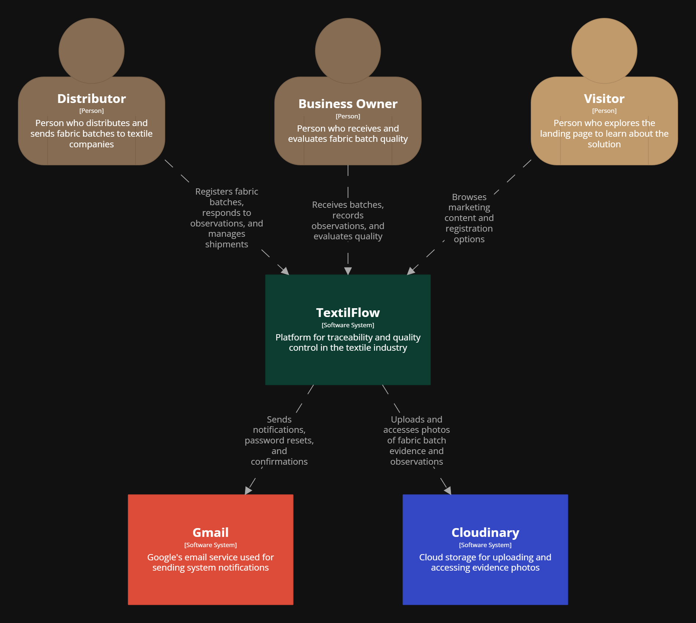
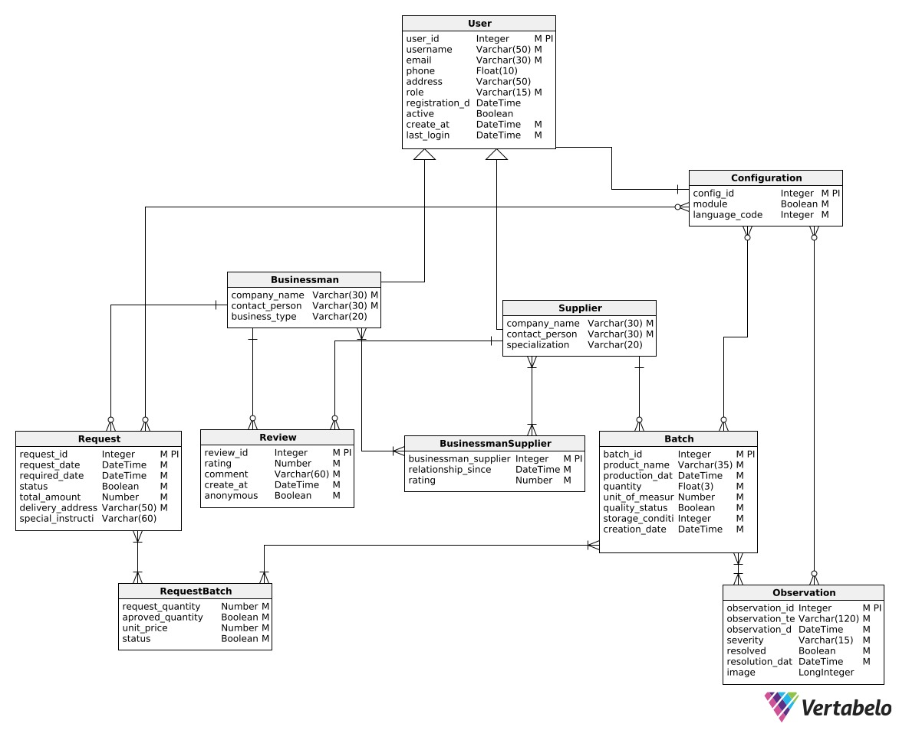
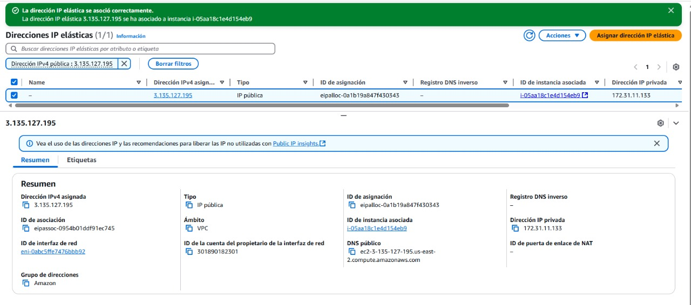

<h1 style="text-align: center;"><strong>Informe del Trabajo Final</strong></h1>
<h3 style="text-align: center;"><strong>Universidad Peruana de Ciencias Aplicadas</strong></h1>

<div style="text-align: center;">
  
</div>

<h4 style="text-align: center;"><strong>Ingeniería de Software</strong></h4>
<h4 style="text-align: center;"><strong>Desarrollo de Aplicaciones Open Source - 4289</strong></h4>
<h4 style="text-align: center;"><strong>Docente: Efraín Ricardo Bautista Ubillús</strong></h4>
<h4 style="text-align: center;"><strong>Startup: Qualix</strong></h4>
<h4 style="text-align: center;"><strong>Producto: TextilFlow</strong></h4>

### **Team members:**

<table style="width: 100%; border-collapse: collapse; margin: 0 auto;">
  <tr>
    <th style="border: 1px solid black; padding: 8px; text-align: center;">Nombre</th>
    <th style="border: 1px solid black; padding: 8px; text-align: center;">Código</th>
  </tr>
  </tr>
    <tr>
    <td style="border: 1px solid black; padding: 8px; text-align: center;">Steven Mathew Roca Tineo</td>
    <td style="border: 1px solid black; padding: 8px; text-align: center;">U202311361</td>
  </tr>
  </tr>
    <tr>
    <td style="border: 1px solid black; padding: 8px; text-align: center;">Maylhy Olinda Gutierrez Condo</td>
    <td style="border: 1px solid black; padding: 8px; text-align: center;">U202311220</td>
  </tr>  
  <tr>
    <td style="border: 1px solid black; padding: 8px; text-align: center;">Mathias Eduardo Bueno Perales</td>
    <td style="border: 1px solid black; padding: 8px; text-align: center;">U202313433</td>  
  </tr>
    <tr>
    <td style="border: 1px solid black; padding: 8px; text-align: center;">Giancarlo Rafael Solis Santa Cruz</td>
    <td style="border: 1px solid black; padding: 8px; text-align: center;">U202318615</td>
  </tr>
</table>

<h3 style="text-align: center;"><strong>Ciclo 2025-10</strong></h3>

<hr>

## Registro de Versiones del Informe


| Versión | Fecha | Autor | Descripción de modificación |
| :---- | :---- | :---- | :---- |
| TB1 | 27/04/2025 | Gutiérrez Condo, Maylhy Olinda Roca Tineo, Steven Mathew Mathias Eduardo Bueno Perales Giancarlo Rafael Solis Santa Cruz | En la primera entrega del informe de nuestro proyecto, hemos realizado los primeros 5 capítulos del informe y también entregamos la primera versión del landing page de TextilFlow. |
| TP | 16/05/2025 | Gutiérrez Condo, Maylhy Olinda Roca Tineo, Steven Mathew Mathias Eduardo Bueno Perales Giancarlo Rafael Solis Santa Cruz | En esta entrga parcial del informe de nuestro proyecto, hemos realizado el sprint 2 del informe y también entregamos nuestra landing page junto con la aplicacion. |
| TB2 | 22/06/2025 | Gutiérrez Condo, Maylhy Olinda Roca Tineo, Steven Mathew Mathias Eduardo Bueno Perales Giancarlo Rafael Solis Santa Cruz | En esta entrga  del informe de nuestro proyecto, hemos realizado el sprint 3 del informe y también entregamos una primera version desplegada de nuestro backend |

<hr>

## Project Report Collaboration Insights  


Desarrollamos el informe de nuestro proyecto en un repositorio denominado "Informe_Grupo_3" dentro de nuestra organización "TextilFlow-Curso-Open-Source", ya que allí implementaremos los diferentes componentes de nuestra aplicación web del mismo nombre. 

#### Enlace del repositorio "Informe_Grupo_3": **https://github.com/TextilFlow-Curso-Open-Source/Informe_Grupo_3**

**TB1:** Para lograr la elaboración colaborativa de este informe, primero trabajamos en un documento compartido en Google Docs y posteriormente migramos el contenido a GitHub utilizando formato markdown. 

**TP:** Para lograr la elaboración colaborativa de este informe, primero dividimos cada parte del trabajo y trabajamos cada uno en su rama para posteriormente subir todo a GitHub utilizando formato markdown. 

**TB2:** Para lograr la elaboración colaborativa de este informe, primero dividimos cada parte del trabajo y trabajamos cada uno en su rama para posteriormente subir todo a GitHub utilizando formato markdown. 

A continuación, presentamos una imagen que muestra los insights de las contribuciones (commits) realizadas por cada integrante del equipo en este repositorio.

**Figura 1**  
*Insights de Informe_Grupo_3*

<p align="center">
  
</p>


## Tabla de Contenidos


<summary>Capítulo I: Introducción </summary>    
  <ul>
    <li><a href="#11-Startup-Profile">1.1. Startup Profile</a></li>
    <li><a href="#111-Descripción-de-la-Startup">1.1.1. Descripción de la Startup</a></li>
    <li><a href="#112-Perfiles-de-Integrantes-del-Equipo">1.1.2. Perfiles de Integrantes del Equipo</a></li>
    <li><a href="#12-Solution-Profile">1.2. Solution Profile</a></li>
    <li><a href="#121-Antecedentes-y-Problemática">1.2.1. Antecedentes y Problemática</a></li>
    <li><a href="#122-Lean-UX-Process">1.2.2. Lean UX Process</a></li>
    <li><a href="#1221-Lean-UX-Problem-Statements">1.2.2.1. Lean UX Problem Statements</a></li>
    <li><a href="#1222-Lean-UX-Assumptions">1.2.2.2. Lean UX Assumptions</a></li>
    <li><a href="#1223-Lean-UX-Hypothesis-Statements">1.2.2.3. Lean UX Hypothesis Statements</a></li>
    <li><a href="#1224-Lean-UX-Canvas">1.2.2.4. Lean UX Canvas</a></li>
    <li><a href="#13-Segmentos-Objetivos">1.3. Segmentos Objetivos</a></li>
  </ul>    


<summary>Capítulo II: Requirements Elicitation & Analysis</summary>
  <ul>
    <li><a href="#21-competidores">2.1. Competidores</a></li>
    <li><a href="#211-Análisis-competitivo">2.1.1. Análisis competitivo</a></li>
    <li><a href="#212-Estrategias-y-tácticas-frente-a-competidores">2.1.2. Estrategias y tácticas frente a competidores</a></li>
    <li><a href="#22-Entrevistas">2.2. Entrevistas</a></li>
    <li><a href="#221-Diseño-de-entrevistas">2.2.1. Diseño de entrevistas</a></li>
    <li><a href="#222-Registro-de-entrevistas">2.2.2. Registro de entrevistas</a></li>
    <li><a href="#223-Análisis-de-entrevistas">2.2.3. Análisis de entrevistas</a></li>
    <li><a href="#23-Needfinding">2.3. Needfinding</a></li>
    <li><a href="#231-User-Personas">2.3.1. User Personas</a></li>
    <li><a href="#232-User-Task-Matrix">2.3.2. User Task Matrix</a></li>
    <li><a href="#233-User-Journey-Mapping">2.3.3. User Journey Mapping</a></li>
    <li><a href="#234-Empathy-Mapping">2.3.4. Empathy Mapping</a></li>
    <li><a href="#235-As-is-Scenario-Mapping">2.3.5. As-is Scenario Mapping</a></li>
    <li><a href="#24-Ubiquitous-Language">2.4. Ubiquitous Language</a></li>
</ul>   

<summary>Capítulo III: Requirements Specification </summary>
  <ul>
    <li><a href="#31-To-Be-Scenario-Mapping">3.1. To-Be Scenario Mapping</a></li>
    <li><a href="#32-User-Stories">3.2. User Stories</a></li>
    <li><a href="#33-Impact-Mapping">3.3. Impact Mapping</a></li>
    <li><a href="#34-Product-Backlog">3.4. Product Backlog</a></li>
  </ul>    

<summary>Capítulo IV: Product Design </summary>
  <ul>
    <li><a href="#41-Style-Guidelines">4.1. Style Guidelines</a></li>
    <li><a href="#411-General-Style-Guidelines">4.1.1. General Style Guidelines</a></li>
    <li><a href="#412-Web-Style-Guidelines">4.1.2. Web Style Guidelines</a></li>
    <li><a href="#42-Information-Architecture">4.2. Information Architecture</a></li>
    <li><a href="#421-Organization-Systems">4.2.1. Organization Systems</a></li>
    <li><a href="#422-Labeling-Systems">4.2.2. Labeling Systems</a></li>
    <li><a href="#423-SEO-Tags-and-Meta-Tags">4.2.3. SEO Tags and Meta Tags</a></li>
    <li><a href="#424-Searching-Systems">4.2.4. Searching Systems</a></li>
    <li><a href="#425-Navigation-Systems">4.2.5. Navigation Systems</a></li>
    <li><a href="#43-Landing-Page-UI-Design">4.3. Landing Page UI Design</a></li>
    <li><a href="#431-Landing-Page-Wireframe">4.3.1. Landing Page Wireframe</a></li>
    <li><a href="#432-Landing-Page-Mock-up">4.3.2. Landing Page Mock-up</a></li>
    <li><a href="#44-Web-Applications-UXUI-Design">4.4. Web Applications UX/UI Design</a></li>
    <li><a href="#441-Web-Applications-Wireframes">4.4.1. Web Applications Wireframes</a></li>
    <li><a href="#442-Web-Applications-Wireflow-Diagrams">4.4.2. Web Applications Wireflow Diagrams</a></li>
    <li><a href="#443-Web-Applications-Mock-ups">4.4.3. Web Applications Mock-ups</a></li>
    <li><a href="#444-Web-Applications-User-Flow-Diagrams">4.4.4. Web Applications User Flow Diagrams</a></li>
    <li><a href="#45-Web-Applications-Prototyping">4.5. Web Applications Prototyping</a></li>
    <li><a href="#46-Domain-Driven-Software-Architecture">4.6. Domain-Driven Software Architecture</a></li>
    <li><a href="#461-Software-Architecture-Context-Diagrams">4.6.1. Software Architecture Context Diagrams</a></li>
    <li><a href="#462-Software-Architecture-Container-Diagrams">4.6.2. Software Architecture Container Diagrams</a></li>
    <li><a href="#463-Software-Architecture-Components-Diagrams">4.6.3. Software Architecture Components Diagrams</a></li>
    <li><a href="#47-Software-Object-Oriented-Design">4.7. Software Object-Oriented Design</a></li>
    <li><a href="#471-class-diagrams">4.7.1. Class Diagrams</a></li>
    <li><a href="#472-Class-Dictionary">4.7.2. Class Dictionary</a></li>
    <li><a href="#48-Database-Design">4.8. Database Design</a></li>
    <li><a href="#481-Database-Diagram">4.8.1. Database Diagram</a></li>
  </ul>    


<summary>Capítulo V: Product Implementation, Validation & Deployment </summary>
  <ul>
    <li><a href="#51-software-configuration-management">5.1. Software Configuration Management</a></li>
    <li><a href="#511-software-development-environment-configuration">5.1.1. Software Development Environment Configuration</a></li>
    <li><a href="#512-source-code-management">5.1.2. Source Code Management</a></li>
    <li><a href="#513-source-code-style-guide-conventions">5.1.3. Source Code Style Guide & Conventions</a></li>
    <li><a href="#514-software-deployment-configuration">5.1.4. Software Deployment Configuration</a></li>
    <li><a href="#52-landing-page-services-applications-implementation">5.2. Landing Page, Services & Applications Implementation</a></li>
    <li><a href="#521-sprint-1">5.2.1. Sprint 1</a></li>
    <li><a href="#5211-sprint-planning-1">5.2.1.1. Sprint Planning 1</a></li>
    <li><a href="#5212-aspect-leaders-and-collaborators">5.2.1.2. Aspect Leaders and Collaborators</a></li>
    <li><a href="#5213-sprint-backlog-1">5.2.1.3. Sprint Backlog 1</a></li>
    <li><a href="#5214-development-evidence-for-sprint-review">5.2.1.4. Development Evidence for Sprint Review</a></li>
    <li><a href="#5215-execution-evidence-for-sprint-review">5.2.1.5. Execution Evidence for Sprint Review</a></li>
    <li><a href="#5216-services-documentation-evidence-for-sprint-review">5.2.1.6. Services Documentation Evidence for Sprint Review</a></li>
    <li><a href="#5217-software-deployment-evidence-for-sprint-review">5.2.1.7. Software Deployment Evidence for Sprint Review</a></li>
    <li><a href="#5218-team-collaboration-insights-during-sprint">5.2.1.8. Team Collaboration Insights during Sprint</a></li>
    <li><a href="#522-sprint-2">5.2.2. Sprint 2</a></li>
    <li><a href="#5221-sprint-planning-2">5.2.2.1. Sprint Planning 2</a></li>
    <li><a href="#5222-aspect-leaders-and-collaborators">5.2.2.2. Aspect Leaders and Collaborators</a></li>
    <li><a href="#5223-sprint-backlog-2">5.2.2.3. Sprint Backlog 2</a></li>
    <li><a href="#5224-development-evidence-for-sprint-review">5.2.2.4. Development Evidence for Sprint Review</a></li>
    <li><a href="#5225-execution-evidence-for-sprint-review">5.2.2.5. Execution Evidence for Sprint Review</a></li>
    <li><a href="#5226-services-documentation-evidence-for-sprint-review">5.2.2.6. Services Documentation Evidence for Sprint Review</a></li>
    <li><a href="#5227-software-deployment-evidence-for-sprint-review">5.2.2.7. Software Deployment Evidence for Sprint Review</a></li>
    <li><a href="#5228-team-collaboration-insights-during-sprint">5.2.2.8. Team Collaboration Insights during Sprint</a></li>
    <li><a href="#523-sprint-3">5.2.3. Sprint 3</a></li>
    <li><a href="#5231-sprint-planning-3">5.2.3.1. Sprint Planning 3</a></li>
    <li><a href="#5232-aspect-leaders-and=collaborators">5.2.3.2. Aspect Leaders and Collaborators</a></li>
    <li><a href="#5233-sprint-backlog-3">5.2.3.3. Sprint Backlog 3</a></li>
    <li><a href="#5234-development-evidence-for-sprint-review">5.2.3.4. Development Evidence for Sprint Review</a></li>
    <li><a href="#5235-execution-evidence-for-sprint-review">5.2.3.5. Execution Evidence for Sprint Review</a></li>
    <li><a href="#5236-services-documentation-evidence-for-sprint-review">5.2.3.6. Services Documentation Evidence for Sprint Review</a></li>
    <li><a href="#5237-software-deployment-evidence-for-sprint-review">5.2.3.7. Software Deployment Evidence for Sprint Review</a></li>
    <li><a href="#5238-team-collaboration-insights-during-sprint">5.2.3.8. Team Collaboration Insights during Sprint</a></li>
    <li><a href="#53-validation-interviews">5.3. Validation Intervews</a></li>
    <li><a href="#531-diseño-de-entrevistas">5.3.1. Diseño de Entrevistas</a></li>
    <li><a href="#532-registro-de-entrevistas">5.3.2. Registro de Entrevistas</a></li>
    <li><a href="#533-evaluaciones-segun-heuristicas">5.3.3. Evaluaciones según heurísticas</a></li>
    <li><a href="#54-video-about-the-product">5.4. Video About-the-Product</a></li>

    
  </ul>        

<hr>

## **Student Outcome**

| Criterio específico | Acciones realizadas  | Conclusiones  |
| :---- | :---- | :---- |
| **Comunica oralmente con efectividad a diferentes rangos de audiencia.**  | <br>**TB1:<br> Gutiérrez Condo, Maylhy Olinda**<br> Expuso el Capítulo I completo, lideró las presentaciones de User Stories, Product Backlog, y la creación del Landing Page Wireframe y Mockup, Capítulo V <br>**Roca Tineo, Steven Mathew**<br> Presentó Needfinding (User Personas, User Task Matrix, Journey Mapping), Web Applications User Flow y Prototyping, además de coordinar la explicación técnica de diagramas C4 y Class Diagrams,Capítulo V. <br>**Mathias Eduardo Bueno Perales**<br> Expuso Empathy Map, As-Is Scenario Mapping, Ubiquitous Language, To-Be Scenario y Impact Mapping. También participó en el avance de Style Guidelines,Capítulo V.<br> **Giancarlo Rafael Solis Santa Cruz** <br> Realizó la exposición del análisis competitivo de los competidores y presentó Labeling Systems, SEO Tags y Searching Systems,Capítulo V. <br>**TP:<br> Gutiérrez Condo, Maylhy Olinda**<br> Al actualizar el Figma, levantar la API y registrar los lotes, pude explicar de manera clara los cambios y procesos tanto a diseñadores como a desarrolladores, adaptando mi comunicación según el perfil técnico de cada grupo para asegurar una comprensión efectiva. <br>**Roca Tineo, Steven Mathew**<br> Al desarrollar el registro, login de usuario y la sección de solicitudes, comuniqué los avances y necesidades del proyecto de forma clara y adecuada, adaptando mi mensaje según el perfil técnico de cada miembro del equipo. <br>**Mathias Eduardo Bueno Perales**<br> Al trabajar en la configuración, el perfil de usuario y el avance del sprint 2, logré comunicar claramente los objetivos y progresos a distintos miembros del equipo, ajustando mi lenguaje según el rol de cada interlocutor para asegurar una colaboración efectiva. <br> **Giancarlo Rafael Solis Santa Cruz** <br> Durante el desarrollo del HomeView y la mejora del diagrama de clases y diccionario de clases, logré comunicar de forma clara y adecuada los avances y decisiones técnicas al equipo, adaptando el lenguaje según el perfil de cada audiencia, lo que facilitó la colaboración y comprensión del proyecto. <br>**TB2:<br> Gutiérrez Condo, Maylhy Olinda**<br> <br>**Roca Tineo, Steven Mathew**<br> <br>**Mathias Eduardo Bueno Perales**<br> Durante el desarrollo del Sprint 3, comuniqué de forma clara los avances del bounded context de batches y la configuración de sus endpoints, adaptando el lenguaje técnico según la audiencia para asegurar la comprensión entre desarrolladores y líderes de proyecto. <br> **Giancarlo Rafael Solis Santa Cruz** <br> | <br>**TB1:**<br> Los integrantes mostraron una comunicación oral clara y efectiva en la exposición de sus respectivos temas. El equipo adaptó su lenguaje técnico o general según el público (profesores y compañeros), asegurando comprensión en cada fase. <br>**TP:**<br> Todos los integrantes mostraron una comunicación oral clara y efectiva en la exposición. Adaptamos el lenguaje según el público (profesores y compañeros), asegurando comprensión en cada fase. <br>**TB2:**<br> Los integrantes del grupo en su totalidad mostraron capacidad de comunicacion oral clara y efectiva durante la exposicion. Nos adaptamos segun el publico y aseguramos la comprension total en cada fase.| 
| <br> **Comunica por escrito con efectividad a diferentes rangos de audiencia**<br>  | <br>**TB1: <br>Gutiérrez Condo, Maylhy Olinda**<br> Redactó el Capítulo I completo, User Stories, Product Backlog, Landing Page Wireframe, Mockups, y colaboró en la redacción del Capítulo V. <br>**Roca Tineo, Steven Mathew**<br> Redactó las secciones de Needfinding (User Personas, Task Matrix, Journey Mapping), Prototyping, User Flow y participó en la documentación de diagramas C4, Class Diagrams y el Capítulo V. <br>**Mathias Eduardo Bueno Perales** <br> Elaboró los documentos de Empathy Mapping, As-Is Scenario Mapping, Ubiquitous Language, To-Be Scenario y Impact Mapping, además de apoyar en el Capítulo V.<br> **Giancarlo Rafael Solis Santa Cruz**<br> Redactó el análisis competitivo, Labeling Systems, SEO Tags y Searching Systems, además de colaborar en el Capítulo V. <br>**TP:<br> Gutiérrez Condo, Maylhy Olinda**<br> Al actualizar el Figma, levantar la API y registrar lotes, redacté informes y documentos claros y precisos, adaptando el contenido para que tanto diseñadores como desarrolladores comprendieran fácilmente los avances y requerimientos del proyecto.<br>**Roca Tineo, Steven Mathew**<br> Al implementar el registro, login de usuario y la sección de solicitudes, documenté de manera clara los procesos y requerimientos, adaptando la redacción para que tanto perfiles técnicos como no técnicos pudieran comprender y dar seguimiento al proyecto. <br>**Mathias Eduardo Bueno Perales**<br> Al trabajar en la configuración, el perfil de usuario y el avance del sprint 2, elaboré documentación clara y accesible que permitió a diferentes miembros del equipo entender el progreso y los detalles técnicos del proyecto, adaptando el lenguaje según el público. <br> **Giancarlo Rafael Solis Santa Cruz** <br> Al desarrollar el HomeView, corregir el diagrama de clases y actualizar el diccionario de clases, redacté documentos técnicos claros y estructurados, facilitando la comprensión tanto para perfiles técnicos como para miembros con menos experiencia. <br>**TB2:<br> Gutiérrez Condo, Maylhy Olinda**<br> <br>**Roca Tineo, Steven Mathew**<br> <br>**Mathias Eduardo Bueno Perales**<br> Redacté la documentación del Sprint 3 de forma clara y estructurada, permitiendo que tanto el equipo técnico como los stakeholders comprendieran el alcance y avance del bounded context de batches y sus endpoints. <br> **Giancarlo Rafael Solis Santa Cruz** <br> Realicé las entrevistas correspondientes y avancé en el desarrollo del contexto de Observation, lo cual me permitió comprender mejor el funcionamiento de la API y su interacción con la base de datos. Además, pude identificar cómo este contexto satisface las necesidades de los usuarios.| <br>**TB1:**<br> La documentación producida por el equipo fue clara, estructurada y adecuada al público académico y técnico. El estilo de escritura permitió entender de forma efectiva los requisitos, análisis, diseño y avances del proyecto. Se reconoce la participación destacada de Maylhy Gutiérrez Condo en liderar la redacción de las partes principales del informe. <br>**TP:**<br> Durante esta parte del trabajo, la documentacion agregada al documento fue clara y adecuada para distintos publicos. Nuestra redaccion ordenada permite la comprension de los nuevos puntos avanzados del proyecto. Cada uno realizo aporte para llenar por completo la documentacion. <br>**TB2:**<br> En esta etapa del trabajo, la documentacion agregada fue clara y adecuada para ser vista por diferentes publicos. La redaccion empleada permite total comprension referente a los nuevos puntos del proyecto. Cada miembro del equipo aporto para completar lo requerido para la documentacion de esta entrega.

<hr>

## **Capítulo I: Introducción**

### **1.1. Startup Profile**

#### **1.1.1. Descripción de la Startup**
Qualyx es una startup tecnológica orientada al desarrollo de soluciones digitales que optimizan la gestión operativa de las empresas del sector textil. Esta iniciativa surge como respuesta a la necesidad urgente de digitalizar y transparentar los procesos relacionados con la recepción, evaluación y trazabilidad de los insumos textiles, aspectos clave para asegurar la calidad en la producción de prendas y productos confeccionados.

Fundada por estudiantes de Ingeniería de Software de la Universidad de Ciencias Aplicadas de Perú, la startup tiene como propósito brindar herramientas tecnológicas accesibles, colaborativas, mejorando el control de calidad y reduciendo pérdidas en la cadena de suministro.
### *Servicios y Producto Principal:* 
 Su producto principal es TextilFlow, una plataforma web diseñada para permitir a las empresas textiles y distribuidores llevar un control visual y documental de los lotes de tela que se entregan y reciben.
 Con TextilFlow, las empresas pueden verificar en tiempo real las condiciones de la tela antes de ser usada (color, textura, elasticidad, entre otros aspectos), registrar observaciones con evidencia visual y generar reportes de calidad que sirven como respaldo ante posibles reclamos o auditorías. A su vez, los distribuidores pueden documentar el estado del lote antes del envío y compartirlo con sus clientes de forma segura y transparente.
### *Visión:*
Ser la plataforma open source líder en trazabilidad y control de calidad textil en América Latina, impulsando relaciones comerciales más justas, transparentes y eficientes dentro del ecosistema productivo.
### *Misión:*
 Proporcionar a distribuidores, talleres y empresas textiles una herramienta digital integral y colaborativa que permita verificar, documentar y respaldar la calidad de los insumos textiles, fortaleciendo la confianza en la cadena de suministro y reduciendo los errores en la producción.


#### **1.1.2. Perfiles de Integrantes del Equipo**

<p align="center">
  
</p>

<p align="center">
  
</p>

<p align="center">
  
</p> 

<p align="center">
  
</p> 


#### **1.2. Solution Profile**

#### **1.2.1. Antecedentes y problemática**
#### What – ¿Cuál es el problema?
En el sector textil peruano, especialmente en las pequeñas y medianas empresas, los procesos de recepción de tela y control de calidad aún se realizan de forma manual, lo cual genera una alta tasa de errores e incidencias en la producción. La falta de herramientas digitales para registrar y validar las características técnicas de los insumos impide una trazabilidad efectiva del material, dificultando los reclamos a los proveedores ante defectos (Astete & Dominguez, 2023).

 **Imagen 1**
<p align="center">
  
</p>

#### When : ¿Cuándo sucede el problema?
Este problema surge cada vez que una empresa recibe un lote de tela. Si en ese momento crítico no se realiza una evaluación detallada o esta se hace de manera informal, pueden usarse insumos defectuosos en la producción, lo que se traduce en reprocesos, pérdidas económicas y demoras en la entrega final. La falta de estandarización en los procesos genera inconsistencias que afectan directamente la calidad del producto final (Serna, 2024).

#### Where : ¿Dónde ocurre el problema?
Generalmente, el problema se manifiesta en las zonas de recepción de materiales y almacenes textiles, espacios que suelen tener alta rotación de insumos y, muchas veces, bajo acceso a tecnología digital. La ausencia de soluciones adaptadas a estas condiciones genera registros incompletos o inexistentes sobre la calidad de los lotes de tela (Astete & Dominguez, 2023).
#### Who :  ¿Quiénes están involucrados?
Las personas más afectadas por esta situación son las encargadas de almacén, las jefas de producción y las operarias de control de calidad. Ellas deben evaluar el estado de la tela sin contar con herramientas para registrar color, textura o elasticidad, lo que dificulta realizar reclamos con evidencia. También se ven afectadas las distribuidoras de tela, que enfrentan conflictos por devoluciones no documentadas (Aspilcueta, 1999).
#### Why : ¿Por qué ocurre esta situación?
La baja digitalización es una de las causas principales. Aunque algunas empresas han iniciado procesos de modernización, menos del 45% del sector ha implementado herramientas digitales en sus operaciones (Astete & Dominguez, 2023, p. 4). Además, muchas Mypes carecen del presupuesto o capacitación necesarios para adoptar soluciones tecnológicas, lo que las deja fuera de la cuarta revolución industrial (Aspilcueta, 1999).
#### How : ¿En qué condiciones usan el producto?
Las empresas textiles que buscan mejorar su gestión de insumos lo harán en entornos operativos dinámicos, usando tablets o celulares. La interfaz del producto debe ser amigable y permitir registrar evidencia (fotos, comentarios, etiquetas) de manera simple. Estudios han demostrado que herramientas como las 5S o el ciclo PDCA mejoran el orden y reducen defectos hasta en un 80% (Serna, 2024).
#### How Much : ¿Cuánto cuesta no resolverlo?
Los costos de no actuar son elevados. Los defectos no detectados a tiempo generan reprocesos que pueden representar pérdidas económicas del 52.6% del total de la producción (Serna, 2024). También se producen conflictos con proveedores por falta de evidencia técnica y se perpetúa la desigualdad digital, ya que las Mypes no acceden a herramientas adaptadas a sus necesidades reales (Astete & Dominguez, 2023, p. 6).

**Imagen 2**
<p align="center">
  
</p>


#### **1.2.2. Lean UX Process**

#### **1.2.2.1. Lean UX Problem Statements**
#### Problem Statement 1: 
 Nuestra plataforma ha sido diseñada para ayudar a empresas textiles a mejorar el control de calidad y trazabilidad de los lotes de tela que reciben de sus proveedores. A través de una herramienta digital simple, buscamos que estas empresas puedan documentar el estado del material con fotos, comentarios y registros estructurados, antes de utilizarlo en sus procesos de confección.

 Hemos observado que muchas empresas textiles aún dependen de controles manuales o informales para verificar la calidad de las telas al recibirlas. Esto provoca errores en producción, dificultades para reclamar al proveedor y una pérdida importante de insumos y tiempo, afectando la rentabilidad del negocio.

 *¿Cómo podemos mejorar el proceso de control de calidad en la recepción de telas, brindando a las empresas textiles una plataforma accesible y visual que les permita registrar evidencias, evaluar materiales y tomar decisiones informadas antes de iniciar la producción?*

 #### Problem Statement 2: 


TextilFlow fue creado con el objetivo de facilitar la relación comercial entre distribuidores de tela y empresas textiles, ofreciendo una plataforma donde ambas partes puedan registrar y visualizar el estado del material desde su origen hasta su recepción. Esto promueve una relación más transparente, justa y profesional.

Hemos identificado que muchos distribuidores no cuentan con un sistema donde dejar constancia del estado de la tela antes de despacharla, lo que los deja vulnerables ante reclamos sin evidencia. Esta falta de respaldo perjudica la confianza del cliente y genera conflictos evitables.

 *¿Cómo podemos ayudar a los distribuidores de tela a registrar y compartir de forma clara el estado de los lotes enviados, reduciendo conflictos con los clientes y fortaleciendo la confianza comercial mediante herramientas digitales colaborativas?*


#### **1.2.2.2. Lean UX Assumptions**
 1. Creo que mis clientes necesitan una forma clara, rápida y visual de registrar el estado de las telas que reciben o envían, para evitar reclamos, pérdidas y malentendidos en la cadena textil.

 2. Estas necesidades se pueden resolver co una plataforma digital colaborativa donde ambas partes (empresa textil y proveedor) puedan dejar evidencia del estado de cada lote (fotos, comentarios, fechas, historial, etc.).

 3. Mis clientes iniciales son (o serán) talleres y fábricas textiles que trabajan con diferentes distribuidores

 4. El valor #1 que un cliente quiere de mi servicio es tener respaldo visual y organizado sobre el estado del material, para prevenir problemas en producción y hacer reclamos con evidencia cuando sea necesario.

 5. El cliente también puede obtener estos beneficios adicionales acceso a un historial de proveedores, informes automáticos, trazabilidad por lote, ahorro de tiempo en auditorías internas, y mejor relación comercial basada en datos.

 6. Voy a adquirir la mayoría de mis clientes a través de alianzas con distribuidores textiles, redes de emprendedores textiles, ferias del rubro, grupos de confección en redes sociales y boca a boca en comunidades de producción.

 7. Haré dinero a través de modelos freemium (funciones básicas gratuitas + funciones premium), suscripciones mensuales para talleres o distribuidores, y posibles licencias para empresas grandes.

 8. Mi competencia principal en el mercado será el uso de métodos tradicionales (papel, WhatsApp, Excel), y algunas soluciones ERP costosas o no especializadas que usan algunas empresas grandes del sector.

 9. Los venceremos debido a que somos una solución accesible, fácil de usar, diseñada específicamente para el flujo de trabajo textil, colaborativa entre partes, y con enfoque visual y práctico.

 10. Mi mayor riesgo de producto es que los usuarios no estén dispuestos a cambiar sus hábitos informales o vean la herramienta como una carga adicional y no como una solución útil.

 11. Resolveremos esto a través de una experiencia de usuario extremadamente simple, con interfaz intuitiva, demostraciones visuales, y casos reales que muestren el beneficio directo en tiempo, dinero y relaciones comerciales.


#### 1. ¿Quién es el usuario?
El usuario es el personal responsable del control de calidad y recepción de insumos en empresas textiles, así como los distribuidores o proveedores de tela que desean registrar y respaldar el estado de los lotes que envían.
#### 2. ¿Dónde encaja nuestro producto en su trabajo o vida? 
TextilFlow encaja en el momento clave de la recepción o envío de telas, donde es necesario evaluar su calidad, registrar observaciones, y generar evidencia visual/documental para asegurar transparencia y trazabilidad.

#### 3. ¿Qué problemas tiene nuestro producto? ¿Resolver?
 El producto busca resolver la falta de control sistemático y visual sobre el estado de los insumos textiles. Actualmente, este proceso es informal o manual, lo que genera pérdidas, conflictos y errores en producción. También resuelve la ausencia de un canal de comunicación técnico entre proveedor y cliente.
#### 4. ¿Cuándo y cómo es nuestro producto usado? 
TextilFlow se usa justo antes de utilizar una tela en la producción o antes de su despacho. El usuario accede desde un celular, tablet o PC, toma fotos, escribe observaciones, y genera un registro digital del lote. También se usa para consultas de historial o generación de reportes.
#### 5. ¿Qué características son importantes?
* Registro visual (fotos/videos del lote)
* Observaciones técnicas personalizables
* Reportes automáticos (PDF, historial por lote o proveedor)
* Interfaz sencilla, adaptable a celular
* Acceso compartido para proveedor y cliente
* Notificaciones ante observaciones o reclamos

#### 6. ¿Cómo debe verse nuestro producto y cómo comportarse?
 Debe verse simple, visual, intuitivo y profesional. El diseño debe ser limpio, con botones claros, formularios breves y posibilidad de subir fotos al instante. Debe comportarse de forma rápida, sin errores, y facilitar el flujo natural del trabajo, sin requerir formación técnica previa.


#### **1.2.2.3. Lean UX Hypothesis Statements**
* #### Hypothesis Statement 01:

  **Creemos que** permitir que las empresas textiles registren el estado de los lotes de tela con fotos y observaciones antes de usarlos reducirá los errores de producción y mejorará la capacidad de hacer reclamos con evidencia.
  **Sabremos** que hemos tenido éxito
  **cuando** veamos que los usuarios registran activamente los lotes en la plataforma y reportan una disminución en la cantidad de telas defectuosas utilizadas en producción.

* #### Hypothesis Statement 02:

  **Creemos que** ofrecer a los distribuidores una forma de documentar y compartir la calidad del lote antes del envío aumentará la confianza del cliente y reducirá los reclamos sin justificación.
  **Sabremos** que hemos tenido éxito
  **cuando** veamos que los distribuidores generan reportes previos al envío y que los clientes mencionan una mayor claridad sobre el estado de la tela recibida.

#### **1.2.2.4. Lean UX Canvas**
**Imagen 3**
<p align="center">
  
</p>

### **1.3. Segmentos Objetivos**

#### Segmento Objetivo 1: Empresas textiles (Talleres y Fábricas de confección)

Este segmento está compuesto por responsables de producción y personal encargado del control de calidad y recepción de insumos en pequeñas y medianas empresas textiles. En muchos casos, estas funciones las asumen las propias dueñas del taller o personal multitarea, quienes deben verificar el estado de las telas antes de usarlas en el proceso de confección.
#### Características demográficas:
* Ubicación: Principalmente en Lima Metropolitana, en distritos con alta concentración textil como Gamarra (La Victoria), San Juan de Lurigancho, El Agustino y Los Olivos.
* Edad: Entre 25 y 45 años, con una media de 35 años.
* Nivel socioeconómico: Clase media y media-baja.
#### Desafíos:
* Estas empresas reciben telas en distintas condiciones, pero no cuentan con un sistema formal para registrar el estado del material.
* Enfrentan errores frecuentes en producción al usar telas con defectos no detectados a tiempo.
* La falta de una plataforma donde puedan dejar evidencia clara (fotos, comentarios) limita su capacidad para hacer reclamos o tomar decisiones informadas.
* Usan registros manuales, hojas sueltas o mensajes de WhatsApp, lo que genera desorganización y pérdida de datos.
#### Segmento Objetivo 2: Distribuidores de telas (Mayoristas, tiendas o proveedores directos)
Este segmento está formado por personas o empresas dedicadas a la venta y distribución de telas por rollo a talleres, fábricas o diseñadores independientes. Pueden operar desde tiendas físicas en zonas comerciales o desde almacenes, y muchas veces realizan entregas directamente al cliente.
#### Características demográficas:
* Ubicación: Zonas de alta actividad comercial textil como Gamarra (La Victoria), Lima Cercado, Callao y zonas de almacenes en Ate o San Luis.
* Edad: Entre 30 y 55 años, con una media de 42 años.
* Nivel socioeconómico: Clase media.
#### Desafíos:
* Muchos distribuidores no cuentan con un método para registrar el estado de los lotes antes del envío.
* Sufren reclamos de clientes por defectos que, muchas veces, no estaban presentes al momento del despacho.
* No tienen un respaldo visual ni histórico que les permita demostrar la calidad de su producto ni gestionar incidencias con agilidad.


<hr>

## **Capítulo II: Requirements Elicitation & Analysis**

### **2.1. Competidores**

#### **2.1.1. Análisis competitivo**

| Competitive Analysis Landscape |  |  |  |  |  |
| ----- | :---: | ----- | ----- | ----- | ----- |
|  ¿Por qué llevar a cabo este análisis? |  | ¿Cuál es el análisis de las ventajas y desventajas de las empresas que compiten con nosotros? ¿Cómo nos comparamos en términos de fortalezas y debilidades respecto a ellos? ¿Se vislumbran oportunidades para destacarnos de la competencia y de qué manera podríamos sacar provecho de ellas? |  |  |  |
|  |  | El propósito de este análisis competitivo es evaluar las ventajas y desventajas de Qualix y su producto Textiflow en comparación con los competidores, con el fin de crear estrategias y diseños que nos permitan competir de manera efectiva en el mercado. |  |  |  |
|  Competidores |  | Textiflow ![][image1] | Inspectorio ![Inspectorio Announces New Tracking Platform to Prevent Supply Chain Delays  and Improve On-Time Delivery Performance][image2] | Texbase ![Texbase Appoints Veteran Retail Tech Pioneer Donny Askin As CEO][image3] | TextileGenesis ![TextileGenesis Enables Fashion Industry to Trace Origin of All Materials,  Sustainable or Generic, via its Platform – DailyCADCAM][image4] |
|  P E R F I L | Overview | Plataforma web para trazabilidad y control de calidad en la recepción y distribución de telas. |  Plataforma SaaS global para control de calidad, auditorías y cumplimiento en la cadena de suministro  | Plataforma de gestión de calidad, cumplimiento y especificaciones para textiles y productos blandos. | Plataforma de trazabilidad para el sector textil/moda, que utiliza la tecnología Fibercoin |
|  |  Ventaja Competitiva ¿Qué valor ofrece el cliente?  | Textiflow se enfoca en utilizar evidencia visual y documentada del estado de los lotes de tela para prevenir errores y fortalecer la confianza entre distribuidores y talleres. | Inspectorio su gran enfoque es en automatizar inspecciones, mejora cumplimiento y visibilidad, reduce errores humanos.  | Texbase se enfoca en unificar la cadena de suministro en términos de cumplimiento, pruebas de laboratorio y gestión de producto. | TextileGenesis se concentra más en acelerar la implantación de la trazabilidad desde la fibra al retail para todo el sector. |
|  P E R F I L D E M A R K E T I N G | Mercado Objetivo | TextiFlow tiene como mercado objetivo empresas textiles, talleres de confección y distribuidores de telas en Perú dándole una mayor visualización a las pequeñas empresas y negocios que recién comienzan en este rubro. | Inspectorio está dirigido principalmente a grandes marcas de moda, retailers y fabricantes globales. | Textbase está más dirigido hacia grandes retailers, marcas y además a laboratorios textiles. | TextileGenesis está más enfocado a lo que es una red global de fabricantes de fibras sostenibles, marcas líderes y organizaciones industriales. |
|  | Estrategias de marketing | Las estrategias de marketing que utiliza el producto TextiFlow se centran en promover su solución dentro de los estándares modernos como: Marketing de Contenidos Marketing en Redes Sociales Publicidad Online Publicidad directa en zona de distribución textil.  | Inspectorio opta por un estilo de marketing como: B2B, alianzas con marcas como Target, Crocs, Levi’s. | Textbase se enfoca más por el lado de asociaciarce con proveedores certificados, énfasis en estándares. | TextileGenesis busca más por optar una comunicación directa con los retails además de darse a conocer por anuncios en línea. |
|  | Productos y servicios | TextilFlow ofrece en principal registrar lotes de tela, generar reportes, subir fotos, evidencias y compartir datos con clientes/proveedores; dándole un completo énfasis en la verificación de las telas | Inspectorio ofrece en general las inspecciones digitales, compliance, trazabilidad, auditorías, desbordas analíticos. | Textbase se enfoca más en ofrecer una gestión de pruebas, fichas técnicas, cumplimiento regulatorio, calidad. | TextileGenesis ofrece más que todo acelerar la implantación de la trazabilidad desde la fibra al retail con marcas internacionales de renombre. |
|  | Precios y costos | Ofrecemos una versión de pago accesible para los clientes. | Ofrece más que todo modelo Enterprise personalizado, alto ticket. | Enfocado a medianas y grandes empresas, con precios personalizados. | Posiblemente basado en membresía o suscripción con opción a free service. |
|  | Canales de distribución |  Directo vía web, ferias textiles. |  Equipo comercial, partners globales, eventos corporativos. |  Ventas corporativas, red de partners tecnológicos. |  Alianzas estratégicas y presencia digital. |
| A N A L I S I S S W O T | Fortalezas | Enfoque regional, facilidad de uso, precio accesible, visión open source. Adaptabilidad a procesos locales y facilidad de implementación. | Cliente base fuerte, herramienta robusta, presencia global. | Larga trayectoria en la industria, alta personalización. | Foco en sostenibilidad y trazabilidad desde la fibra al retail. |
|  | Debilidades | Startup en etapa temprana, sin clientes consolidados aún. Baja adopción tecnológica de usuarios tradicionales del rubro textil. | Costo elevado, poco enfoque en pymes. |  No enfocado en  control visual de  lotes o contacto  directo con  talleres.  | No especificado, pero podría carecer de enfoque en pymes.  |
|  | Oportunidades | Digitalización acelerada del sector textil, necesidad de transparencia en Perú. Nuevas exigencias de trazabilidad y respaldo para exportaciones y auditorías. | Expansión hacia LATAM. | Integrarse con plataformas emergentes más ágiles. | Reposicionar modelo en regiones donde el impacto de ESG es creciente. |
|  | Amenazas |  Competidores  consolidados en  mercados  internacionales que  pueden expandirse localmente. Cultura de  informalidad o   resistencia al  cambio en pymes  textiles.  | Competencia más flexible o económica para mercados emergentes. | Soluciones más económicas y específicas para LATAM. | Demanda baja en mercados donde la trazabilidad aún no es prioridad. |

#### **2.1.2. Estrategias y tácticas frente a competidores**

En base al análisis competitivo efectuado anticipadamente, se logró identificar con exactitud las fortalezas, oportunidades, debilidades y amenazas destacadas de los competidores. Dicha información resulta ser clave para trazar estrategias y tácticas de superación hacia la competencia, cuando el servicio entre al mercado (lanzamiento rentable). A continuación, se brindará una serie de estrategias y tácticas trazadas para alcanzar esta meta:

---

### Afrontando las fortalezas de nuestros competidores:
- Plataformas robustas con presencia global y clientes internacionales.
- Integración avanzada con herramientas de automatización y sistemas ERP.
- Cobertura de múltiples áreas de la cadena textil, desde producción hasta retail.
- Implementación de estándares sostenibles y cumplimiento normativo para marcas de gran escala.

Comprendemos que nuestras fortalezas son:
- Adaptación a la realidad de empresas textiles y distribuidores en Perú.
- Registro visual y documental del estado de los lotes de tela con evidencia fotográfica.

Entonces, podemos aplicar las siguientes estrategias y tácticas:

#### Estrategias
- Brindar una solución centrada en la trazabilidad visual con enfoque accesible y práctico para el contexto latinoamericano.

#### Tácticas
- Incluir herramientas simples para la carga de fotos, comentarios técnicos, y generación automática de reportes en PDF.
- Desarrollar una interfaz ágil con flujos claros de ingreso de datos, ideal para operarios y supervisores sin experiencia técnica.

---

### Afrontando las debilidades de nuestros competidores:
- Altos costos de licenciamiento para pymes textiles o distribuidores locales.
- Interfaces complejas que requieren capacitación técnica avanzada.
- Enfoque principal en grandes marcas, sin adaptabilidad a empresas emergentes.
- Baja presencia o adaptación específica al mercado latinoamericano.

Comprendemos que nuestras debilidades son:
- Baja visibilidad actual en el mercado frente a empresas consolidadas.
- Plataforma aún en etapa inicial de validación y desarrollo.

Entonces, podemos aplicar las siguientes estrategias y tácticas:

#### Estrategias
- Mantener un enfoque iterativo que permita adaptarse rápidamente al feedback del usuario real en campo.

#### Tácticas
- Implementar formularios simples de contacto directo y soporte técnico desde la misma plataforma.
- Publicar actualizaciones frecuentes del sistema en función a las necesidades reales del usuario.
- Crear una comunidad colaborativa con usuarios que aporten ideas de mejora desde su experiencia en la industria.

---

### Afrontando las oportunidades de nuestros competidores:
- Creciente digitalización de procesos textiles en Latinoamérica.
- Mayor interés en la trazabilidad y sostenibilidad por parte de marcas exportadoras.
- Escasa oferta de herramientas accesibles para talleres o distribuidores pequeños.

Comprendemos que nuestras oportunidades son:
- Alta demanda de digitalización en procesos de inspección de calidad textil.
- Oportunidad de crear un estándar digital en Perú de verificación textil.

Entonces, podemos aplicar las siguientes estrategias y tácticas:

#### Estrategias
- Desarrollar la plataforma como un producto abierto, escalable y enfocado en calidad y transparencia colaborativa.

#### Tácticas
- Aplicar pruebas de usabilidad con talleres y distribuidores para perfeccionar la experiencia del usuario.
- Implementar plantillas preconfiguradas para distintos tipos de tela o defectos comunes.
- Crear una sección educativa dentro de la plataforma con recursos sobre trazabilidad, control de calidad y exportación textil.

---

### Afrontando las amenazas de nuestros competidores:
- Aparición de nuevos competidores globales con mayor presupuesto.
- Preferencia de algunas empresas por soluciones genéricas (ERP, Excel, WhatsApp).
- Alta informalidad en ciertos sectores del rubro textil que retrasa la digitalización.

Comprendemos que nuestras amenazas son:
- Dificultad para generar tracción inicial sin inversión fuerte en marketing.
- Riesgo de ser percibidos como una solución complementaria y no como herramienta clave.

Entonces, podemos aplicar las siguientes estrategias y tácticas:

#### Estrategias
- Posicionar a TextilFlow como la herramienta que “evita pérdidas” y “protege relaciones comerciales” mediante evidencia digital.

#### Tácticas
- Desarrollar campañas de concientización sobre casos reales de reclamos evitados gracias al respaldo fotográfico.
- Establecer alianzas con gremios textiles, incubadoras universitarias y ferias del sector para facilitar la adopción inicial.


### **2.2. Entrevistas**
#### La sección abarca el proceso de investigación de nuestros segmentos objetivos mediante la recolección de información en base a entrevistas.


#### **2.2.1. Diseño de entrevistas**

### Segmento Objetivo #1: Empresarios
##### *Preguntas dirigidas a los empresarios de fábricas textiles.*
---

**Características demográficas:**
1. ¿Cuál es tu edad?
2. ¿En qué ciudad y tipo de empresa textil trabajas (taller, fábrica, marca de ropa, etc.)?
3. ¿Cuántos años de experiencia tienes trabajando en el rubro textil?

**Preguntas Principales:**
1. ¿Cómo es el proceso actual cuando llega un nuevo lote de tela a tu empresa?
2. ¿Tienen un protocolo definido para revisar la calidad de la tela? ¿Quién lo realiza?
3. ¿Qué aspectos revisan normalmente en la tela (color, textura, elasticidad, manchas, etc.)?
4. ¿Llevan algún registro de esa revisión? ¿Cómo lo hacen? (Papel, Excel, WhatsApp, etc.)
5. ¿Toman fotos o videos como respaldo? ¿Dónde los guardan?
6. ¿Qué pasa si detectan un problema en el lote recibido? ¿Tienen forma de reclamar al proveedor? ¿Cómo lo hacen?
7. ¿Han tenido problemas por haber usado tela en mal estado sin darse cuenta al inicio?

**Preguntas sobre el Proyecto (TextilFlow):**
1. ¿Qué te parecería tener una plataforma donde puedas registrar cada lote de tela que recibes y dejar evidencia visual y escrita de su estado?
2. ¿Qué datos crees que serían importantes registrar en la plataforma? (Ej. tipo de tela, proveedor, fecha, problemas detectados, fotos, etc.)
3. ¿Te ayudaría tener reportes automáticos o un historial con todos los lotes revisados?

### Segmento Objetivo #2: Distribuidores de Telas
##### *Preguntas dirigidas a los distribuidores de telas.*
---
**Características demográficas:**
1. ¿Cuál es tu edad?
2. ¿Tienes tienda física, vendes online o ambos?
3. ¿Qué tipo de telas sueles distribuir?

**Preguntas Principales:**
1. ¿Cómo verificas la calidad de tus telas antes de enviarlas a los clientes?
2. ¿Tienes alguna forma de respaldar que las telas estaban en buen estado al momento de la entrega?
3. ¿Te han reclamado alguna vez por defectos que no detectaste? ¿Qué pasó?
4. ¿Llevas algún registro sobre los lotes que envías (número, tipo de tela, cliente)?
5. ¿Tomas fotos o haces alguna inspección antes de despachar?

**Preguntas sobre el Proyecto (TextilFlow):**
1. ¿Qué te parecería tener una plataforma donde puedas dejar evidencia visual del estado de las telas antes del envío?
2. ¿Te ayudaría contar con un historial de envíos y controles realizados por cliente?
3. ¿Preferirías que los controles de calidad sean visibles para ambos (tú y tu cliente) dentro de la misma plataforma?

#### **2.2.2. Registro de entrevistas**

### Segmento 1: Empresarios

| Entrevistado 1 |  Jeanfer Ichiro Oshiro Asato |
| :---- | :---- |
| Edad | 25 años |
| Distrito/Ciudad | Lima |
|  | Cuenta con 2 años de experiencia trabajando en una fábrica textil de ropa deportiva. Realiza funciones en el área de almacén y control de calidad. Al recibir un nuevo lote, primero verifica que coincida con la guía, luego hace una inspección visual. Aunque existe un protocolo de revisión, no siempre se aplica por falta de tiempo. Los aspectos que evalúa son color, textura, elasticidad, manchas y metraje. Usa papel, Excel y WhatsApp para los registros, aunque de forma no constante. Toman fotos, pero no están organizadas. Cree que una plataforma que centralice esta información sería muy útil para el orden y los reclamos. |
| Timing:00:02 – 06:20 min | [Entrevista 1 TextilFlow.mp4](https://upcedupe-my.sharepoint.com/personal/u202311220_upc_edu_pe/_layouts/15/stream.aspx?id=%2Fpersonal%2Fu202311220%5Fupc%5Fedu%5Fpe%2FDocuments%2FEntrevista%20TextilFlow%2Emp4&ga=1&referrer=StreamWebApp%2EWeb&referrerScenario=AddressBarCopied%2Eview%2E5cb30a6c%2D0c5e%2D4acf%2D8fb2%2Dea5b477f75b8)  |

| Entrevistado 2 |  Victor Eduardo Orbezo Paredes |
| :---- | :---- |
| Edad | 25 años |
| Distrito/Ciudad | Lima |
|    | Tiene entre 8 a 10 años de experiencia trabajando en un negocio familiar textil. Cuando recibe tela, se almacena y revisa visualmente sin seguir un protocolo técnico. La revisión se basa en la experiencia y se limita a aspectos generales como color, textura y elasticidad. Los registros se hacen en papel o por WhatsApp, de manera informal. Considera difícil reclamar a proveedores por falta de evidencia. Afirma que una plataforma que permita registrar evidencias visuales y observaciones facilitaría el orden interno y el respaldo ante reclamos. |
| Timing:06:23 – 12:27 min | [Entrevista 2 TextilFlow.mp4](https://upcedupe-my.sharepoint.com/personal/u202311220_upc_edu_pe/_layouts/15/stream.aspx?id=%2Fpersonal%2Fu202311220%5Fupc%5Fedu%5Fpe%2FDocuments%2FEntrevista%20TextilFlow%2Emp4&ga=1&referrer=StreamWebApp%2EWeb&referrerScenario=AddressBarCopied%2Eview%2E5cb30a6c%2D0c5e%2D4acf%2D8fb2%2Dea5b477f75b8) |

| Entrevistado 3 |  Eduardo Andy Bueno Muro |
| :---- | :---- |
| Edad | 46 años |
|   | Eduardo no tiene tienda física ni online; vende a través de su cartera de clientes. Distribuye jersey, franela, french terry y gamuza pima. Verifica la calidad en laboratorios midiendo gramaje y encogimiento. Hace inspecciones finales para detectar fallas. Guarda registros digitales por fecha y cliente. Toma muestras por color como respaldo. Le parece buena la idea de una plataforma para compartir evidencia visual, aunque expresa cierta reserva sobre exponer todo el proceso por miedo a que sus clientes copien su ruta de producción. |
| Timing:12:30 – 18:12 min | [Entrevista 3 TextilFlow.mp4](https://upcedupe-my.sharepoint.com/personal/u202311220_upc_edu_pe/_layouts/15/stream.aspx?id=%2Fpersonal%2Fu202311220%5Fupc%5Fedu%5Fpe%2FDocuments%2FEntrevista%20TextilFlow%2Emp4&ga=1&referrer=StreamWebApp%2EWeb&referrerScenario=AddressBarCopied%2Eview%2E5cb30a6c%2D0c5e%2D4acf%2D8fb2%2Dea5b477f75b8) |


### Segmento 2: Distribuidores de Telas 

| Entrevistado 4 |  Daniela Gomez |
| :---- | :---- |
| Edad | 28 años |
| Distrito/Ciudad | Lima |
| | Daniela trabaja por pedidos para marcas pequeñas. Verifica calidad al tacto y visualmente. No tiene respaldo formal; cuando detecta defectos, no puede reclamar. Lleva registros en notas manuales y carpetas, lo que le genera desorden. Solo toma fotos si el cliente es nuevo o ha reclamado antes. Considera que una plataforma sería muy útil para mostrar evidencia, evitar errores y tener orden. Le gustaría que tanto proveedor como cliente puedan ver los controles para evitar malentendidos. |
| Timing:18:13 – 22:16 min | [Entrevista 4 TextilFlow.mp4](https://upcedupe-my.sharepoint.com/personal/u202311220_upc_edu_pe/_layouts/15/stream.aspx?id=%2Fpersonal%2Fu202311220%5Fupc%5Fedu%5Fpe%2FDocuments%2FEntrevista%20TextilFlow%2Emp4&ga=1&referrer=StreamWebApp%2EWeb&referrerScenario=AddressBarCopied%2Eview%2E5cb30a6c%2D0c5e%2D4acf%2D8fb2%2Dea5b477f75b8) |

| Entrevistado 5 |  Antonio Ramirez |
| :---- | :---- |
| Edad | 22 años |
| Distrito/Ciudad | Lima |
| | Tiene una tienda física en Gamarra y vende también por redes. Distribuye algodón licrado, denim y telas deportivas. Verifica calidad de forma visual, usando a veces lámparas para ver imperfecciones. A veces envía fotos por WhatsApp, pero no tiene respaldo formal. Ha tenido reclamos por diferencias de tono sin tener pruebas. Lleva registros en cuadernos o Excel de manera intermitente. Le parece excelente una plataforma donde pueda registrar evidencia, tener orden y compartir información con el cliente. |
| Timing:22:19 – 26:35 min | [Entrevista 5 TextilFlow.mp4](https://upcedupe-my.sharepoint.com/personal/u202311220_upc_edu_pe/_layouts/15/stream.aspx?id=%2Fpersonal%2Fu202311220%5Fupc%5Fedu%5Fpe%2FDocuments%2FEntrevista%20TextilFlow%2Emp4&ga=1&referrer=StreamWebApp%2EWeb&referrerScenario=AddressBarCopied%2Eview%2E5cb30a6c%2D0c5e%2D4acf%2D8fb2%2Dea5b477f75b8) |

| Entrevistado 6 | Luis García |
| :---- | :---- |
| Edad | 20 años |
| Distrito/Ciudad | Lima |
|  | Tiene una tienda física y también vende por redes y WhatsApp. Distribuye franela, jersey, algodón licrado y telas sintéticas. Revisa el lote cuando llega del mayorista, pero no siempre documenta. Toma algunas fotos, pero no están organizadas. Ha recibido reclamos por diferencias de tono. Registra pedidos en Excel de forma básica. Considera que una plataforma sería muy útil para evitar malentendidos y mostrar evidencia a los clientes. |
| Timing:26:38 – 31:55 min | [Entrevista 6 TextilFlow.mp4](https://upcedupe-my.sharepoint.com/personal/u202311220_upc_edu_pe/_layouts/15/stream.aspx?id=%2Fpersonal%2Fu202311220%5Fupc%5Fedu%5Fpe%2FDocuments%2FEntrevista%20TextilFlow%2Emp4&ga=1&referrer=StreamWebApp%2EWeb&referrerScenario=AddressBarCopied%2Eview%2E5cb30a6c%2D0c5e%2D4acf%2D8fb2%2Dea5b477f75b8) |

[Ver las entrevistas en Microsoft Stream](https://upcedupe-my.sharepoint.com/:v:/g/personal/u202311220_upc_edu_pe/EWcSisjze8xGsdF3Mvh79Y4BvDdoGIq_Nw9mIRqa4f08zw?e=pw8lk8)

#### **2.2.3. Análisis de entrevistas**


<p align="center">
  
</p> 

<p align="center">
  
</p> 

<p align="center">
  
</p> 

<p align="center">
  
</p> 


### **2.3. Needfinding**

#### **2.3.1. User Personas**

<p align="center">
  
</p> 

<p align="center">
  
</p> 

#### **2.3.2. User Task Matrix**

<p align="center">
  
</p> 

#### **2.3.3. User Journey Mapping**

<p align="center">
  
</p> 

#### **2.3.4. Empathy Mapping**

### Usuario 1: Cecilia Huaman


<p align="center">
  
</p> 

### Usuario 2: Miguel Sanchez

<p align="center">
  
</p> 

#### **2.3.5. As-is Scenario Mapping**

#### En esta seccion se presentara los As-is Scenario Mapping para cada segmento objetivo.

### As-is Scenario Mapping de Empresarios

<p align="center">
  
</p> 

### As-is Scenario Mapping de Distribuidores de Telas

<p align="center">
  
</p> 


### **2.4. Ubiquitous Language**

### *Términos relacionados con nuestro servicio:*

- Lote de tela: Unidad del material recibido u enviado, es el objetivo principal de nuestro seguimiento.

- Proveedor: Distribuidor encargado de despachar los lotes.

- Receptor: Taller o empresa que recibe el lote.

- Ficha técnica: Registro que describe las características de nuestro lote. Puede ser el color, tipo de tela, metraje, etc.

- Control de calidad: Proceso de evaluación tanto visual como física de los lotes previo a su uso.

- Tela defectuosa: Material que presenta problemas en su calidad.

### *Términos generales para el proyecto de Open Source:*

- Repositorio: El espacio digital donde se almacena y gestiona el código fuente de nuestro proyecto. Nosotros hacemos uso de GitHub.

- Fork: Copia personal de un repositorio en el cual se pueden hacer cambios sin afectar el original.

- Branch (Rama): Una línea de desarrollo paralelo al principal. Usado principalmente para agregar nuevas funciones o correcciones sin alterar el sistema actual.

- Commit: Registro de cambios especificos hechos al codigo, en conjunto a mensajes explicando en que consiste cada uno.

- Changelog: Registro cronológico de los cambios realizados según la versión del proyecto. Ayuda a no perder la ilación de las actualizaciones hechas a los usuarios.


<hr>

## **Capítulo III: Requirements Specification**

### **3.1. To-Be Scenario Mapping**

#### En esta seccion se presentara el To - be Scenario Mapping para cada segmento objetivo, aqui se hara analisis si se resuelve el dolor del usuario y garantizar su experiencia ideal.

### To-be Scenario Mapping de Empresarios

<p align="center">
  
</p> 

### To-be Scenario Mapping de Distribuidores de Telas

<p align="center">
  
</p> 

### **3.2. User Stories**

| Epic | ID |
| ----- | ----- |
| Inicio de sesión | EP01 |
| Gestión de lotes  | EP02 |
| Gestión de observaciones | EP03 |
| Gestión de suscripción | EP04 |
| Configuración de cuenta | EP05 |
| Landing Page | EP06 |
| Solicitudes y Distribuidores | EP07 |

| Story ID | Título  | Descripción  | Criterios de Aceptación  | Relacionado con (Epic ID) |
| :---- | :---- | :---- | :---- | :---- |
| US01 | Visualizar listado de lotes recibidos | Como empresario, Quiero visualizar una lista de todos los lotes que he recibido, Para saber su estado actual y tomar decisiones sobre su aceptación o rechazo. | **Escenario : Visualización de la lista de lotes recibidos Given** que el empresario ha iniciado sesión correctamente, **When** accede a la sección de lotes recibidos, **Then** el sistema muestra una lista que incluye código, cliente, tipo de tela, fecha, estado y precio del lote.    | EP02 |
| US02 | Visualizar listado de lotes enviados | Como distribuidor, Quiero ver todos los lotes que he enviado a las empresas, Para hacer seguimiento de su estado. | **Escenario 1: Visualización de la lista de lotes enviados Given** que el distribuidor ha iniciado sesión correctamente, **When** accede a la sección “Mis Lotes”, **Then** el sistema muestra una lista de lotes enviados con su estado correspondiente (Por enviar, Enviado, Confirmado, Rechazado).             **Escenario 2: Acceso restringido para otros tipos de usuario Given** que el usuario autenticado no tiene rol de distribuidor, **When** intenta acceder a la sección “Mis Lotes”,**Then** el sistema impide el acceso y redirige al panel correspondiente según su rol.   | EP02 |
| US03 | Filtrar y buscar lotes por distintos criterios | Como usuario (empresario o distribuidor), Quiero buscar y filtrar los lotes por código, cliente, tipo de tela, estado o fecha, Para encontrar fácilmente la información que necesito. | **Escenario 1: Filtrado de lotes por atributos Given** que el usuario se encuentra autenticado y visualiza la sección de lotes, **When** aplica uno o más filtros (por estado, fecha, cliente o tipo de tela), **Then** el sistema actualiza automáticamente la lista para mostrar solo los lotes que cumplen con los filtros seleccionados. **Escenario 2: Búsqueda por código o nombre Given** que el usuario se encuentra en la sección de lotes, **When** escribe un texto en el campo de búsqueda y presiona “Enter” o el botón correspondiente, **Then** el sistema muestra únicamente los lotes cuyo código o cliente coincidan total o parcialmente con el texto ingresado.   | EP02 |
| US04 | Ver detalles de un lote específico | Como usuario, Quiero poder ver los detalles completos de un lote, Para tomar decisiones informadas. | **Escenario : Acceso al detalle del lote Given** que el usuario se encuentra autenticado y visualiza la lista de lotes, **When** selecciona la opción “Ver Detalles” sobre un lote específico, **Then** el sistema muestra en pantalla la información completa del lote, incluyendo: código, cliente, tipo de tela, color, fecha de recepción, cantidad, precio y observaciones registradas.   | EP02 |
| US05 | Enviar observaciones sobre un lote recibido | Como empresario, Quiero poder enviar una observación sobre un lote que recibí, Para alertar al distribuidor de problemas en el producto. | **Escenario 1: Acceso al formulario de observación Given** que el empresario está visualizando el detalle de un lote recibido, **When** selecciona la opción “Enviar Observación”, **Then** el sistema muestra un formulario con campos para ingresar el motivo de la observación y adjuntar evidencia en formato imagen o documento. **Escenario 2: Registro exitoso de observación Given** que el empresario completa todos los campos requeridos y adjunta la evidencia, **When** presiona el botón “Enviar”, **Then** el sistema guarda la observación, la asocia al lote correspondiente y notifica al distribuidor.   | EP02 |
| US06 | Registrar y enviar lote | **Como** distribuidor, **Quiero** registrar un nuevo lote con todos los datos necesarios, **Para** enviarlo a un empresario y dar seguimiento a su evaluación. | **Escenario 1: Registro de un nuevo lote Given** que el distribuidor se encuentra en la sección “Registrar Lote”, **When** ingresa todos los datos requeridos y confirma el registro, **Then** el sistema debe guardar el lote con los datos proporcionados y asignarle el estado inicial “Por enviar”. **Escenario 2: Notificación al empresario Given** que el lote ha sido registrado correctamente, **When** el distribuidor completa el envío del lote, **Then** el sistema debe notificar automáticamente al empresario correspondiente indicando que ha recibido un nuevo lote.    | EP02 |
| US07 | Descargar reporte de lotes | **Como** usuario (empresario o distribuidor), **Quiero** poder descargar un reporte con la información de mis lotes, **Para** llevar un respaldo o análisis fuera de la plataforma. | **Escenario 1: Acceso a la opción de descarga Given** que el usuario se encuentra autenticado y visualiza la sección de lotes (enviados o recibidos), **When** selecciona el icono de descarga, **Then** el sistema debe generar un archivo PDF descargable que contenga los datos visibles en la pantalla. **Escenario 2: Descarga filtrada por estado o fecha Given** que el usuario ha aplicado filtros por fecha, estado o cliente, **When** ejecuta la opción de descarga, **Then** el sistema debe generar un archivo PDF solo con los lotes que cumplen con los filtros seleccionados. **Escenario 3: Validación del contenido del archivo Given** que el usuario abre el archivo descargado, **When** revisa su contenido, **Then** el reporte debe incluir como mínimo: código del lote, tipo de tela, fecha, estado, cantidad, precio y observaciones (si las hubiera).  | EP02 |
| US08 | Visualizar observaciones enviadas | **Como** distribuidor, **Quiero** ver todas las observaciones que he enviado, **Para** llevar un control de lo que fue observado y su estado actual. | **Escenario 1: Acceso al historial de observaciones Given** que el distribuidor se encuentra autenticado correctamente, **When** accede a la sección “Mis observaciones”, **Then** el sistema muestra una lista con los siguientes campos: lote asociado, fecha de envío, motivo registrado, evidencia adjunta (si existe), y el estado actual de la observación (pendiente, visto, rechazado o confirmado).   | EP03 |
| US09 | Editar observación enviada (si no ha sido revisada aún) | Como distribuidor, Quiero poder editar una observación que aún no ha sido revisada por el empresario, Para corregir información o añadir detalles antes de su revisión. | **Escenario 1: Edición de observación no vista Given** que la observación enviada tiene el estado “pendiente”, **When** el distribuidor hace clic en el botón “Editar”, **Then** el sistema permite modificar el texto del motivo y actualizar o reemplazar la evidencia adjunta. **Escenario 2: Restricción si ya fue revisada Given** que la observación tiene estado “visto”, “rechazado” o “confirmado”, **When** el distribuidor intenta editarla, **Then** el sistema muestra un mensaje indicando: “No se puede editar una observación ya revisada” y bloquea la acción.  | EP03 |
| US10 | Eliminar observación enviada (si no ha sido revisada aún) | Como distribuidor, Quiero eliminar una observación que aún no ha sido vista, Para retirarla del sistema si fue registrada por error. | **Escenario 1: Eliminación de observación pendiente Given** que la observación se encuentra en estado “pendiente”, **When** el distribuidor hace clic en la opción “Eliminar”, **Then** el sistema solicita una confirmación y, al confirmarse, elimina la observación de forma definitiva. **Escenario 2: Bloqueo de eliminación si ya fue revisada Given** que la observación ya ha sido vista, rechazada o confirmada, **When** el distribuidor intenta eliminarla, **Then** el sistema muestra un mensaje indicando: “Solo se pueden eliminar observaciones pendientes” y bloquea la acción.  | EP03 |
| US11 | Marcar observaciones como vistas | Como empresario, Quiero marcar una observación como vista cuando la revise, Para llevar el control de qué observaciones ya fueron leídas. | **Escenario: Marcado como visto Given** que el empresario se encuentra autenticado y visualiza la sección de “Observaciones Recibidas”, **When** hace clic en la opción “Marcar como Visto” en una observación, **Then** el sistema cambia el estado de la observación a “Visto” y registra automáticamente la fecha y hora de lectura.  | EP03 |
| US12 | Visualizar planes de suscripción disponibles | Como usuario, Quiero ver los planes de suscripción disponibles, Para comparar sus beneficios y elegir el que se ajuste a mis necesidades. | **Escenario 1: Acceso a la vista de planes Given** que el usuario está autenticado correctamente, **When** accede a la sección “Planes de suscripción”, **Then** el sistema muestra los planes disponibles (Básico y Corporativo) junto con sus beneficios y precios correspondientes. **Escenario 2: Detalles de cada plan Given** que el usuario está visualizando la sección de planes, **When** hace clic en la opción “Ver más” de uno de los planes, **Then** el sistema despliega la información detallada del plan seleccionado, incluyendo: número de lotes permitidos, acceso a estadísticas, cantidad de usuarios permitidos, y otros beneficios. | EP04 |
| US13 | Cambiar de plan de suscripción | Como usuario, Quiero poder cambiar mi plan de suscripción, Para ajustar mi cuenta según el crecimiento de mi negocio. | **Escenario 1: Selección de nuevo plan Given** que el usuario está visualizando los planes de suscripción, **When** selecciona un plan diferente al actual y confirma el cambio, **Then** el sistema actualiza el plan activo del usuario y aplica los nuevos beneficios. **Escenario 2: Confirmación del cambio Given** que el usuario ya seleccionó un nuevo plan, **When** el sistema completa el proceso de actualización, **Then** muestra un mensaje de confirmación indicando que el cambio fue exitoso y especifica la fecha de vigencia del nuevo plan.  | EP04 |
| US14 | Personalizar la vista de la plataforma | Como usuario, Quiero poder personalizar la vista de la plataforma (modo claro/oscuro, orden de elementos, tipo de visualización), Para sentirme más cómodo/a usando el sistema según mis preferencias. | **Escenario 1: Activar modo oscuro o claro Given** que el usuario accede a la sección de configuración de cuenta, **When** selecciona “Modo Oscuro” o “Modo Claro”, **Then** el sistema aplica de forma inmediata el modo de visualización elegido en toda la interfaz. **Escenario 2: Cambiar orden de visualización Given** que el usuario se encuentra en la sección de personalización, **When** selecciona un orden de visualización (por fecha, cliente o tipo de tela), **Then** el sistema reorganiza la información presentada en pantalla según la preferencia seleccionada.    | EP05 |
| US15 | Editar datos del perfil | Como usuario, Quiero editar mi nombre, correo electrónico y foto de perfil o logo, Para mantener mi cuenta actualizada y personal. | **Escenario 1: Acceso al formulario de edición Given** que el usuario accede a la sección “Mi perfil” **When** hace clic en la opción “Editar”, **Then** el sistema muestra un formulario con los campos editables: nombre, correo electrónico y logo/foto. **Escenario 2: Guardado exitoso Given** que el usuario ha actualizado los datos del formulario, **When** hace clic en “Guardar cambios”, **Then** el sistema actualiza los datos correctamente y muestra el mensaje: “Perfil actualizado con éxito”.**Escenario 3: Validación de campos requeridos Given** que el usuario intenta guardar el formulario sin completar los campos obligatorios, **When** presiona “Guardar cambios”, **Then** el sistema muestra mensajes de error indicando qué campos faltan completar.  | EP05 |
| US16 | Cerrar sesión de forma segura | Como usuario, Quiero cerrar sesión desde mi cuenta, Para asegurar mi privacidad cuando ya no esté usando la plataforma. | **Escenario: Cierre de sesión exitoso Given** que el usuario se encuentra autenticado, **When** hace clic en el botón “Cerrar sesión”, **Then** el sistema elimina la sesión activa del usuario y lo redirige a la pantalla de inicio de sesión.  | EP05 |
| US17 | Cambiar modo de visualización (claro / oscuro) | Como usuario, Quiero cambiar entre modo claro y oscuro, Para personalizar la interfaz según mis preferencias visuales. | **Escenario: Activación de modo oscuro o claro Given** que el usuario se encuentra en la sección “Configuración de cuenta”, **When** selecciona una opción de visualización (modo claro u oscuro), **Then** el sistema aplica el modo seleccionado de forma inmediata en toda la  | EP05 |
| US18 | Registrar lote por código automático o manual | Como distribuidor, Quiero registrar un nuevo lote utilizando un código generado automáticamente o ingresarlo manualmente, Para mantener orden en mis registros y adaptarme a mis necesidades de control. | **Escenario 1: Generación automática de código de lote Given** que el distribuidor se encuentra en el menú “Configuraciones”, **When** selecciona la opción “Generar código automáticamente”, **Then** el sistema genera un código único con el formato estándar (ej. LOT-20250421-001) y lo asigna automáticamente al nuevo lote. **Escenario 2: Ingreso manual de código de lote Given** que el distribuidor está en la misma sección, **When** selecciona la opción “Ingresar código manualmente”, **Then** el sistema habilita un campo editable para que el distribuidor escriba su propio código. **Escenario 3: Validación de unicidad del código Given** que el distribuidor ingresa manualmente un código de lote, **When** intenta guardar un código que ya está registrado en la base de datos, **Then** el sistema muestra un mensaje de error: “Este código ya ha sido registrado” y bloquea el registro.   | EP05 |
| US19 | Editar datos del perfil | Como usuario, Quiero editar mi nombre, correo electrónico y foto/logo, Para mantener actualizada mi información de perfil. | **Escenario 1: Acceso al formulario de edición Given** que el usuario accede a la sección “Mi perfil”, **When** hace clic en la opción “Editar”, **Then** el sistema muestra un formulario con los campos editables: nombre, correo electrónico y logo/foto. **Escenario 2: Guardado exitoso Given** que el usuario ha actualizado los datos del formulario, **When** hace clic en “Guardar cambios”, **Then** el sistema actualiza los datos correctamente y muestra el mensaje: “Perfil actualizado con éxito”. **Escenario 3: Validación de campos requeridos Given** que el usuario intenta guardar el formulario sin completar los campos obligatorios, **When** presiona “Guardar cambios”, **Then** el sistema muestra mensajes de error indicando qué campos faltan completar.  | EP05 |
| US20 | Cerrar sesión | Como usuario, Quiero cerrar sesión de forma segura, Para proteger mi información cuando dejo de usar la plataforma. | **Escenario: Cierre de sesión exitoso Given** que el usuario se encuentra autenticado, **When** hace clic en el botón “Cerrar sesión”, **Then** el sistema finaliza la sesión activa y redirige al usuario a la pantalla de inicio de sesión. . | EP05 |
| US21 | Registro de usuario | Como nuevo usuario, quiero registrarme con mis datos personales para crear una cuenta en TextilFlow y poder ingresar a la plataforma. | **Escenario: Usuario se registra correctamente Given** el usuario se encuentra en la pantalla de registro **When** ingresa nombre, email y contraseña válidos y hace clic en "Iniciar sesión" **Then** el sistema registra la cuenta y redirige a la pantalla de selección de rol | EP01 |
| US22 | Inicio de sesión | Como usuario registrado, quiero iniciar sesión con mi correo y contraseña para ingresar a mi cuenta. | **Escenario1: Inicio de sesión exitoso Given** el usuario está en la pantalla de login **When** ingresa credenciales válidas y presiona “Entrar ahora” **Then** el sistema valida los datos y muestra la pantalla de selección de rol **Escenario2: Error en inicio de sesión Given** el usuario ingresa credenciales incorrectas **When** presiona “Entrar ahora” **Then** el sistema muestra un mensaje de error indicando que los datos no son válidos | EP01 |
| US23 | Recuperación de contraseña | Como usuario, quiero recuperar mi contraseña en caso de olvidarla, para poder acceder nuevamente a la plataforma. | **Escenario: Solicitud de recuperación de contraseña Given** el usuario hace clic en "¿Olvidaste tu contraseña?" **When** ingresa su email registrado **Then** el sistema envía un enlace de recuperación al correo proporcionado | EP01 |
| US24 | Selección de tipo de usuario | Como usuario, quiero seleccionar si soy empresa o distribuidor al iniciar sesión, para que el sistema me muestre las funciones correspondientes a mi perfil. | **Escenario: Usuario selecciona su tipo Given** el usuario ha iniciado sesión correctamente **When** se muestra la pantalla “Selecciona tu tipo de usuario” **Then** el usuario hace clic en “Empresa” o “Distribuidor” **And** el sistema lo redirige al panel correspondiente según su elección | EP01 |
| US25 | Cierre de sesión | Como usuario, quiero poder cerrar sesión, para proteger mi cuenta y salir de la plataforma cuando termine de usarla. | **Escenario: Cierre exitoso de sesión Given** el usuario está dentro de su panel **When** hace clic en “Cerrar sesión” desde el menú **Then** el sistema termina la sesión y lo redirige al login | EP01 |
| US26 | Visualizar información principal sobre la plataforma | Como visitante, Quiero acceder a una descripción clara de la funcionalidad y propósito de TextilFlow, Para comprender de inmediato cómo puede ayudarme. | **Escenario: Acceso al mensaje principal en el hero Given** que el visitante accede a la landing page, **When** la página carga, **Then** el sistema muestra un encabezado con el mensaje: “Digitaliza el control de calidad textil con TextilFlow”, acompañado de un botón con el texto “Conoce más”.  | EP06 |
| US27 | Conocer los beneficios de usar TextilFlow | Como visitante, Quiero ver de forma rápida los beneficios de usar la plataforma, Para entender su propuesta de valor. | **Escenario: Sección de “¿Por qué elegir TextilFlow?” Given** que el visitante se desplaza por la landing page, **When** llega a la sección de beneficios, **Then** el sistema muestra tres bloques con íconos y texto que presentan las ventajas: evitar errores de producción, documentación visual con evidencia y conexión colaborativa entre actores del proceso textil.  | EP06 |
| US28 | Consultar información sobre la empresa | Como visitante, Quiero conocer quiénes están detrás de TextilFlow, Para confiar en la plataforma y su visión. | **Escenario: Acceso a “Quiénes somos” Given** que el visitante se encuentra navegando por la landing page, **When** se desplaza hasta la sección “Quiénes somos”, **Then** el sistema muestra una breve descripción de la startup, su misión y visión empresarial. | EP06 |
| US29 | Comparar planes de suscripción disponibles | Como visitante, Quiero visualizar los planes ofrecidos con sus precios y beneficios, Para elegir el más adecuado según mis necesidades. | **Escenario: Visualización de los planes Given** que el visitante accede a la sección “Planes” en la landing page, **When** compara el Plan Básico y el Plan Corporativo, **Then** el sistema muestra de forma clara el precio, las características y las restricciones asociadas a cada plan.  | EP06 |
| US30 | Resolver dudas frecuentes sobre el uso de la plataforma | Como visitante, Quiero leer respuestas a preguntas frecuentes, Para entender mejor cómo funciona y si es adecuada para mí. | **Escenario: Sección de preguntas frecuentes (FAQs) Given** que el visitante se encuentra en la landing page, **When** hace clic en una pregunta dentro de la sección de FAQs, **Then** el sistema despliega la respuesta correspondiente utilizando un formato de acordeón (plegable).  | EP06 |
| US31 | Contactar al equipo de TextilFlow | Como visitante, Quiero enviar un mensaje de contacto a través de un formulario, Para obtener más información, resolver dudas o solicitar una demo. | **Escenario: Envío de formulario de contacto Given** que el visitante ha completado los campos del formulario (nombre, correo electrónico y mensaje), **When** hace clic en el botón “Enviar”, **Then** el sistema valida los campos obligatorios y muestra un mensaje de confirmación si la información es correcta. **Escenario adicional: Validación de campos vacíos o incorrectos Given** que el visitante deja campos vacíos o ingresa un correo inválido, **When** intenta enviar el formulario, **Then** el sistema muestra mensajes de error indicando los campos que deben corregirse. | EP06 |
| US32 | Acceder a la opción de iniciar sesión | **Como visitante**, Quiero ver un botón de "Iniciar sesión" en el encabezado, **Para ingresar fácilmente a mi cuenta si ya estoy registrado**. | **Escenario: Acceso desde el encabezado Given** que el visitante se encuentra en la landing page, **When** visualiza el encabezado, **Then** el sistema debe mostrar un botón “Iniciar sesión” visible y funcional que redirige al usuario a la plataforma web (pantalla de login).   | EP06 |
| US33 | Conocer las secciones del sitio desde el menú | **Como visitante**, Quiero ver un menú de navegación en el encabezado con accesos a Producto,Nosotros, Planes y Registro, **Para explorar fácilmente el contenido de la web**. | **Escenario: Navegación principal Given** que el visitante se encuentra en la parte superior de la landing page, **When** visualiza el menú de navegación, **Then** el sistema debe mostrar claramente cada sección del sitio (ej. Inicio, Beneficios, Planes, Quiénes somos, Contacto) y redirigir al visitante correctamente al hacer clic en cada una. | EP06 |
| US34 | Visualizar información legal y de autor | **Como visitante**, Quiero ver información legal o de derechos de autor al final de la página, **Para conocer la propiedad y responsabilidad de la plataforma**. | **Escenario: Visualización del footer Given** que el visitante llega al final de la landing page, **When** visualiza el pie de página, **Then** el sistema debe mostrar el texto “© 2024 TextilFlow. Todos los derechos reservados” u otra información de copyright de forma clara y visible.  | EP06 |
| US35 | Acceder a redes sociales o enlaces adicionales | **Como visitante**, Quiero acceder a los íconos o enlaces del footer, **Para seguir a TextilFlow en redes o explorar más contenido**. | **Escenario: Enlaces sociales desde el footer Given** que el visitante se encuentra en el pie de página, **When** visualiza los íconos de redes sociales (ej. Instagram, LinkedIn, Facebook), **Then** puede hacer clic en cualquiera de ellos y se abre en una nueva pestaña la red o página correspondiente asociada.  | EP06 |
| US36 | Visualizar distribuidores actuales | **Como empresario,** Quiero ver un listado de los distribuidores con los que ya tengo relación, Para poder hacer solicitudes de lote o calificarlos. | **Escenario: Visualización de distribuidores actuales Given** que el empresario ha iniciado sesión y navega a “Distribuidores”, **When** selecciona la opción “Distribuidores actuales”, **Then** el sistema muestra una lista con nombre del distribuidor, correo, calificación, foto de perfil, y un botón “Pedir lote”. | EP07 |
| US37 | Solicitar lote a un distribuidor actual | **Como empresario,** Quiero solicitar un lote desde el listado de distribuidores actuales, Para enviar detalles como tipo de tela, cantidad, color, dirección y comentario. | **Escenario: Envío de solicitud Given** que el empresario está en la sección de “Distribuidores actuales”, **When** hace clic en “Pedir Lote” y completa el formulario, **Then** el sistema guarda la solicitud y la envía al distribuidor correspondiente. | EP07 |
| US38 | Calificar a un distribuidor | **Como empresario,** Quiero asignar una calificación con estrellas y dejar un comentario, Para registrar mi experiencia con un distribuidor. | **Escenario: Registro de calificación Given** que el empresario visualiza un distribuidor actual, **When** hace clic en las estrellas y escribe un comentario, **Then** el sistema guarda la calificación y la asocia al distribuidor. | EP07 |
| US39 | Añadir nuevo distribuidor | **Como empresario,** Quiero acceder a un listado ordenado por calificación de distribuidores disponibles, Para poder enviarles una solicitud de conexión. | **Escenario: Visualización de nuevos distribuidores** Given que el empresario selecciona “Añadir Distribuidor”, **When** se carga la vista, **Then** el sistema muestra los distribuidores disponibles ordenados por calificación promedio. | EP07 |
| US40 | Enviar solicitud a nuevo distribuidor | **Como empresario,** Quiero enviar una solicitud con tipo de tela, color, cantidad, dirección y comentario, Para iniciar una relación con un nuevo distribuidor. | **Escenario: Envío de solicitud a nuevo distribuidor** Given que el empresario visualiza un nuevo distribuidor, **When** hace clic en “Mandar solicitud” y completa el formulario, **Then** el sistema guarda y envía la solicitud al distribuidor.  | EP07 |
| US41 | Visualizar solicitudes de empresas actuales | **Como distribuidor,** Quiero ver la lista de empresas con las que ya tengo una relación y que me han enviado una solicitud, Para revisar sus detalles y decidir si acepto o no el pedido. | **Escenario: Visualización de empresas actuales** Given que el distribuidor ha iniciado sesión y accede a “Solicitudes”, **When** hace clic en la pestaña “Empresas Actuales”, **Then** el sistema muestra una lista con nombre, correo de empresa y un botón “Aceptar Solicitud”.  | EP07 |
| US42 | Ver detalles de solicitud de lote | **Como distribuidor,** Quiero poder ver los detalles completos de una solicitud expandiendo el panel, Para conocer lo que solicita la empresa antes de aceptarlo. | **Escenario: Expansión de detalles** Given que el distribuidor visualiza la lista de solicitudes, **When** hace clic en el icono desplegable, **Then** el sistema muestra tipo de tela, color, cantidad, dirección y comentario de la empresa.  | EP07 |
| US43 | Aceptar solicitud de lote | **Como distribuidor,** Quiero aceptar una solicitud enviada por una empresa, Para comenzar con el registro y envío del lote solicitado. | **Escenario: Aceptación de solicitud** Given que el distribuidor está viendo los detalles de la solicitud, **When** hace clic en “Aceptar Solicitud”, **Then** el sistema marca la solicitud como aceptada y la asocia al flujo de “Registrar Lote”. | EP07 |
| US44 | Ver nuevas empresas interesadas | **Como distribuidor,** Quiero ver solicitudes provenientes de empresas con las que aún no tengo relación, Para decidir si deseo comenzar a trabajar con ellas. | **Escenario: Visualización de empresas nuevas** Given que el distribuidor accede a la pestaña “Empresas nuevas”, **When** se cargan los datos, **Then** el sistema muestra empresas desconocidas que han enviado una solicitud con botón “Aceptar Solicitud” y posibilidad de ver detalles. | EP07 |

### Technical Stories

| ID | Título Técnico | Descripción | Relacionado con |
| :---- | :---- | :---- | :---- |
| TS01 | Endpoint GET | Como developer, quiero implementar un endpoint para obtener los lotes registrados del empresario. | US01 |
| TS02 | Endpoint GET | Como developer, quiero implementar un endpoint para obtener los lotes enviados por un distribuidor. | US02 |
| TS03 | Middleware de validación de rol distribuidor | Como developer, quiero asegurarme de que solo los distribuidores puedan acceder a sus propios lotes. | US02 |
| TS04 | Implementar endpoint con filtros  | Como developer, quiero implementar un endpoint que permita filtrar los lotes por estado, fecha o cliente. | US03 |
| TS05 | Implementar endpoint de búsqueda  | Como developer, quiero permitir búsquedas por código o cliente desde el backend mediante query param. | US03 |
| TS06 | Endpoint GET | Como developer, quiero crear un endpoint que devuelva los datos completos de un lote específico por su ID. | US04 |
| TS07 | Endpoint POST | Como developer, quiero implementar un endpoint que registre una nueva observación asociada a un lote. | US05 |
| TS08 | Endpoint POST | Como developer, quiero implementar un endpoint para registrar un nuevo lote con estado inicial “Por enviar”. | US06 |
| TS9 | Validar campos obligatorios en el registro de lote | Como developer, quiero asegurar que todos los campos requeridos estén completos antes de guardar el lote. | US06 |
| TS10 | Generar PDF con datos visibles de lotes | Como developer, quiero generar un archivo PDF con los datos mostrados en pantalla para permitir su descarga. | US07 |
| TS11 | Aplicar filtros a los datos descargados | Como developer, quiero que el archivo descargado respete los filtros aplicados en la vista de lotes. | US07 |
| TS12 | Endpoint GET | Como developer, quiero crear un endpoint que devuelva las observaciones enviadas por el distribuidor autenticado. | US08 |
| TS13 | Endpoint PUT | Como developer, quiero permitir la edición de una observación si su estado es “pendiente”. | US09 |
| TS14 | Endpoint DELETE | Como developer, quiero permitir la eliminación de observaciones con estado “pendiente”. | US10 |
| TS15 | Endpoint PUT | Como developer, quiero crear un endpoint para actualizar el estado de una observación a “Visto”. | US11 |
| TS16 | Endpoint GET | Como developer, quiero crear un endpoint que devuelva la lista de planes de suscripción disponibles. | US12 |
| TS17 |  Endpoint GET  | Como developer, quiero permitir obtener el detalle completo de un plan seleccionado. | US12 |
| TS18 | Endpoint PUT | Como developer, quiero permitir que el usuario actualice su plan de suscripción desde su cuenta. | US13 |
| TS19 | Generar código automático único con formato estándar | Como developer, quiero implementar la lógica para generar un código único con el formato LOT-YYYYMMDD-XXX. | US18 |
| TS20 | Habilitar campo para ingreso manual de código | Como developer, quiero permitir al usuario ingresar un código manual desde la configuración. | US18 |
| TS21 |  Endpoint PUT /api/usuarios/{id} para actualizar perfil  | Como developer, quiero crear un endpoint que permita actualizar nombre, email y logo del usuario. | US19 |
| TS22 |  Implementar funcionalidad de cierre de sesión en frontend  | Como developer, quiero implementar el cierre de sesión desde la interfaz y redirigir al login. | US20 |
| TS23 |  Invalidar sesión en backend  | Como developer, quiero asegurarme de que el token o sesión activa se invalide correctamente en backend. | US20 |
| TS24 | Implementar menú de navegación fijo en la landing page | Como developer, quiero crear un menú en el encabezado que muestre todas las secciones principales del sitio. | US33 |
| TS25 | Configurar apertura de enlaces en nueva pestaña | Como developer, quiero asegurar que cada enlace social se abra en una nueva pestaña del navegador. | US35 |
| TS26 | Endpoint GET distribuidores actuales | **Como** developer, **Quiero** implementar un endpoint que devuelva los distribuidores asociados al empresario autenticado, **Para** mostrarlos en la vista de “Distribuidores actuales”. | US36 |
| TS27 | Endpoint POST solicitud de lote | **Como developer,** Quiero implementar un endpoint que permita registrar una solicitud de lote desde un empresario a un distribuidor, Para guardar tipo de tela, color, cantidad, dirección y comentario. | US37, US40 |
| TS28 | Endpoint POST calificación de distribuidor | **Como developer,** Quiero permitir que el empresario califique a un distribuidor y deje un comentario, Para registrar esa interacción y calcular promedio de calificaciones. | US38 |
| TS29 | Endpoint GET distribuidores disponibles | **Como developer,** Quiero obtener la lista de distribuidores no asociados al empresario, ordenados por calificación, Para mostrarla en la vista de “Añadir Distribuidor”. | US39 |
| TS30 | Endpoint GET solicitudes por distribuidor | **Como** developer**, Quiero** crear un endpoint que devuelva las solicitudes de lote agrupadas por empresas actuales y nuevas, **Para** mostrar esta información al distribuidor. | US41, US44 |
| TS31 | Endpoint GET detalles de solicitud | **Como developer, Quiero** implementar un endpoint que devuelva los detalles completos de la solicitud (tipo de tela, color, cantidad, etc.), **Para que** se puedan visualizar al expandir la tarjeta. | US42 |
| TS32 |  Endpoint PUT aceptar solicitud | **Como developer, Quiero** crear una funcionalidad que permita al distribuidor aceptar una solicitud, **Para** cambiar su estado y asociarla al proceso de generación de lote. | US43 |


### **3.3. Impact Mapping**

Usuario empresario

<p align="center">
  
</p>

Usuario distribuidor

<p align="center">
  
</p>

### **3.4. Product Backlog**

[Product Backlog en Trello](https://trello.com/invite/b/680818ed983bfbaa57371360/ATTI81adeca1028e61e1ddeba590e4bd2b9eA0A8A093/trello-agile-sprint-board-template)


| \# Orden  | User Story Id | Título  | Descripción  | Story Points (1 / 2 / 3 / 5 / 8\)  |
| :---- | :---- | :---- | :---- | :---- |
| 1 | US01 | Visualizar listado de lotes recibidos | Como empresario, Quiero visualizar una lista de todos los lotes que he recibido, Para saber su estado actual y tomar decisiones sobre su aceptación o rechazo. | 5 |
| 2 | US02 | Visualizar listado de lotes enviados | Como distribuidor, Quiero ver todos los lotes que he enviado a las empresas, Para hacer seguimiento de su estado. | 5 |
| 3 | US03 | Filtrar y buscar lotes por distintos criterios | Como usuario (empresario o distribuidor), Quiero buscar y filtrar los lotes por código, cliente, tipo de tela, estado o fecha, Para encontrar fácilmente la información que necesito. | 5 |
| 4 | US04 | Ver detalles de un lote específico | Como usuario, Quiero poder ver los detalles completos de un lote, Para tomar decisiones informadas. | 5 |
| 5 | US05 | Enviar observaciones sobre un lote recibido | Como empresario, Quiero poder enviar una observación sobre un lote que recibí, Para alertar al distribuidor de problemas en el producto. | 3 |
| 6 | US06 | Registrar y enviar lote | Como distribuidor, Quiero registrar un nuevo lote con todos los datos necesarios, Para enviarlo a un empresario y dar seguimiento a su evaluación. | 3 |
| 7 | US07 | Descargar reporte de lotes | Como usuario (empresario o distribuidor), Quiero poder descargar un reporte con la información de mis lotes, Para llevar un respaldo o análisis fuera de la plataforma. | 3 |
| 8 | US08 | Visualizar observaciones enviadas | Como distribuidor, Quiero ver todas las observaciones que he enviado, Para llevar un control de lo que fue observado y su estado actual. | 3 |
| 9 | US09 | Editar observación enviada (si no ha sido revisada aún) | Como distribuidor, Quiero poder editar una observación que aún no ha sido revisada por el empresario, Para corregir información o añadir detalles antes de su revisión. | 3 |
| 10 | US10 | Eliminar observación enviada (si no ha sido revisada aún) | Como distribuidor, Quiero eliminar una observación que aún no ha sido vista, Para retirarla del sistema si fue registrada por error. | 2 |
| 11 | US11 | Marcar observaciones como vistas | Como empresario, Quiero marcar una observación como vista cuando la revise, Para llevar el control de qué observaciones ya fueron leídas. | 2 |
| 12 | US12 | Visualizar planes de suscripción disponibles | Como usuario, Quiero ver los planes de suscripción disponibles, Para comparar sus beneficios y elegir el que se ajuste a mis necesidades. | 2 |
| 13 | US13 | Cambiar de plan de suscripción | Como usuario, Quiero poder cambiar mi plan de suscripción, Para ajustar mi cuenta según el crecimiento de mi negocio. | 2 |
| 14 | US14 | Personalizar la vista de la plataforma | Como usuario, Quiero poder personalizar la vista de la plataforma (modo claro/oscuro, orden de elementos, tipo de visualización), Para sentirme más cómodo/a usando el sistema según mis preferencias. | 3 |
| 15 | US15 | Editar datos del perfil | Como usuario, Quiero editar mi nombre, correo electrónico y foto de perfil o logo, Para mantener mi cuenta actualizada y personal. | 2 |
| 16 | US16 | Cerrar sesión de forma segura | Como usuario, Quiero cerrar sesión desde mi cuenta, Para asegurar mi privacidad cuando ya no esté usando la plataforma. | 1 |
| 17 | US17 | Cambiar modo de visualización (claro / oscuro) | Como usuario, Quiero cambiar entre modo claro y oscuro, Para personalizar la interfaz según mis preferencias visuales. | 1 |
| 18 | US18 | Registrar lote por código automático o manual | Como distribuidor, Quiero registrar un nuevo lote utilizando un código generado automáticamente o ingresarlo manualmente, Para mantener orden en mis registros y adaptarme a mis necesidades de control. | 3 |
| 19 | US19 | Editar datos del perfil | Como usuario, Quiero editar mi nombre, correo electrónico y foto/logo, Para mantener actualizada mi información de perfil. | 2 |
| 20 | US20 | Cerrar sesión | Como usuario, Quiero cerrar sesión de forma segura, Para proteger mi información cuando dejo de usar la plataforma. | 1 |
| 21 | US21 | Registro de usuario | Como nuevo usuario, quiero registrarme con mis datos personales para crear una cuenta en TextilFlow y poder ingresar a la plataforma. | 2 |
| 22 | US22 | Inicio de sesión | Como usuario registrado, quiero iniciar sesión con mi correo y contraseña para ingresar a mi cuenta. | 2 |
| 23 | US23 | Recuperación de contraseña | Como usuario, quiero recuperar mi contraseña en caso de olvidarla, para poder acceder nuevamente a la plataforma. | 2 |
| 24 | US24 | Selección de tipo de usuario | Como usuario, quiero seleccionar si soy empresa o distribuidor al iniciar sesión, para que el sistema me muestre las funciones correspondientes a mi perfil. | 1 |
| 25 | US25 | Cierre de sesión | Como usuario, quiero poder cerrar sesión, para proteger mi cuenta y salir de la plataforma cuando termine de usarla. | 1 |
| 26 | US26 | Visualizar información principal sobre la plataforma | Como visitante, Quiero acceder a una descripción clara de la funcionalidad y propósito de TextilFlow, Para comprender de inmediato cómo puede ayudarme. | 1 |
| 27 | US27 | Conocer los beneficios de usar TextilFlow | Como visitante, Quiero ver de forma rápida los beneficios de usar la plataforma, Para entender su propuesta de valor.  | 1 |
| 28 | US28 | Consultar información sobre la empresa | Como visitante, Quiero conocer quiénes están detrás de TextilFlow, Para confiar en la plataforma y su visión. | 1 |
| 29 | US29 | Comparar planes de suscripción disponibles | Como visitante, Quiero visualizar los planes ofrecidos con sus precios y beneficios, Para elegir el más adecuado según mis necesidades.  | 2 |
| 30 | US30 | Resolver dudas frecuentes sobre el uso de la plataforma | Como visitante, Quiero leer respuestas a preguntas frecuentes, Para entender mejor cómo funciona y si es adecuada para mí.  | 2 |
| 31 | US31 | Contactar al equipo de TextilFlow | Como visitante, Quiero enviar un mensaje de contacto a través de un formulario, Para obtener más información, resolver dudas o solicitar una demo.  | 3 |
| 32 | US32 | Acceder a la opción de iniciar sesión | **Como visitante**, Quiero ver un botón de "Iniciar sesión" en el encabezado, **Para ingresar fácilmente a mi cuenta si ya estoy registrado**. | 3 |
| 33 | US33 | Conocer las secciones del sitio desde el menú | **Como visitante**, Quiero ver un menú de navegación en el encabezado con accesos a Producto,Nosotros, Planes y Registro, **Para explorar fácilmente el contenido de la web**. | 3 |
| 34 | US34 | Visualizar información legal y de autor | **Como visitante**, Quiero ver información legal o de derechos de autor al final de la página, **Para conocer la propiedad y responsabilidad de la plataforma**. | 1 |
| 35 | US35 | Acceder a redes sociales o enlaces adicionales | **Como visitante**, Quiero acceder a los íconos o enlaces del footer, **Para seguir a TextilFlow en redes o explorar más contenido**. | 1 |
| 36 | US36 | Visualizar distribuidores actuales | **Como empresario,** Quiero ver un listado de los distribuidores con los que ya tengo relación, Para poder hacer solicitudes de lote o calificarlos. | 3 |
| 37 | US37 | Solicitar lote a un distribuidor actual | **Como empresario,** Quiero solicitar un lote desde el listado de distribuidores actuales, Para enviar detalles como tipo de tela, cantidad, color, dirección y comentario. | 5 |
| 38 | US38 | Calificar a un distribuidor | **Como empresario,** Quiero asignar una calificación con estrellas y dejar un comentario, Para registrar mi experiencia con un distribuidor. | 3 |
| 39 | US39 | Añadir nuevo distribuidor | **Como empresario,** Quiero acceder a un listado ordenado por calificación de distribuidores disponibles, Para poder enviarles una solicitud de conexión. | 3 |
| 40 | US40 | Enviar solicitud a nuevo distribuidor | **Como empresario,** Quiero enviar una solicitud con tipo de tela, color, cantidad, dirección y comentario, Para iniciar una relación con un nuevo distribuidor. | 5 |
| 41 | US41 | Visualizar solicitudes de empresas actuales | **Como distribuidor,** Quiero ver la lista de empresas con las que ya tengo una relación y que me han enviado una solicitud, Para revisar sus detalles y decidir si acepto o no el pedido. | 3 |
| 42 | US42 | Ver detalles de solicitud de lote | **Como distribuidor,** Quiero poder ver los detalles completos de una solicitud expandiendo el panel, Para conocer lo que solicita la empresa antes de aceptarlo. | 2 |
| 43 | US43 | Aceptar solicitud de lote | **Como distribuidor,** Quiero aceptar una solicitud enviada por una empresa, Para comenzar con el registro y envío del lote solicitado. | 3 |
| 44 | US44 | Ver nuevas empresas interesadas | **Como distribuidor,** Quiero ver solicitudes provenientes de empresas con las que aún no tengo relación, Para decidir si deseo comenzar a trabajar con ellas. | 3 |


<hr>

## **Capítulo IV: Product Design**

### **4.1. Style Guidelines**

#### **4.1.1. General Style Guidelines**

En esta seccion como grupo hemos decidido establecer ciertas directrices de estilo para garantizar la coherencia visual y de comunicacion en la aplicacion. Establecimos aspectos clave, relacionados con: Branding, Typography, Spacing System and Colors. 

### *Branding:* 
Nuestro logotipo esta compuesto por una bola de estambre rodeada por el nombre de nuestra start up (TextilFlow). La bola de estambre representando al hilo que es un compuesto del que estan hechos muchos tipos de telas.

<p align="center">
  
</p>


### *Typography:*
Para TextilFlow, decidimos usar dos fuentes: 

* Manrope: Para los titulos y subtitulos en pesos *bold* y *semibold* respectivamente para cada una.

<p align="center">
  
</p>

* Lato: Para el texto de los parrafos, en peso *regular*, permitiendo al usuario una lectura comoda.

<p align="center">
  
</p>

### *Spacing:* 
Para nuestro espaciado, nos basamos en lo recomendado para el diseño de interfaces. 


### *Colors:*
Hemos decidido por colores que dan el ambiente de trabajo en una empresa textil, tonalidades marrones como #2A1905 y #866C52 combinadas con un fonde en su mayoria blanca #FFFFFF y con tonalides grises #E8E2E2 respectivamente. Para el texto decidimos por dejarlo en negro #000000.

<p align="center">
  
</p>

#### **4.1.2. Web Style Guidelines**

**Diseño minimalista industrial y profesional:**
TextilFlow adopta un enfoque visual limpio y funcional, combinando elementos minimalistas con una estética sobria que refleja profesionalismo, precisión y tecnología enfocada al sector textil. Se prioriza la claridad del contenido y la facilidad de navegación, evitando saturar al usuario con información innecesaria.

**Imagenes ilustrativas:** 
Se opta por imágenes reales de maquinaria, telares y procesos textiles para generar confianza, mostrar profesionalismo y reflejar el contexto de uso.

**Navegacion y Estructura UX:**
Menú fijo superior con botones clave: Producto, Nosotros, Planes, Registro, Iniciar Sesión.

Flujo claro: Inicio ➝ Valor ➝ Planes ➝ FAQ ➝ Contacto.

Llamados a la acción visibles: “Conoce más”, “Ver cómo funciona”, “Enviar”.

**Contraste y accesibilidad:**
Se respetan los principios de alto contraste visual para mejorar la legibilidad (texto oscuro sobre fondos claros y viceversa).

### **4.2. Information Architecture**

#### **4.2.1. Organization Systems**

En lo que respecta a la organizacion de nuestro contenido, nos decidimos por un modelo jerarquico, donde los textos mas grandes indicaran la informacion de importancia encontrada en cada seccion (Producto, Quienes somos, Contacto, Registro, Planes). 

#### **4.2.2. Labeling Systems**

Para el contenido de **TextilFlow**, se prioriza una redacción clara y concisa, con textos reducidos que permitan una lectura rápida y comprensión efectiva por parte de los usuarios.

En cuanto al diseño de botones, se utiliza un estilo minimalista, con bordes redondeados y colores definidos por el sistema de diseño de la marca.

Los íconos también respetan la línea gráfica de **TextilFlow**, facilitando la navegación y comprensión visual de las acciones dentro de la plataforma.

#### **4.2.3. SEO Tags and Meta Tags**

Las metas etiquetas nos ayudan a indicar información codificada y especificar los metadatos. Estas no son visualizadas en los sitios web, pero son leídas por los navegadores o rastreadores web. Las metas etiquetas facilitan el análisis de archivos HTML y permiten un mejor mantenimiento del contenido del archivo. Además, estas etiquetas son fundamentales para el posicionamiento de nuestra página web en los buscadores.

**Las metas etiquetas que usaremos son:**

**Título:**  
Esta etiqueta es una de las más importantes y por lo general se coloca antes que cualquier otra metaetiqueta. Es utilizada o leída por todos los motores de búsqueda como encabezado en las páginas de resultados de búsqueda (SERP).

```html
<title>Optimiza la calidad textil con TextilFlow</title>
```
**Codificación de caracteres:**

Esta etiqueta permite que los navegadores muestren correctamente los caracteres especiales en la página.

```html
<meta charset="UTF-8">
```
**Descripción:**

Esta metaetiqueta proporciona un resumen del contenido de la página web. Aquí debemos dar una breve información sobre lo que se puede visualizar en la página.

```html
<meta name="description" content="TextilFlow es una plataforma web creada para ayudarte a llevar un control detallado y visual de los lotes de la tela que entregas o recibes en tu empresa textil.Con esta herramienta, puedes registrar observaciones,subir fotos de evidencia y generar reportes de calidad con pocos clicks">
```
**Palabras clave:**

En esta etiqueta se colocan las palabras clave relacionadas con el contenido de la página web.

```html
<meta name="keywords" content="control de calidad textil, gestión de lotes, trazabilidad textil, inspección de tela, calidad de producción, textil peruano">
```
**Autor y Derechos de Autor:**

Se utiliza para registrar la información del autor de la página web y la propiedad y derechos de autor.

```html

<meta name="author" content="Equipo TextilFlow">
<meta name="copyright" content="© TextilFlow 2025">
```

#### **4.2.4. Searching Systems**

El sistema de búsqueda de TextilFlow permitirá a los usuarios localizar información clave de forma rápida y eficiente. Se integrarán filtros avanzados para facilitar la gestión y localización de lotes de tela, tanto en el histórico como en la vista de control de calidad.

Los usuarios podrán buscar por número de lote, tipo de tela, cliente y fecha de registro, permitiendo una gestión clara y estructurada de la información.

#### **4.2.5. Navigation Systems**

En la landing page, el sistema de navegación se ubica en la parte superior de la interfaz (header) y permite al usuario desplazarse hacia las secciones principales de manera intuitiva.

En la aplicación web, se utiliza un sidebar que facilita la navegación por las funciones principales, manteniendo siempre visibles las etiquetas textuales para identificar cada sección. Esto asegura que el usuario pueda recorrer los módulos de control, trazabilidad y reportes de calidad de manera eficiente.

Los encabezados y labels presentes en las pantallas informan claramente sobre el contenido que visualizará el usuario al acceder a cada sección, garantizando una experiencia fluida y coherente.

### **4.3. Landing Page UI Design**

#### **4.3.1. Landing Page Wireframe**
<p align="center">
  
</p>

#### **4.3.2. Landing Page Mock-up**
<p align="center">
  
</p>

### **4.4. Web Applications UX/UI Design**

#### **4.4.1. Web Applications Wireframes.**

**Inicio de Sesión**
<p align="center">
  
</p>
<p align="center">
  
</p>
<p align="center">
  
</p>

#### Empresario 

**Inicio**
<p align="center">
  
</p>

**Lotes recibidos**
<p align="center">
  
</p>
<p align="center">
  
</p>
<p align="center">
  
</p>
<p align="center">
  
</p>

**Observaciones Enviadas**
<p align="center">
  
</p>
<p align="center">
  
</p>

**Planes**
<p align="center">
  
</p>

**Configuración**
<p align="center">
  
</p>

**Perfil**
<p align="center">
  
</p>
<p align="center">
  
</p>

#### Distribuidor 

**Inicio**
<p align="center">
  
</p>

**Mis Lotes**
<p align="center">
  
</p>
<p align="center">
  
</p>
<p align="center">
  
</p>
<p align="center">
  
</p>
<p align="center">
  
</p>

**Registrar Lotes**
<p align="center">
  
</p>


**Observaciones**
<p align="center">
  
</p>

**Configuración**
<p align="center">
  
</p>

**Planes**
<p align="center">
  
</p>

**perfil**
<p align="center">
  
</p>
<p align="center">
  
</p>

[ Enlace en Figma de Web Applications Wireframes Empresario ](https://www.figma.com/design/zoAlRMYgINLrqksRRdVMiO/TextilFlow?node-id=119-2478&t=JXQyMkXCVQTK4SMK-1)
<br>
[ Enlace en Figma de Web Applications Wireframes Distribuidor](https://www.figma.com/design/zoAlRMYgINLrqksRRdVMiO/TextilFlow?node-id=119-2479&t=JXQyMkXCVQTK4SMK-1)


#### **4.4.2. Web Applications Wireflow Diagrams**

[Wireflows de TextilFlow en Overflow](https://overflow.io/s/DU68QJ8F)

## **User Goal 1: Inicio de sesión y acceso al sistema**

**User Persona:** Empresarios y Distribuidores

**Explicación del flujo:** El usuario accede a la página de bienvenida de TextilFlow donde se le presentan las opciones para registrarse o iniciar sesión. Al seleccionar iniciar sesión, el usuario debe ingresar sus credenciales (correo y contraseña). Tras validar sus datos, el sistema muestra la pantalla de selección de rol donde el usuario puede elegir entre "Empresa" o "Distribuidor". Dependiendo de su selección, el sistema lo redirige al dashboard correspondiente que muestra información relevante según el rol seleccionado, mostrando información de los lotes por enviar, enviados o confirmados, junto con notificaciones recientes.

<p align="center">
  
</p>


## **User Goal 2: Gestión de lotes y visualización de detalle**

**User Persona:** Empresarios y Distribuidores

**Explicación del flujo:** Desde el dashboard principal, el usuario puede visualizar los diferentes estados de los lotes (por enviar, enviados, confirmados o rechazados) con contadores que indican la cantidad en cada categoría. Al hacer clic en "Ver detalles" de cualquier categoría, el sistema muestra una tabla completa con todos los lotes correspondientes a ese estado. Esta tabla incluye información como código, cliente, tipo de tela, fecha, estado y opciones para filtrar o buscar. El usuario puede seleccionar un lote específico para ver información más detallada o realizar acciones adicionales según su rol en el sistema.

<p align="center">
  
</p>

## **User Goal 3: Visualización y filtrado de observaciones**

**User Persona:** Empresarios y Distribuidores

**Explicación del flujo:** El usuario accede a la sección de "Observaciones Enviadas" desde el menú lateral. El sistema muestra una tabla con todas las observaciones registradas, incluyendo información como el lote relacionado, fecha, motivo, evidencia adjunta y estado actual (pendiente, visto, rechazado, confirmado). El usuario puede utilizar las opciones de filtrado ubicadas en la parte superior para refinar la lista según diferentes criterios. Al seleccionar una observación específica, puede ver más detalles o realizar acciones como editar o eliminar, dependiendo del estado actual de la observación.

<p align="center">
  
</p>

## **User Goal 4: Gestión de suscripción y planes**

**User Persona:** Empresarios y Distribuidores

**Explicación del flujo:** El usuario accede a la sección "Planes y suscripción" desde el menú lateral. El sistema muestra los planes disponibles: Plan Básico ($9.99) y Plan Corporativo ($49.99), detallando los beneficios de cada uno. Cada plan incluye información sobre número de lotes permitidos, acceso a estadísticas y funcionalidades adicionales. El usuario puede comparar los planes y seleccionar el que mejor se adapte a sus necesidades haciendo clic en "Cambiar" para el plan básico o "Ir al Plan" para el corporativo. El sistema confirma la selección y actualiza la cuenta con los beneficios correspondientes.

<p align="center">
  
</p>

## **User Goal 5: Configuración de la aplicación y perfil**

**User Persona:**  Empresarios y Distribuidores

**Explicación del flujo:** El usuario accede a las opciones de configuración a través del menú lateral. Desde aquí, puede personalizar su experiencia en la plataforma ajustando preferencias como el modo de visualización (claro/oscuro) y la información de su perfil. Al seleccionar "Mi perfil", el sistema muestra un formulario con los datos actuales del usuario, permitiéndole editar su nombre, correo electrónico y foto/logo de la empresa. Tras realizar los cambios deseados, el usuario guarda la información actualizada mediante el botón correspondiente. Adicionalmente, en esta sección el usuario puede configurar preferencias específicas como la generación automática o manual de códigos para lotes y otros ajustes que personalicen su experiencia en TextilFlow según sus necesidades operativas.

<p align="center">
  
</p>

#### **4.4.3. Web Applications Mock-ups**

**Inicio de Sesión**
<p align="center">
  
</p>
<p align="center">
  
</p>
<p align="center">
  
</p>

#### Empresario 

**Inicio**
<p align="center">
  
</p>

**Lotes recibidos**
<p align="center">
  
</p>
<p align="center">
  
</p>
<p align="center">
  
</p>
<p align="center">
  
</p>

**Observaciones Enviadas**
<p align="center">
  
</p>
<p align="center">
  
</p>

**Planes**
<p align="center">
  
</p>

**Configuración**
<p align="center">
  
</p>

**Perfil**
<p align="center">
  
</p>
<p align="center">
  
</p>

#### Distribuidor 

**Inicio**
<p align="center">
  
</p>

**Mis Lotes**
<p align="center">
  
</p>
<p align="center">
  
</p>
<p align="center">
  
</p>
<p align="center">
  
</p>
<p align="center">
  
</p>

**Registrar Lotes**
<p align="center">
  
</p>


**Observaciones**
<p align="center">
  
</p>

**Configuración**
<p align="center">
  
</p>

**Planes**
<p align="center">
  
</p>

**perfil**
<p align="center">
  
</p>
<p align="center">
  
</p>

[ Enlace en Figma de Web Applications Mock-ups Empresario ](https://www.figma.com/design/zoAlRMYgINLrqksRRdVMiO/TextilFlow?node-id=80-1885&t=JXQyMkXCVQTK4SMK-1)
<br>

[ Enlace en Figma de Web Applications Mock-ups Distribuidor](https://www.figma.com/design/zoAlRMYgINLrqksRRdVMiO/TextilFlow?node-id=137-8411&t=JXQyMkXCVQTK4SMK-1)


#### **4.4.4. Web Applications User Flow Diagrams**

[User Flow Diagrams de TextilFlow en Overflow](https://overflow.io/s/ABWJ05M8)

## **1\. User Goal: Acceso e inicio de sesión en la plataforma**

**User Persona:** Distribuidores y Empresarios

**Explicación del flujo:** El usuario ingresa a la plataforma TextilFlow a través de la pantalla de bienvenida. En esta primera pantalla, puede elegir entre registrarse como nuevo usuario o iniciar sesión con credenciales existentes. Al seleccionar iniciar sesión, debe ingresar su correo electrónico y contraseña. Una vez validados los datos, el sistema lo dirige a la pantalla de selección de rol, donde debe indicar si actuará como "Empresa" o "Distribuidor". Dependiendo de la selección, el sistema redirige al usuario al dashboard correspondiente, mostrando información relevante según su rol, incluyendo contadores de lotes en diferentes estados (por enviar, enviados, confirmados) y las notificaciones recientes que requieren su atención.

<p align="center">
  
</p>

## **2\. User Goal: Gestión de suscripción y planes**

**User Persona:** Distribuidores y Empresarios

**Explicación del flujo:** El usuario, desde su dashboard principal, accede a la sección de "Planes y suscripción" a través del menú lateral. El sistema muestra una comparativa entre los dos planes disponibles: Plan Básico ($9.99/mes) y Plan Corporativo ($49.99/mes). Cada plan presenta sus beneficios específicos, como límites de lotes, acceso a estadísticas, y funcionalidades adicionales. El usuario puede analizar las diferencias entre ambos planes y seleccionar el que mejor se adapte a sus necesidades haciendo clic en "Cambiar" para el plan básico o "Ir al Plan" para el corporativo. Al confirmar su elección, el sistema actualiza la suscripción y aplica inmediatamente los beneficios correspondientes al plan seleccionado.

<p align="center">
  
</p>

## **3\. User Goal: Visualización y gestión de lotes**

**User Persona:** Distribuidores y Empresarios

**Explicación del flujo:** Desde el dashboard, el usuario puede ver un resumen de sus lotes clasificados por estado. Al hacer clic en "Ver detalles" de cualquier categoría, el sistema muestra una tabla completa con todos los lotes correspondientes. Esta tabla incluye columnas para código, cliente, tipo de tela, fecha, estado y opciones adicionales. El usuario puede filtrar y ordenar la información según diferentes criterios para encontrar rápidamente lo que busca. Al seleccionar un lote específico, puede ver información más detallada o realizar acciones adicionales como editar, descargar reportes o registrar observaciones. La interfaz permite navegar entre diferentes vistas de lotes según sus estados (enviados, recibidos, confirmados, rechazados) manteniendo una experiencia coherente.

<p align="center">
  
</p>

## **4\. User Goal: Registro y envío de nuevos lotes**

**User Persona:** Distribuidores

**Explicación del flujo:** El distribuidor, desde su dashboard, selecciona la opción "Registrar Lotes" del menú lateral. El sistema muestra un formulario completo para ingresar la información del nuevo lote, incluyendo campos para código del lote (que puede ser automático o manual), cliente, tipo de tela, fecha de registro, y observaciones adicionales. El usuario completa todos los campos requeridos y tiene la opción de añadir información complementaria como calidad de tela o fotos. Una vez completado el formulario, el distribuidor hace clic en "Enviar" para registrar el lote en el sistema. La plataforma confirma el registro exitoso y notifica automáticamente al empresario destinatario sobre el nuevo lote recibido, actualizando los contadores en ambos dashboards.

<p align="center">
  
</p>

## **5\. User Goal: Gestión de observaciones de lotes**

**User Persona:** Distribuidores y Empresarios

**Explicación del flujo:** El usuario accede a la sección "Observaciones" desde su dashboard. Dependiendo de su rol, visualiza las observaciones enviadas (distribuidor) o recibidas (empresario). El sistema muestra una tabla con todas las observaciones, incluyendo información como código de lote relacionado, fecha, motivo, estado y evidencia adjunta. El usuario puede filtrar la lista por diferentes criterios para localizar observaciones específicas. Al seleccionar una observación, puede ver detalles completos, incluyendo imágenes adjuntas como evidencia. Si la observación aún está en estado "pendiente", el empresario puede editarla o eliminarla; si ya fue revisada, estas opciones no están disponibles. El distribuidor puede marcar observaciones como "vistas" y responder a ellas según sea necesario.

<p align="center">
  
</p>

## **6\. User Goal: Configuración de la aplicación y perfil**

**User Persona:** Empresarios y Distribuidores

**Explicación del flujo:** El usuario accede a la sección de configuración a través del menú lateral. Aquí puede personalizar aspectos de su experiencia en la plataforma, incluyendo la información de su perfil y preferencias visuales. Al seleccionar la opción de perfil, puede modificar datos personales como nombre, foto/logo de la empresa y datos de contacto. El sistema permite al usuario elegir entre modo claro u oscuro para la interfaz, así como configurar preferencias específicas como la generación automática o manual de códigos para lotes. Tras realizar los cambios deseados, el usuario confirma las modificaciones y el sistema las aplica inmediatamente. Esta sección también proporciona opciones de seguridad como cambio de contraseña y cierre de sesión, permitiendo al usuario gestionar completamente su experiencia en la plataforma.

<p align="center">
  
</p>

### **4.5. Web Applications Prototyping**

<p align="center">
  
</p>

[Web Applications Prototyping TextilFlow](https://upcedupe-my.sharepoint.com/:v:/g/personal/u202311361_upc_edu_pe/EdB5RunylOtGm678FwW-g64BH_ntQg-ugW-fUD7lLYVNQw?e=OmtcdT&nav=eyJyZWZlcnJhbEluZm8iOnsicmVmZXJyYWxBcHAiOiJTdHJlYW1XZWJBcHAiLCJyZWZlcnJhbFZpZXciOiJTaGFyZURpYWxvZy1MaW5rIiwicmVmZXJyYWxBcHBQbGF0Zm9ybSI6IldlYiIsInJlZmVycmFsTW9kZSI6InZpZXcifX0%3D)
[Prototyping TextilFlow empresario](https://www.figma.com/proto/zoAlRMYgINLrqksRRdVMiO/TextilFlow?page-id=80%3A54&node-id=80-1379&p=f&viewport=312%2C221%2C0.03&t=009fFmOjceMCUFtJ-1&scaling=min-zoom&content-scaling=fixed&starting-point-node-id=80%3A1379)

[Prototyping TextilFlow distribuidor](https://www.figma.com/proto/zoAlRMYgINLrqksRRdVMiO/TextilFlow?page-id=107%3A11073&node-id=110-3700&p=f&viewport=323%2C313%2C0.13&t=aeMfSDSTb2ar8lAe-1&scaling=min-zoom&content-scaling=fixed)

### **4.6. Domain-Driven Software Architecture**

#### **4.6.1. Software Architecture Context Diagrams**

<p align="center">
  
</p>

#### **4.6.2. Software Architecture Container Diagrams**

<p align="center">
  
</p>

#### **4.6.3. Software Architecture Components Diagrams**

**Diagrama de Componentes FrontEnd**

<p align="center">
  
</p>


<p align="center">
  
</p>
<p align="center">
  
</p>
<p align="center">
  
</p>
<p align="center">
  
</p>
<p align="center">
  
</p>
<p align="center">
  
</p>
<p align="center">
  
</p>
<p align="center">
  
</p>

### **4.7. Software Object-Oriented Design**

#### **4.7.1. Class Diagrams**
**Diagrama de Clases FrontEnd**
<p align="center">
  
</p>

**Diagrama de Clases BackEnd**

<p align="center">
  
</p>

#### **4.7.2. Class Dictionary**

### Auth 

#### Class User

|  Atribute  | Type | Description| 
| :---- | :---- | :---- | 
| id | string | Unique code for a user | 
| username | string | Username used to log into the platform | 
| password | string | Encrypted password for user authentication | 
| role | Enum(businessman,supplier,admin) | Role assigned to the user, determining their access level | 
| createAt | Date | Date and time when the user account was created | 
| updateAt | Date | Date and time when the user account was last updated | 


---

#### class AuthService <<Singleton>>

| Attribute | Type | Description |
| :---- | :---- | :---- |
| instance | AuthService | Static instance of the singleton class, ensuring a single point of access to authentication logic |

---

### Businessman

#### Class Businessman

| Attribute | Type | Description |
| :---- | :---- | :---- |
| id | string | Unique identifier for the businessman |
| userId | string | Foreign key linking to the associated user account |
| companyName | string | Official name of the business entity |
| contactName | string | Full name of the main contact person for the business |
| phone | string | Contact phone number for the business |
| address | string | Physical or mailing address of the business |
| logoUrl | string | URL linking to the company’s logo image |
| website | string | Official website of the business, if any |
| createdAt | Date | Timestamp indicating when the businessman record was created |
| updatedAt | Date | Timestamp of the last update made to the businessman record |


---

#### Class BusinessmanHomeComponent

| Attribute | Type | Description |
| :---- | :---- | :---- |
| stats | Statistics | Contains various performance metrics and business-related data |
| activeRequests | Request[] | List of requests that are currently active or in progress |

---

#### Class BusinessmanPlansComponent

| Attribute | Type | Description |
| :---- | :---- | :---- |
| availablePlans | Plan[] | List of all plans that the businessman can subscribe to |
| subscribedPlans | Subscription[] | List of plans the businessman is currently subscribed to |

---

#### Class BusinessmanRequestComponent

| Attribute | Type | Description |
| :---- | :---- | :---- |
| pendingRequests | Request[] | List of requests that are currently pending or in progress |
| completedRequests | Request[] | List of requests that have been completed or closed |
| completedRequests | Request | Represents a new request being created by the user |

---

### Supplier 
#### Class Supplier 

| Attribute | Type | Description |
| :---- | :---- | :---- |
| id | string | Unique identifier for the supplier |
| userId | string | Reference to the associated user account |
| companyName | string | Reference to the associated user account |
| serviceTypes | string[] | List of service types offered by the supplier |
| contactName | string | Name of the primary contact person |
| phone | string | Contact phone number |
| address | string | Physical business address |
| logoUrl | string | URL to the company's logo image |
| website | string | Website URL of the supplier |
| createdAt | Date | Timestamp of when the supplier was created |
| updatedAt | Date | Timestamp of the last update made to the supplier data |


---

#### Class SupplierHomeComponent 

| Attribute | Type | Description |
| :---- | :---- | :---- |
| stats | Statistics | Statistical data related to the supplier's activity (e.g., completed services, ratings) |
| pendingRequests | Request[] | List of current pending service requests assigned to the supplier |

---

#### Class SupplierPlansComponent 

| Attribute | Type | Description |
| :---- | :---- | :---- |
| registeredPlans | Plan[] | List of plans that the supplier has registered or subscribed to |

---

#### Class SupplierRequestComponent 

| Attribute | Type | Description |
| :---- | :---- | :---- |
| assignedRequests | Request[] | List of requests currently assigned to the supplier |
| completedRequests | Request[] | List of requests the supplier has completed |

---

### Batch 

#### Class BatchEntity

| Attribute | Type | Description |
| :---- | :---- | :---- |
| id | string | Unique identifier of the batch entity |
| batchId | string | Identifier of the batch to which this entity belongs |
| entityType | string | Type/category of the entity |
| entityData | object | Data content of the entity |
| processingStatus | string | Current processing status of the entity (e.g., pending, processed) |
| createdAt | Date | Timestamp when the entity was created |
| updatedAt | Date | Timestamp when the entity was last updated |

---

#### Class Batch

| Attribute | Type | Description |
| :---- | :---- | :---- |
| id | string | Unique identifier of the batch |
| requestId | string | Identifier of the request that triggered this batch |
| status | string | Current status of the batch (e.g., processing, completed, cancelled) |
| resultData | object | Result data or output generated from batch processing |
| errorMessage | string | Error message if processing failed |
| createdAt | Date | Timestamp when the batch was created |
| updatedAt | Date | Timestamp when the batch was last updated |

---
#### Class BusinessmanBatchComponent

| Attribute | Type | Description |
| :---- | :---- | :---- |
| batches | Batch[] | List of batches related to the businessman. |

---

#### Class SupplierBatchComponent

| Attribute | Type | Description |
| :---- | :---- | :---- |
| batches | Batch[] | List of batches related to the businessman. |

---

#### Class SupplierBatchComponent

| Attribute | Type | Description |
| :---- | :---- | :---- |
| newBatch | Batch | The batch being created or registered. |
| entities | BatchEntity[] | List of entities included in the new batch |

---

#### Class SupplierRegisterBatchComponent 

| Attribute | Type | Description |
| :---- | :---- | :---- |
| newBatch | Batch | The batch being created or registered |
| entities | BatchEntity[] | List of entities included in the new batch |
---

### Shared

#### Class Request

| Attribute | Type | Description |
| :---- | :---- | :---- |
| id | string | Unique identifier of the request |
| businessmanId | string | ID of the businessman who created the request |
| supplierId | string | ID of the supplier assigned to the request |
| title | string | Title or short summary of the request |
| description | string | ID of the supplier assigned to the request |
| requirements | string | Specific requirements needed to fulfill the request |
| status | string | Current status of the request (e.g., pending, accepted) |
| deadline | string | Deadline by which the request should be completed |
| createdAt | Date | Deadline by which the request should be completed |
| updatedAt | Date | Timestamp when the request was last updated |

---

#### Class Plan

| Attribute | Type | Description |
| :---- | :---- | :---- |
| id | string | Unique identifier of the plan |
| name | string | Name of the plan |
| description | string | Description of the plan’s features and benefits |
| price | decimal | Price of the plan |
| features | string[] | List of features included in the plan |
| isActive | boolean | Indicates if the plan is currently active |
| createdAt | Date | Timestamp when the plan was created |
| updatedAt | Date | Timestamp when the plan was last updated |

---

#### Class Subscription

| Attribute | Type | Description |
| :---- | :---- | :---- |
| id | string | Unique identifier of the subscription |
| businessmanId | string | ID of the businessman holding the subscription |
| planId | string | ID of the subscribed plan |
| startDate | Date | Subscription start date |
| endDate | Date | Subscription end date |
| status | string | Current status of the subscription (active, cancelled, expired) |
| paymentInfo | object | Payment details related to the subscription |
| createdAt | Date | Timestamp when the subscription was created |
| updatedAt | Date | Timestamp when the subscription was last updated |

---

#### Class Comment

| Attribute | Type | Description |
| :---- | :---- | :---- |
| id | string | Unique identifier of the comment |
| requestId | string | ID of the request to which the comment belongs |
| userId | string | ID of the user who made the comment |
| content | string | Text content of the comment |
| attachmentUrl | string | URL of any attachment included with the comment |
| createdAt | Date | Timestamp when the comment was created |
| updatedAt | Date | Timestamp when the comment was last updated |

---

#### Class NotificationManager 

| Attribute | Type | Description |
| :---- | :---- | :---- |
| instance | NotificationManager | Static instance of the singleton class |
| observers | Observer[] | List of subscribed observers for notifications |

---

#### Class Notification

| Attribute | Type | Description |
| :---- | :---- | :---- |
| id | string | Unique identifier of the notification |
| userId | string	 | ID of the user who receives the notification |
| type | string | Type of notification (e.g., info, warning, request_update) |
| message | string | The message content of the notification |
| isRead | boolean | Indicates whether the user has read the notification |
| relatedId | string | ID of the related entity (e.g., request, plan, batch) the notification refers to |
| createdAt | Date | Timestamp when the notification was created |

---

#### Class Statistics

| Attribute | Type | Description |
| :---- | :---- | :---- |
| totalRequests | number | Total number of requests made or received |
| completedRequests | number | Number of requests marked as completed |
| pendingRequests | number | Number of requests that are still pending |
| rejectedRequests | number | Number of requests that were rejected |
| inProgressRequests | number | Number of requests that are currently in progress |


### **4.8. Database Design**
#### **4.8.1. Database Diagram**

<p align="center">
  
</p>


## **Capítulo V: Product Implementation, Validation & Deployment**

### **5.1. Software Configuration Management**

En este apartado detallaremos la configuracion de nuestro entorno de desarrollo, la gestion del codigo fuente, las convenciones de estilo y el proceso para desplegar nuestro sistema web de evaluacion y guardado de lotes de telas.

#### **5.1.1. Software Development Environment Configuration**

**Diseño UX-UI:** Aqui nos centramos en la creacion de las interfaces, procurando que sean amigables e intuitivas para el usu, considerando todo lo que ellos deberian tener a disposicion. Las herramientas que intervinieron en este proceso fueron: 

* Figma: Nos permite crear wireframes, mockups y prototipos de aplicaciones en forma creativa y colaborativa. 

**Desarrollo del Software:** Para todo nuestro proceso con el software, usamos las siguientes herramientas:

* **Github:** Usando Github, creamos y manejamos el repositorio donde alojamos nuestro proyecto y gestionamos distintas versiones de este. Junto la herramienta Git controlamos el flujo de nuestro desarrollo trabajando con ramas (branches).

* **UxPressia:** Usamos esta herramienta para la elaboracion de los User Personas, el Customer Journey Map, los Empathy Maps y el Impact Mapping.

* **Miro:** Empleado para los Scenario Mapping de ambos segmentos.

* **LucidChart:** Pagina que usamos para elaborar los diagramas UML y de flujo, para asi representar de forma visual el desarrollo de los procesos en el proyecto.

* **Trello:** Herramienta en la cual incorporamos nuestro Product Backlog y el nicel de importancia segun el core de nuestro producto.

* **Structurizr:** Herramienta en la que aplicamos el DDD y creamos los diagramas de Contexto, Contenedores y los Bounded Context Diagrams de TextilFlow.

* **Discord:** Aplicacion que nos ayudo a nuestra comunicacion y intercambio de ideas. La usamos para reuniones clave decidiendo el rumbo del proyecto y separacion de labores individuales.

#### **5.1.2. Source Code Management**

Para el desarrollo de este proyecto es fundamental un flujo y gestio eficiente del trabajo. Nosotros empleamos Git como herramienta por su manejo de versiones y su flajo en ramas (branches). Reunimos todo nuestro proyecto en un repositorio que creamos en GitHub.

Nuestra organizacion: https://github.com/TextilFlow-Curso-Open-Source

Repositorio: Landing Page: https://github.com/TextilFlow-Curso-Open-Source/Landing-Page-TextilFlow.git

En lo que corresponde a como llevamos a cabo el proyecto, establecimos un modelo de ramas en GitFlow

* Ramas Principales:

*main*: La rama principal, aqui se encontrara la ultima version del codigo una vez completado el proceso de produccion. 

*develop*: Rama de desarrollo, antes de enviar los cambios a la rama *main* se validan aqui todas las actualizaciones, correcciones o cambios realizados antes de llevarlo a produccion.

* Ramas auxiliares: 

*feature/feature_name*: Ramas creadas para trabajar los requirements asignados sin afectar el flujo de los demas. Una vez terminado el requirement, se uniran los cambios a la rama de desarrollo o *develop*. Al momento de nombrarlas, se pondra un nombre haciendo referencia al requirement realizado. 

#### Convenciones para los "commits"

Para mantener un historial de cambios simple y de facil identificacion, adoptamos la convencion basada en la estructura de "Conventional Commits". De esta forma, nos es mas sencillo el seguimiento en el desarrollo y analizar todos los cambios que se realizan.

```html
<type>(scope): <description>
```

*Ejemplo: feat: adding user stories*

#### Donde:

* **type:** Es un campo obligatorio. En este apartado se especifica el tipo de cambio realizado. Los tipos de commits pueden ser los siguientes:

feat: Para introducir una nueva funcionalidad al código fuente.

fix: Para arreglar algun tipo de error del código fuente.

style: Agrega cambios de estilo al producto, en este caso los archivos CSS.

refactor: Agrega mejoras del código fuente, mas no agrega funcionalidad. Podrian ser arreglar fallas gramaticales o uso de mejores practicas.

docs: Cuando se realizan cambios en la documentacion del proyecto. No afecta en nada a las funcionalidades del proyecto.

build: Cambios en la configuración del proyecto, tales como cambiar, agregar o eliminar dependencias del proyecto.

* **scope:** Un campo opcional. Indica el alcance de impacto que tiene el commit. En este caso pondremos los identificadores de las user stories o requirements.
* **description:** Es un campo obligatorio. Un breve resumen del commit. Se escribirá en inglés y debe iniciar con un verbo en infinitivo.

#### **5.1.3. Source Code Style Guide & Conventions**

En esta seccion se procedera a explicar a detalle las nomenclaturas de los siguientes lenguajes de programacion y frameworks a emplear.

* HTML
1. Los nombres de las etiquetas deben estar en lowercase (o minuscula).
2. Todas las etiquetas deben estar cerradas.
Los atributos de las etiquetas deben estar en lowercase (o minúscula).
3. Los valores de los atributos deben estar encerrados en comillas dobles.
4. Las imágenes tienen que tener los atributos *alt*, *width* y *height* por motivos de ajuste y rendimiento.
5. No agregar líneas en blanco o espacios sin motivo.
* CSS
1. Usar nombres específicos o generales para identificar las clases.
2. Acortar nombre de las clases sin perder el mensaje.
3. Para separar las palabras en un nombre de clase se usara “-”.
4. Evitar selectores de ID.
5. Usar valores abreviados para las propiedades.
6. Evitar usar la declaración !important.
* JavaScript
1. No usar la palabra reservada var. En vez de eso usar const y let.
2. Usar camelCase para el nombramiento de variables y funciones.
3. Usar PascalCase para nombrar clases.
4. Usar UPPERCASE para nombrar constantes.
5. No usar el constructor Array para la creación de arreglos.
6. Uso del Rest Operator
7. Uso del Spread Operator
* Angular
1. Usa una estructura modular desde el inicio (feature modules).
2. Cada feature debe ir en su propio subdirectorio.
3. Agrupa archivos por feature, no por tipo de archivo.
* Gherkin
1. Las especificaciones deben de ser claras y legibles.
2. No usar terminologías técnicas para que no exista dificultad de comprension por parte de los colaboradores.
3. Usar las palabras claves Given, When, Then, And y But para describir el comportamiento del sistema.
4. Evitar redundancias en las descripciones de los escenarios.


#### **5.1.4. Software Deployment Configuration**

**Para que nuestra landing page esté disponible para todos nuestros usuarios, la publicamos como un sitio web utilizando la plataforma de GitHub. El proceso se llevó a cabo de la siguiente manera:**

1. **Registro en GitHub** Creamos una cuenta en GitHub para poder gestionar nuestros repositorios.

2. **Creación del repositorio**
  * Hicimos clic en el botón "New" para generar un nuevo repositorio.
  * Le asignamos el nombre "LandingPage" dentro de nuestra organización "TextilFlow"

3. **Configuración del repositorio**
  * Nos aseguramos de que el repositorio sea de acceso público.

4. **Carga de los archivos de la landing page**
  * Accedimos al repositorio creado.
  * Esperamos a que todos los contribuyentes hagan los commits del desarrollo para darle Merge a la rama main.
  * Finalmente, confirmamos la acción con "Commit changes" para guardar los archivos.

5. **Activación de GitHub Pages**
  * Entramos a la sección "Settings" del repositorio.
  * Nos desplazamos hasta encontrar el apartado "GitHub Pages".
  * Elegimos la rama "feature/develop" y guardamos los cambios con "Save".

**Figura**
*Explicación del paso 5*
<p align="center">
  
</p>

Nota. Elaboración propia.

6. **Verificación del sitio web** En pocos minutos, el sitio se publica en la siguiente dirección:  https://textilflow-curso-open-source.github.io/Landing-Page-TextilFlow/
Accedemos a esta URL desde el navegador para confirmar que el sitio está activo.

7. **Actualización del sitio**
  * Cuando necesitemos modificar el sitio, solo debemos realizar commits y darle merge de nuevo siguiendo los mismos pasos.
  * Los cambios se verán reflejados automáticamente en línea.

### **5.2. Landing Page, Services & Applications Implementation**

#### **5.2.1. Sprint 1**

##### **5.2.1.1. Sprint Planning 1**

Ahora, mostraremos nuestro sprint planning. En esta sección, vamos a explicar la reunión inicial del sprint realizado, detallando lo que se planeó, acordó y revisó en la reunión.

| Sprint \# | Sprint 1 |
| :---- | :---- |
| **Sprint Planning Background:** | Nos reunimos con el equipo para planificar el primer Sprint, enfocándonos en el desarrollo de la página principal (landing page) de TextilFlow. Durante la reunión: Seleccionamos historias de usuario orientadas al visitante de la plataforma.<br> Estimamos los Story Points.<br> Acordamos el objetivo del Sprint y dividimos el trabajo en tareas específicas.<br> Definimos prioridades y formas de colaboración.  |  |
| Date | 2025-04-18 |
| Time | 21:05 PM |
| Location | Meeting by Discord |
| Prepared By | Maylhy Gutiérrez Condo and Mathew Steven Roca Tineo |
| Attendees (to planning meeting) | Mathias Eduardo Bueno Perales<br> Giancarlo Rafael Solis Santa Cruz  |
| Sprint n \- Review Summary | Revisamos nuestras metas de negocio (business goals), validamos la duración del Sprint (3 semanas), evaluamos los riesgos y dimos feedback entre los miembros. Se aclararon las historias seleccionadas, y se discutieron posibles bloqueos o dependencias técnicas. |
| Sprint n \- Retrospective Summary | **Start:** Mejorar la comunicación interna.<br> Planificar las tareas colectivas con anticipación.<br> **Stop:** Dejar de esperar el último momento para comenzar tareas.<br> **Continue:** Hacer preguntas al Product Owner.<br> Realizar reuniones cortas y frecuentes para alinear avances.  |
| **Sprint Goal & User Stories** |  |
| Sprint n Goal | Nuestro objetivo es implementar todas las funcionalidades principales de la **landing page de TextilFlow** en este Sprint de 3 semanas, para ofrecer una experiencia clara, confiable y atractiva a los visitantes nuevos. Queremos que los usuarios: Comprendan de inmediato el propósito de la plataforma.<br> Conozcan sus beneficios, precios y el equipo detrás.<br> Tengan acceso directo al registro, login, redes sociales y navegación del sitio.  |
| Sprint 1 Velocity | 3 |
| Sum of Story Points | 18 |

##### **5.2.1.2. Aspect Leaders and Collaborators**

| Team Member (Last Name, First Name) | GitHub Username | Landing page Leader (L) / Collaborator (C) | DocumentationLeader (L) / Collaborator (C) | Epics Leader (L) / Collaborator (C) |
| :---- | :---- | :---- | :---- | :---- |
| Steven Mathew Roca Tineo | matthewsrt29 | L | C | C |
| Maylhy Olinda Gutierrez Condo | Ly009463 | C | C | L |
| Mathias Eduardo Bueno Perales | MathiasBueno | C | C | C |
| Giancarlo Rafael Solis Santa Cruz | LucidVoid10 | C | L | C |


##### **5.2.1.3. Sprint Backlog 1**

Para este primer Sprint, nuestro objetivo principal es desarrollar la **Landing Page de TextilFlow**. Para lograrlo, hemos creado tareas específicas para cada historia de usuario relacionada con la landing y las hemos asignado entre los integrantes del equipo. Además, para una mejor organización y seguimiento del Backlog, estamos utilizando la herramienta **Trello**  
**Figura**  

*Sprint 1 de TextilFlow*
<p align="center">
  
</p>

[Sprint Backlog en Trello](https://trello.com/invite/b/680818ed983bfbaa57371360/ATTI81adeca1028e61e1ddeba590e4bd2b9eA0A8A093/trello-agile-sprint-board-template)


| Sprint \# | Sprint 1 |  |  |  |  |  |  |
| :---- | :---- | :---- | :---- | :---- | :---- | :---- | :---- |
| User Story |  | Work Item/Task |  |  |  |  |  |
| Id | Title | Id | Title | Description | Estimation (Hours) | Assigned To | Status (To-do / InProcess / ToReview / Done) |
| 26 | 	Visualizar información principal sobre la plataforma | T1 | Sección Principal | Implementar sección principal en landing page | 2 | Mathew Roca | Done |
| 27 | 	Conocer los beneficios de usar TextilFlow | T1 | Sección de Beneficios | Implementar sección de beneficios en la web | 3 | Maylhy Gutiérrez | Done |
| 28 | Consultar información sobre la empresa | T1 | Redacción "Sobre Nosotros" | Escribir un breve resumen de la historia y propósito de la empresa. | 1 | Maylhy Gutiérrez | Done |
|  |  | T2 | 	Implementar sección "Sobre Nosotros" | Integrar la sección informativa de la empresa en la landing page. | 2 | Maylhy Gutiérrez | Done |
| 29 | Comparar planes de suscripción disponibles | T1 | Diseñar estructura de comparación de planes | Crear el esquema visual de los diferentes planes ofrecidos. | 2 | Giancarlo Solis | Done |
|  |  | T2 | Implementar sección de planes en la landing | Programar la estructura visual con precios y beneficios. | 3 | Giancarlo Solis | Done |
| 30 | Resolver dudas frecuentes sobre el uso de la plataforma | T1 | Redactar contenido de preguntas frecuentes | Crear preguntas y respuestas claras sobre el funcionamiento de TextilFlow. | 1 | Mathias Bueno | Done |
|  |  | T2 | Implementar sección FAQs | Programar e integrar el contenido en la landing page. | 2 | Mathias Bueno | Done |
| 31 | Contactar al equipo de TextilFlow | T1 | Diseñar formulario de contacto | Crear la interfaz visual del formulario con campos necesarios. | 1 | Mathew Roca | Done |
|  |  | T2 | Programar envío del formulario | Desarrollar la lógica para el envío de mensajes o solicitudes. | 3 | Mathew Roca | Done |
| 32 | Acceder a la opción de iniciar sesión | T1 |  Agregar botón "Iniciar sesión" al header  | Insertar el botón visual en el encabezado de la landing. | 1 | Mathias Bueno | In process |
| 33 | Conocer las secciones del sitio desde el menú | T1 | Diseñar estructura del menú de navegación | Definir los elementos del menú (Producto, Nosotros, Planes, Registro). | 2 | Mathew Roca | Done |
|  |  | T2 | Programar menú responsive | Implementar el menú adaptable para diferentes dispositivos. | 3 | Mathew Roca | Done |
| 34 | Visualizar información legal y de autor | T1 | Redactar información legal | Escribir el texto de derechos de autor y condiciones legales. | 1 | Giancarlo Solis | Done |
|  |  | T2 | Implementar sección legal en el footer | Agregar el contenido legal al pie de página. | 2 | Giancarlo Solis | Done |
| 35 | Acceder a redes sociales o enlaces adicionales | T1 | Insertar íconos de redes sociales | Agregar íconos representativos de redes sociales en el footer. | 1 | Mathias Bueno | Done |
|  |  | T2 | 	Configurar enlaces hacia redes sociales | Programar los íconos para abrir los enlaces correspondientes. | 2 | Mathias Bueno | Done |


##### **5.2.1.4. Development Evidence for Sprint Review**

| Repository  | Branch | Commit Id | Commit | Message Body | Commited on (Date) |
| :---- | :---- | :---- | :---- | :---- | :---- |
| matthewsrt29/Landing-Page-Textiflow | feature/Files\_Images | 1ba5d7b | feat: adding files and images | feat: adding files and images | 26/04/2025 |
| matthewsrt29/Landing-Page-Textiflow | feature/Main\_Section | 0da9f23 | feat: adding main section | feat: adding main section | 26/04/2025 |
| matthewsrt29/Landing-Page-Textiflow | feature/Menu\_Section | d2ec1dd | feat:adding menu and menu toggle | feat:adding menu and menu toggle | 26/04/2025 |
| matthewsrt29/Landing-Page-Textiflow | feature/Responsive\_Part | 3281a18 | feat:adding responsive | feat:adding responsive | 26/04/2025 |
| matthewsrt29/Landing-Page-Textiflow | feature/Contact\_Section | 931ea02 | feat:adding contact section | feat:adding contact section | 26/04/2025 |
| Ly009463/Landing-Page-Textiflow | feature/Benefit\_Section | 7e2334d | feat:adding benefits section | feat:adding benefits section | 26/04/2025 |
| Ly009463/Landing-Page-Textiflow | feature/Company\_Section | 0a120d7 | feat:adding company section | feat:adding company section | 26/04/2025 |
| LucidVoid10/Landing-Page-Textiflow | feature/Price\_Section | 1cf67a55 | feat:adding the Section Prices into the code | feat:adding the Section Prices into the code | 26/04/2025 |
| LucidVoid10/Landing-Page-Textiflow | feature/Legall\_Section | b6122170 | feat:adding footer legal section | feat:adding footer legal section | 26/04/2025 |
| MathiasBueno/Landing-Page-Textiflow | feature/Footer\_Section |  41f5ace | feat:adding footer styles section | feat:adding footer styles section | 27/04/2025 |
| MathiasBueno/Landing-Page-Textiflow | feature/Faq\_Section | 5927c34 | feat:adding faq section js | feat:adding faq section js | 27/04/2025 |

##### **5.2.1.5. Execution Evidence for Sprint Review**

En el sprint 1 alcanzamos un desarrollo parcial en la implementación y despliegue de la landing page, quedando pendientes algunas funcionalidades. La página muestra diversas secciones donde los usuarios pueden encontrar información relevante sobre nuestro producto y nuestra startup. A continuación presentamos algunas evidencias:

[Enlace Textil Flow Landing Page](https://textilflow-curso-open-source.github.io/Landing-Page-TextilFlow/)

Imágenes del despliegue de la landing page TextilFlow:

<p align="center">
  
</p>

<p align="center">
  
</p>

<p align="center">
  
</p>

<p align="center">
  
</p>

<p align="center">
  
</p>

[TextilFlow Execution Evidence for Sprint Review](https://upcedupe-my.sharepoint.com/:v:/g/personal/u202311361_upc_edu_pe/EQR3YmuCQ91IkCD5Q_j4y2cB-z-QLCLoL_pRz_AEyQHWMA?e=e5VGhF&nav=eyJyZWZlcnJhbEluZm8iOnsicmVmZXJyYWxBcHAiOiJTdHJlYW1XZWJBcHAiLCJyZWZlcnJhbFZpZXciOiJTaGFyZURpYWxvZy1MaW5rIiwicmVmZXJyYWxBcHBQbGF0Zm9ybSI6IldlYiIsInJlZmVycmFsTW9kZSI6InZpZXcifX0%3D)


##### **5.2.1.6. Services Documentation Evidence for Sprint Review**

Durante este primer sprint, no se tomó en cuenta la generación de evidencia relacionada con la documentación de los servicios, dado que no fue considerada dentro del alcance establecido para esta etapa.

##### **5.2.1.7. Software Deployment Evidence for Sprint Review**

**Para realizar el deployment de este sprint, hemos realizado varios procesos, a continuación realizaremos un resumen de cada uno de ellos.**

**Publicamos nuestra landing page como un sitio web a través de GitHub para que sea accesible a todos nuestros usuarios. Primero, creamos una cuenta y un repositorio público "Landing-Page-TextilFlow" dentro de nuestra organización "TextilFlow". Luego, subimos los archivos de la página, activamos GitHub Pages seleccionando la rama "main" desde la configuración del repositorio y verificamos que el sitio estuviera disponible en línea en TextilFlow. Cuando queremos hacer cambios, simplemente actualizamos los archivos y los volvemos a subir.**

**Figura**
*Evidencia de deployment 1*
<p align="center">
  
</p>
Nota. Elaboración propia.

**Figura**
*Evidencia de deployment 2*
<p align="center">
  
</p>
**Nota.** Elaboración propia.

##### **5.2.1.8. Team Collaboration Insights during Sprint**

| Alumno | Actividad |
|--------|-----------|
| Steven Mathew Roca Tineo | Implementación de la sección main de la landing page |
| Maylhy Olinda Gutierrez Condo | Implementación de la sección company de la landing page |
| Mathias Eduardo Bueno Perales | Implementación de la sección prices de la landing page |
| Giancarlo Rafael Solis Santa Cruz | Implementación de la sección FAQ de la landing page |

Informe_Grupo_3:

<p align="center">
  
</p>

<p align="center">
  
</p>

Landing-Page-TextilFlow:

<p align="center">
  
</p>

<p align="center">
  
</p>

##### **5.2.2. Sprint 2**


##### **5.2.2.1. Sprint Planning 2**

Ahora, mostraremos nuestro sprint planning. En esta sección, vamos a explicar la reunión inicial del sprint realizado, detallando lo que se planeó, acordó y revisó en la reunión.

| Sprint \# | Sprint 2 |
| :---- | :---- |
| **Sprint Planning Background:** | Nos reunimos con el equipo para planificar este segundo Sprint, enfocándonos en el desarrollo iniciald del front-end de TextilFlow. Durante la reunión: Seleccionamos historias de usuario orientadas al visitante de la plataforma.<br> Estimamos los Story Points.<br> Acordamos el objetivo del Sprint y dividimos secciones para que cada miembro del equipo trabaje<br> Definimos los objetivos y formas de colaboración.  |  |
| Date | 2025-05-01 |
| Time | 19:10 PM |
| Location | Meeting by Discord |
| Prepared By |  Mathew Steven Roca Tineo |
| Attendees (to planning meeting) | Mathias Eduardo Bueno Perales<br> Giancarlo Rafael Solis Santa Cruz <br>Maylhy Olinda Gutierrez Condo |
| Sprint 2 \- Review Summary | Revisamos nuestras metas de negocio (business goals), validamos la duración del Sprint (2 semanas), evaluamos los riesgos y dimos feedback entre los miembros. Se aclararon las historias seleccionadas, y se discutieron posibles bloqueos o dependencias técnicas. |
| Sprint 2 \- Retrospective Summary | **Start:** Mejorar la comunicación interna.<br> Planificar las tareas colectivas con anticipación.<br> **Stop:** Dejar de esperar el último momento para comenzar tareas.<br> **Continue:** Hacer preguntas al Product Owner.<br> Realizar reuniones cortas y frecuentes para alinear avances.  |
| **Sprint Goal & User Stories** |  |
| Sprint 2 Goal | Nuestro objetivo es obtener un producto funcional de forma que cumpla los requerimientos que nos hemos propuesto, que se pueda acceder a los lotes y el registro de cada uno, acerca de su estado y/o observaciones. Queremos que los usuarios: Descubran lo esencial de nuestra aplicacion.<br> Tengan acceso directo al registro, login, registro de lotes, configuracion y personalizacion.  |
| Sprint 2 Velocity | 3 |
| Sum of Story Points | 18 |

##### **5.2.2.2. Aspect Leaders and Collaborators**

| Team Member (Last Name, First Name) | GitHub Username | Frontend Component Development Leader (L) / Collaborator (C) | DocumentationLeader (L) / Collaborator (C) | Fake API Integration Leader (L) / Collaborator (C) |
| :---- | :---- | :---- | :---- | :---- |
| Steven Mathew Roca Tineo | matthewsrt29 | L | C | L |
| Maylhy Olinda Gutierrez Condo | Ly009463 | C | C | C |
| Mathias Eduardo Bueno Perales | MathiasBueno | C | C | C |
| Giancarlo Rafael Solis Santa Cruz | LucidVoid10 | C | L | C |


##### **5.2.2.3. Sprint Backlog 2**

Para este segundo sprint, nuestro objetivo es desarrollar nuestra aplicacion de TextilFlow. Para llevarlo a cabo, definimmos tareas especificas para cada historia de usuario relacionada con la funcionalidad y las hemos asignado entre los integrantes del equipo. Para una mejor organizacion en el Backlog, usamos la herramienta Trello.

*Sprint 2 de TextilFlow*
<p align="center">
  
</p>


[Sprint Backlog en Trello](https://trello.com/invite/b/680818ed983bfbaa57371360/ATTI81adeca1028e61e1ddeba590e4bd2b9eA0A8A093/trello-agile-sprint-board-template)


| Sprint \# | Sprint 2 |  |  |  |  |  |  |
| :---- | :---- | :---- | :---- | :---- | :---- | :---- | :---- |
| User Story |  | Work Item/Task |  |  |  |  |  |
| Id | Title | Id | Title | Description | Estimation (Hours) | Assigned To | Status (To-do / InProcess / ToReview / Done) |
| 21 | Registro de usuario	 | T1 | Desarrollar registro de usuario |  Implementar registro de usuario en Angular | 2 | Mathew Roca | Done |
| 22 | Inicio de Sesion	 | T1 | Desarrollar inicio de sesion | Implementar inicio de sesion en Angular | 2 | Mathew Roca | Done |
| 24 | Seleccion de Tipo de Usuario | T1 | Desarrollar la seleccion segun el tipo de usuario | Implementar la seleccion de usuario en Angular | 1 | Mathew Roca | Done |
| 01 | Visualizar listado de lotes recibidos | T1 | Ver todos los lotes recibidos	 | Implementar la visualizacion de lotes recibidos | 3 | Maylhy Gutiérrez | Done |
| 04 | Ver detalles de un lote específico | T1 | Ver los detalles de los lotes | Desarrollar la muestra de detalles de los lotes | 4 | Maylhy Gutiérrez | Done |
| 05 | Enviar observaciones sobre un lote recibido | T1 | Enviar observaciones de alertas en el lote | Desarrollar la logica de envio de observaciones | 3 | Maylhy Gutiérrez | Done |
| 12 | 	Visualizar planes de suscripción disponibles | T1 | Mostrar los planes disponibles | Agregar la seccion de planes disponibles en Angular | 2 | Giancarlo Solis | Done |
| 14 | Personalizar la vista de la plataforma | T1 | Personalizacion de la vista segun lo quiera el usuario | Desarrollar la personalizacion de la app en Angular | 3 | Mathias Bueno | Done |
| 15 | Editar datos del perfil | T1 | Desarrollar la edicion de datos del perfil | Implementar la logica de personalizacion del perfil | 1 | Mathias Bueno | Done |
| 18 | Registrar lote por código automático o manual | T1 | Desarrollar el registro de lote | Implementar logica de registro de lote en Angular | 4 | Maylhy Gutierrez | Done |
| 08 | Visualizar observaciones enviadas | T1 | Ver todas las observaciones  | Desarrollar la visualizacion de observaciones enviadas | 3 | Giancarlo Solis | In process |


##### **5.2.2.4. Development Evidence for Sprint Review**

| Repository  | Branch | Commit Id | Commit | Message Body | Commited on (Date) |
| :---- | :---- | :---- | :---- | :---- | :---- |
| TextilFlow-Curso-Open-Source/Front-end | feat/initial | e00df80 | feat: adding login,layouts and authentication |  | 13/05/2025 |
| TextilFlow-Curso-Open-Source/Front-end | feat/config_and_profile | 07c7283 | feat: adding config models, services and businessman profile config |  | 14/05/2025 |
| TextilFlow-Curso-Open-Source/Front-end | feat/supplier_home | 84967af | feat:Adding funcionality to the Supplier-home part |  | 14/05/2025 |
| TextilFlow-Curso-Open-Source/Front-end | feat/business_home | 0ab56af | feat:Adding the bussinessmanHome into the code with funcionalities |  | 14/05/2025 |
| TextilFlow-Curso-Open-Source/Front-end | feat/sup_config_profile | 79f1bbc | feat:adding supplier configuration and profile |  | 14/05/2025 |
| TextilFlow-Curso-Open-Source/Front-end | feat/batch_registration | 8b8ef6b | feat: batch registration with success, error and warning notifications |  | 14/05/2025 |
| TextilFlow-Curso-Open-Source/Front-end | feat/batch_registration | 352212f | fix: ajustes finales antes de cerrar la feature  |  | 14/05/2025 |
| TextilFlow-Curso-Open-Source/Front-end | feat/batch_registration | 78039b5 | fix: Add supplier batch |  | 14/05/2025 |
| TextilFlow-Curso-Open-Source/Front-end | feat/batch_registration | 76786ef | fix:update styles,html and logic in Supplier-Home |  | 14/05/2025 |
| TextilFlow-Curso-Open-Source/Front-end | feat/sup_config_profile | f20b934 | fix:updating supplier profile configuration |  | 15/05/2025 |
| TextilFlow-Curso-Open-Source/Front-end | feat/request_section | a14bbf6 | feat: adding request section |  | 16/05/2025 |


##### **5.2.2.5. Execution Evidence for Sprint Review**

Para esta entrega, tanto el producto Landing Page como nuestra aplicacion web se encuentran en lanzamiento y con acceso abierto para todos los usuarios. 

https://github.com/TextilFlow-Curso-Open-Source/Landing-Page-TextilFlow

https://textilflow.web.app/login

<p align="center">
  
</p>

<p align="center">
  
</p>


[TextilFlow Execution Evidence for Sprint Review](https://drive.google.com/drive/folders/1uNoO2d2ZfiTcSW7YRwtGYBqTgDddZON7?usp=sharing)


##### **5.2.2.6. Services Documentation Evidence for Sprint Review**

Aqui se muestra la documentacion de los servicios empleados. En esta ocasion, hemos usado servicios de forma simulada, para aplicar los servicios finales del servicio.

<p align="center">
  
</p>


Servicio de users:

<p align="center">
  
</p>

Servicio de businessman:

<p align="center">
  
</p>

Servicio de supplier:

<p align="center">
  
</p>

Servicio de batches:

<p align="center">
  
</p>


##### **5.2.2.7. Software Deployment Evidence for Sprint Review**

Para este segundo sprint, optamos por usar Firebase para desplegar el front-end. Iniciamos Firebase Tools y luego procedimos a iniciar sesión con Firebase login. Posteriormente, ejecutamos el comando "npm firebase init" en la terminal y seleccionamos el servicio, realizamos la configuracion con los parámetros necesarios, como el directorio de compilación, las rutas y el proyecto asociado. Finalmente, empleamos el comando "firebase deploy " para implementar nuestra aplicación exclusivamente para el servicio.

<p align="center">
  
</p>


##### **5.2.2.8. Team Collaboration Insights during Sprint**

Nuestro método de trabajo se basó en implementar las funcionalidades asociadas a las tareas asignadas para este período. Aqui adjuntamos una imagen que muestra la cotribucion de todos los miembros del equipo con los commits durante este proceso de desarrollo.

| Alumno | Actividad |
|--------|-----------|
| Steven Mathew Roca Tineo | Implementación del login, autenticacion, menus y seccion de pedidos |
| Maylhy Olinda Gutierrez Condo | Implementación del registro de lotes e internacionalizacion|
| Mathias Eduardo Bueno Perales | Implementación de la configuracion y de la edicion del perfil|
| Giancarlo Rafael Solis Santa Cruz | Implementación la seccion de Home segun que usuario entre a la app |


<p align="center">
  
</p>


##### **5.2.3. Sprint 3**

##### 5.2.3.1. Sprint Planning 3.

En esta reunión de planificación del Sprint 3, el equipo de desarrollo se reunió virtualmente para definir los objetivos, las tareas y los resultados esperados para esta iteración. El Sprint 3 se centrará en el desarrollo inicial del backend y en la entrega de una versión actualizada y pulida del frontend. El objetivo principal es establecer una base técnica sólida y desplegar una versión funcional de la aplicación, asegurando que el producto sea accesible y ofrezca una primera experiencia de usuario significativa.

| Sprint \# | Sprint 3 |
| :---- | :---- |
| **Sprint Planning Background:** | Nos reunimos con el equipo para planificar este tercer Sprint, enfocándonos en el desarrollo del back-end de TextilFlow. Durante la reunión: Definimos los bounded context a tener en cuenta para crear la base de datos<br> Estimamos los Story Points.<br> Acordamos el objetivo del Sprint y dividimos secciones para que cada miembro del equipo trabaje<br> Definimos los objetivos y formas de colaboración.  |  |
| Date | 2025-06-08 |
| Time | 16:30 PM |
| Location | Meeting by Discord |
| Prepared By |  Mathew Steven Roca Tineo |
| Attendees (to planning meeting) | Mathias Eduardo Bueno Perales<br> Giancarlo Rafael Solis Santa Cruz <br>Maylhy Olinda Gutierrez Condo |
| Sprint 3 \- Review Summary | Revisamos nuestras metas de negocio (business goals), validamos la duración del Sprint (2 semanas), evaluamos los riesgos y dimos feedback entre los miembros. Se aclararon las historias seleccionadas, y se discutieron posibles bloqueos o dependencias técnicas. |
| Sprint 3 \- Retrospective Summary | **Start:** Mejorar la comunicación interna.<br> Planificar las tareas colectivas con anticipación.<br> **Stop:** Dejar de esperar el último momento para comenzar tareas.<br> **Continue:** Hacer preguntas al Product Owner.<br> Realizar reuniones cortas y frecuentes para alinear avances.  |
| **Sprint Goal & User Stories** |  |
| Sprint 3 Goal |  Nuestro objetivo es iniciar y realizar buen progreso en el desarrollo del backend de nuestro proyecto, asi como actualizar el frontend para que sea lo mas cercano a su concepcion. Haciendo esto, obtendremos una aplicacion funcional que lograra regularizar el traslado seguro de lotes entre usuarios  |
| Sprint 3 Velocity | 4 |
| Sum of Story Points | 20 |

                                                                                                                                                                  

##### 5.2.3.2. Aspect Leaders and Collaborators

En este Sprint, el equipo se centró prioritariamente en el desarrollo del backend, incluyendo la creación de endpoints para el acceso a datos. Paralelamente, se dedicó a la optimización del frontend, buscando alinear su interfaz con los diseños de vista previamente definidos y aplicar patrones de diseño robustos. A continuación, la Matriz de Liderazgo y Colaboración (LACX) ilustra detalladamente los roles de liderazgo y apoyo que cada miembro del equipo asumió en estos aspectos clave del Sprint.


| Team Member (Last Name, First Name) | GitHub Username | **Design Patterns Implementation** Leader (L) / Collaborator (C) | **Data** Leader (L) / Collaborator (C) | **Backend Endpoints** Leader (L) / Collaborator (C) |
| :---- | :---- | :---- | :---- | :---- |
| Steven Mathew Roca Tineo | matthewsrt29 | L | C | L |
| Maylhy Olinda Gutierrez Condo | Ly009463 | C | C | C |
| Mathias Eduardo Bueno Perales | MathiasBueno | C | C | C |
| Giancarlo Rafael Solis Santa Cruz | LucidVoid10 | C | L | C |


##### 5.2.3.3. Sprint Backlog 3.

El objetivo principal del sprint backlog 3 es desarrollar nuestro backend considerando los bounded context del negocio, permitiendo guardar sus datos, acceder a ellos y modificarlos. Para la entrega de este sprint, el equipo se ha organizado en tareas detalladas, siguiendo las historias tecnicas y basandonos en los diagramas resaltando los puntos clave del negocio, y se ha asignado el trabajo de forma equitativa para cumplir en los tiempos estimados.

Sprint Backlog 3 en Trello:

| Sprint \# | Sprint 3 |  |  |  |  |  |  |
| :---- | :---- | :---- | :---- | :---- | :---- | :---- | :---- |
| User Story |  | Work Item/Task |  |  |  |  |  |
| Id | Title | Id | Title | Description | Estimation (Hours) | Assigned To | Status (To-do / InProcess / ToReview / Done) |
| US-22 | Inicio de Sesion | T1 | Obtener listado de usuarios| Recuperar todos los datos de usuarios por medio de un endpoint | 2 | Mathew Roca | Done |
| US-22 | Inicio de Sesion | T1 | Obtener datos de usuarios por id| Recuperar datos de usuario por id por medio de un endpoint | 2 | Mathew Roca | Done |
|  US-05 |Enviar observaciones de un lote reibido  | T1 | Obtener listado de observaciones | Recuperar todos los datos de observaciones por medio de un endpoint | 3 | Maylhy Gutiérrez | Done |
| US-05 | Enviar observaciones de un lote reibido | T1 |Crear nueva observacion | Crear observaciones por medio de un endpoint | 4 | Maylhy Gutiérrez | Done |
| US-21 | Registro de Usuario | T1 | Crear nuevo usuario| Crear usuarios por medio de un endpoint | 3 | Mathew Roca | Done |
| US-04 | Ver detalles de un lote en especifico | T1 | Obtener listado de lotes| Recuperar todos los datos de los lotes por medio de un endpoint | 3 | Mathias Bueno | Done |
| US-03 | Filtrar y buscar lotes por distintos criterios | T1 | Obtener datos de lotes por id| Recuperar datos de lotes por id por medio de un endpoint | 2 | Mathias Bueno | Done |
| US-06 | Registrar y enviar lote | T1 | Crear nuevo lote | Crear lotes por medio de un endpoint | 2 | Mathias Bueno | Done |
|  |  | T1 | | | 3 | Giancarlo Solis | In process |
|  | 	| T1 | | | 2 | Giancarlo Solis | Done |


##### 5.2.3.4. Development Evidence for Sprint Review.
 


| **Repository**               | **Branch** | **Commit Id**                            | **Commit Message**                                  | **Commit Message Body**                                                  | **Commited on (Date)** |
|------------------------------|------------|------------------------------------------|-----------------------------------------------------|---------------------------------------------------------------------------|--------------------------|
| TextilFlow-Curso-Open-Source/BackEnd |develop    |   6bee8b7   |  feat:auth and profiles endpoints    |-    | 17/06/2025               |
| TextilFlow-Curso-Open-Source/BackEnd | develop    |      5b98e2c                  |  feat:Deploy configuration    | -    | 19/06/2025               |
| TextilFlow-Curso-Open-Source/BackEnd | develop    |        8e3d004             |   feat:deploy configuration      | -        | 20/06/2025               |
| TextilFlow-Curso-Open-Source/BackEnd | develop    |         ec249e7        |   feat: creating tables of batches bounded context, queries and commands       | -                              | 20/06/2025               |
| TextilFlow-Curso-Open-Source/BackEnd | develop    |         93bf9db          |     feat: updating batches table, queries and commands       | -                              | 20/06/2025               |
| TextilFlow-Curso-Open-Source/BackEnd | develop    |       8c5664a             |     feat:Create reviews       | -                              | 21/06/2025               |
| TextilFlow-Curso-Open-Source/BackEnd | develop    |           0ce3cc1        |   feat:add class-diagram         | -                              | 21/06/2025               |
| TextilFlow-Curso-Open-Source/BackEnd| develop    |               |           | -                              | /06/2025               |
| TextilFlow-Curso-Open-Source/BackEnd | develop    |                    |            | -                              | /06/2025               |
| TextilFlow-Curso-Open-Source/BackEnd | develop    |                    |           | -                              | /06/2025               |
|


##### 5.2.3.5. Execution Evidence for Sprint Review.

*Aqui mostrar evidencia de que si funciona nuestro backend(BORRAR ESTE TEXTO)*

##### 5.2.3.6. Services Documentation Evidence for Sprint Review.

*Mostrar aqui las evidencias de los endpoints creados(BORRAR ESTE TEXTO)*

##### 5.2.3.7. Software Deployment Evidence for Sprint Review.

<p align="center">
  
</p>

<p align="center">
  
</p>

<p align="center">
  
</p>

<p align="center">
  
</p>

<p align="center">
  
</p>


##### 5.2.3.8. Team Collaboration Insights during Sprint

Nuestra forma de trabajo se baso en implementar las funcionalidades asociadas a lo asignado. Concretamente en este sprint nos enfoncamos en implementar nuestros distintos bounded context en el backend.

### 5.3. Validation Interviews

Después de avanzar en el desarrollo de la Landing page, la aplicación front-end y la API RESTful de TextilFLow, llevamos a cabo entrevistas de validación. Estas entrevistas permitieron a nuestros usuarios de los segmentos objetivo obtener una primera impresión del software.

#### 5.3.1. Diseño de Entrevistas

Segmento Objetivo: Empresas textiles y distribuidores de telas

##### 1. ¿Cuál es su nombre completo? ¿Qué edad tiene? ¿En que distrito vive actualmente?

##### 2. ¿Que opina del diseño de nuestra landing page? ¿Le sirve de incentivo para entrar a la aplicación y registrarse?

##### 3. ¿Considera que nuestra aplicación tiene una interfaz fácil y sencilla de usar? en caso que si, que funcionalidades le agradan más? y en lo contrario, que funcionalidad piensa que sobra o falta para aumentar su interés en usarla?

##### 4. ¿Que dispositivo utilizo para probar la pagina y aplicación web?

##### 5. ¿Hubo algún aspecto visual que no le agrado?


#### 5.3.2. Registro de Entrevistas.

#### 5.3.3. Evaluaciones según heurísticas.

### 5.4. Video About-the-Product

**Reemplazar**
En esta sección el equipo introduce y describe el contenido del Video About-the-
Product, el cual tiene como público objetivo los visitantes al Landing Page, quienes
desean conocer sobre el modelo de negocio y las características principales de los
productos de software, al igual que los usuarios de las Aplicaciones, quienes desean
realizar tareas relacionadas con los procesos soportados por la solución. El tono que
utilice en la comunicación debe ser consistente con el tono adoptado para el
producto y debe incluirse al menos un testimonio positivo de un usuario que haya
participado en las entrevistas de validación. Debe incluirse también en esta sección
un screenshot del Video, el URL de la versión publicada en Microsoft Stream (y
además, el URL de la versión publicada en YouTube utilizada para incrustarse en el
Landing Page), así como el timing (duración) del mismo. Ver otras indicaciones
importantes en el Anexo C. Indicaciones para secciones que incluyen Videos.

URL del video: []

### Video About-The-Team 

**Reemplazar**
En esta sección el equipo elabora un resumen de los aspectos más relevantes del
video About-The-Team, la pauta de secuencias de contenido (secciones con el timing
de inicio de cada una, es decir hh:mm:ss de cada sección dentro del video)
incluyendo además un cuadro de video representativo del mismo, junto con el URL
de la versión publicada en Microsoft Stream (y además, el URL de la versión
publicada en YouTube utilizada para incrustarse en el Landing Page).
Este video resume el proceso de trabajo realizado, incluyendo escenas con imágenes
o video de sesiones de trabajo real del equipo, complementando con narración (voz
en off) del proceso. Incluye además el testimonio ante cámara de cada participante
describiendo actividades realizadas, logro de outcomes y desarrollo de competencias
alcanzados. Ver otras indicaciones importantes en el Anexo C. Indicaciones para
secciones que incluyen Videos.

<hr>


## **Conclusiones**


* Nuestro startup Qualix que tiene como producto a TextilFlow tiene potencial para ser explotado en el rubro textil, y es que la gestión de lotes, su documentación y evidencia visual de cada uno previo a una venta/compra, así como la verificación de la calidad de esta, son cruciales al momento de producir prendas o algún producto confeccionado.

* Luego de la delimitación de las funcionalidades a considerar en nuestro producto, hicimos el despliegue de nuestra Landing Page y web applications con HTML CSS y Javascript, partiendo de las delimitaciones anteriormente hechas en algunos wireframes o mock ups, dándole así uso a la plataforma de control de versiones, GitHub.

* Los miembros del grupo en conjunto creemos que se han cumplido de forma adecuada todos los establecido en la rubrica para esta entrega del TB1. La planificación sobre el trabajo fue fructífera y la comunicación fue vital para realizar nuestro trabajo de forma exitosa. A futuro, seria mejor realizar un mejor control de los tiempos y cumplir con la entrega con mayor antelación.

* Los miembros del grupo en conjunto creemos que todo lo establecido en la rubrica para esta entrega del TP esta cumplido de forma satisfactoria. La buena planificación y la comunicación fue vital para realizar nuestro trabajo de forma exitosa. A futuro, seria mejor cumplir con la entrega con mayor antelación y manejar mejor nuestros tiempos de trabajo.


## **Bibliografía**

Astete Pascual, L. D., & Dominguez Quiroz, K. T. (2023). Relación entre la innovación en digitalización y el desempeño exportador de las empresas del sector confecciones de punto del clúster de gamarra durante el periodo 2019-2020.https://repositorioacademico.upc.edu.pe/handle/10757/668415 

Barbaachán, M. A. (1999). Desempeño de la pequeña y mediana empresa exportadora del sector textil y confecciones en el Perú. Departamento de Empleo y Formación, Oficina Internacional del Trabajo.https://n9.cl/ji3pt 

Burga Spray, R., & Gutiérrez Medina, V. P. (2024). Implementación de modelo para disminuir el nivel de productos defectuosos [Tesis de licenciatura, Universidad Peruana de Ciencias Aplicadas]. Repositorio Académico UPC. https://repositorioacademico.upc.edu.pe/handle/10757/68297  

Serna, L., & Isabel, A. (2024). Propuesta de Gestión de Procesos de Producción para mejorar la calidad del producto de una empresa textil peruana.https://titula.universidadeuropea.com/handle/20.500.12880/10986 


## **Anexos**

Gherkin Conventions for Readable Specifications
https://specflow.org/gherkin/gherkin-conventions-for-readable-specifications/

Angular coding style guide
https://angular.io/guide/styleguide

Google Java Style Guide
https://google.github.io/styleguide/javaguide.html

Google TypeScript Style Guide
https://google.github.io/styleguide/tsguide.html

TextilFlow Execution Evidence for Sprint Review

https://upcedupe-my.sharepoint.com/:v:/g/personal/u202311361_upc_edu_pe/EQR3YmuCQ91IkCD5Q_j4y2cB-z-QLCLoL_pRz_AEyQHWMA?e=gKD9qC&nav=eyJyZWZlcnJhbEluZm8iOnsicmVmZXJyYWxBcHAiOiJTdHJlYW1XZWJBcHAiLCJyZWZlcnJhbFZpZXciOiJTaGFyZURpYWxvZy1MaW5rIiwicmVmZXJyYWxBcHBQbGF0Zm9ybSI6IldlYiIsInJlZmVycmFsTW9kZSI6InZpZXcifX0%3D


Web Applications Prototyping TextilFlow

https://upcedupe-my.sharepoint.com/:v:/g/personal/u202311361_upc_edu_pe/EdB5RunylOtGm678FwW-g64BL0zuNxqupqxVu4GRNtXRmg?e=zuOuBR&nav=eyJyZWZlcnJhbEluZm8iOnsicmVmZXJyYWxBcHAiOiJTdHJlYW1XZWJBcHAiLCJyZWZlcnJhbFZpZXciOiJTaGFyZURpYWxvZy1MaW5rIiwicmVmZXJyYWxBcHBQbGF0Zm9ybSI6IldlYiIsInJlZmVycmFsTW9kZSI6InZpZXcifX0%3D

Landing-Page-TextilFlow

https://github.com/TextilFlow-Curso-Open-Source/Landing-Page-TextilFlow

Imforme_Grupo_3-TextiFlow

https://github.com/TextilFlow-Curso-Open-Source/Informe_Grupo_3

FrontEnd - TextilFlow

https://github.com/TextilFlow-Curso-Open-Source/FrontEnd

BackEnd - TextilFlow

https://github.com/TextilFlow-Curso-Open-Source/BackEnd


Trello

https://trello.com/invite/b/680818ed983bfbaa57371360/ATTI81adeca1028e61e1ddeba590e4bd2b9eA0A8A093/trello-agile-sprint-board-template

Figma-Textiflow

https://www.figma.com/design/zoAlRMYgINLrqksRRdVMiO/TextilFlow?node-id=0-1&t=tOTwl9oY4Kgnbl0f-1

Entrevistas-TextiFlow

https://upcedupe-my.sharepoint.com/:v:/g/personal/u202311220_upc_edu_pe/EWcSisjze8xGsdF3Mvh79Y4BvDdoGIq_Nw9mIRqa4f08zw?e=tPsaOt

Wireflows-TextilFlow

https://overflow.io/s/DU68QJ8F/?node=653a4856

UserFlowsDiagrams-TextiFlow

https://overflow.io/s/DU68QJ8F/?node=653a4856

Video-TextilFlow

https://upcedupe-my.sharepoint.com/:v:/g/personal/u202311361_upc_edu_pe/ET_gNINUrVFHoukgUU5dBOUBP3_veo3PhM6RDabN9D5Q-A?e=dIa4eC&nav=eyJyZWZlcnJhbEluZm8iOnsicmVmZXJyYWxBcHAiOiJTdHJlYW1XZWJBcHAiLCJyZWZlcnJhbFZpZXciOiJTaGFyZURpYWxvZy1MaW5rIiwicmVmZXJyYWxBcHBQbGF0Zm9ybSI6IldlYiIsInJlZmVycmFsTW9kZSI6InZpZXcifX0%3D

Canvas-TextiFlow

https://www.canva.com/design/DAGlnqMxMNM/uOeIo65I9k4TGmSQCUBDhQ/edit?utm_content=DAGlnqMxMNM&utm_campaign=designshare&utm_medium=link2&utm_source=sharebutton
